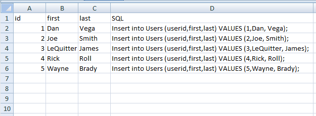
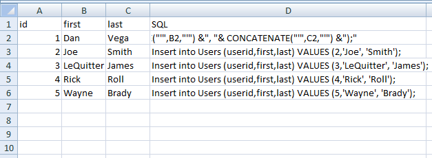

I know this is probably old news to most but I was helping a friend out yesterday who didn’t know this little trick so I thought I would share it. While some of you may have access to production databases its pretty common that these servers are guarded by a DBA. If I get a huge spread sheet of data I can’t really import the data I need to send the sql statements to the dba and the script is run against the production database.

In this example I just got a spread sheet of 5 users that need to be imported into our users table.

.

Now for 5 users this is not a big deal but what about 100 or even a 1000 users. There is actually an easy way to create your insert statements using excel. First we will mark our D column as SQL. Next place click on the cell D1. What we are going to do is write a sql statement that will grab data from the columns a,b and c. First we write our normal insert statement but for the values we can evaluate the data in a cell using the following formula. The & is just used for concatenating.

```sql
="Insert into Users (userid,first,last) VALUES ("& A2 & ","& B2 &", "& C2 &");"
```

Then we can use that same formula for every row in our sheet. Simply copy and then past that formula all the way down for as many records as you have and you will end up with something like this.



While this is great you should see the issue. The user id field is fine but we have no single quotes around our strings, but we can fix that using the concatenate function.

```sql
="Insert into Users (userid,first,last) VALUES ("& A2 & ","& CONCATENATE("'",B2,"'") &", "& CONCATENATE("'",C2,"'") &");"
```

Now our insert statements look a lot better. Again, not the coolest thing in the world but it really helps out nicely in this spot.


