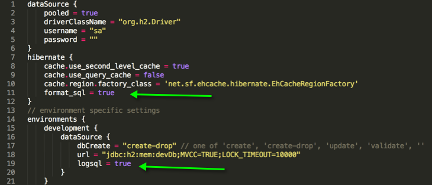
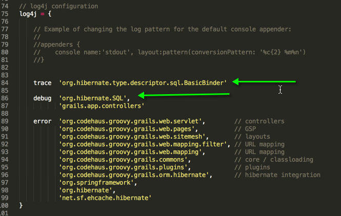
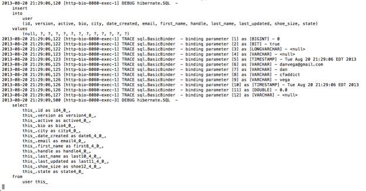

As a little bit of a Hibernate veteran at this point I know the value of logging when it comes to debugging issues. So before I even get my first application going here I figured I would setup hibernate logging. I am not going to go through everything you can do with logging, you can [check out the docs for that](http://grails.org/doc/latest/guide/single.html#logging).

Enabling Hibernate logging is actually really simple. Open up your datasource configuration file and add logsql to the environment you wish to enable logging in. You can add it to the hibernate settings but its a safe bet to just add it to your development environment. I also added the format\_sql setting which gives you some nice formatting of the generated SQL.

Next we need to add a couple of lines to the log4j settings. Open up your Config.groovy file and go down to the log4j section. We need to add a debug line for 'org.hibernate.SQL'. This is actually all we need to do to log statements. Sometimes though its nice to see what parameters are being binding to queries. To see these we need that trace statement. Make sure you get specific here, if you just log 'org.hibernate.type' you will get a lot of info that you really don't care to have.

That is all there is to it folks, pretty easy stuff. Below is a console view of an insert into the user table followed by a select. We can see what values are being inserted and the nice thing is it shows each type. Notice the nice formatting for the SQL as well.

