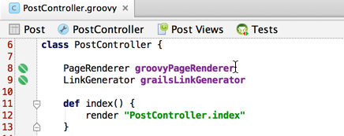
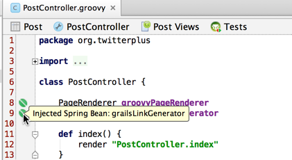

In my quest to learn Groovy and Grails I have been using Sublime because that is what I am familiar with. I have also been testing out IntelliJ on the recommendation from almost everyone. I have to agree that it is pretty darn awesome and I want to look at one smaller, but pretty cool feature today.

In the following PostController I have declared two properties. Each of these classes have already been instantiated and declared as a bean in spring. So rather than import them and create a new instance I will use what already exists. The cool thing is you can see the 2 bean icons in the gutter. This means that Spring has recognized these as valid beans and will inject them for us. When you hover over them it will let you know that Spring has injected the bean.

