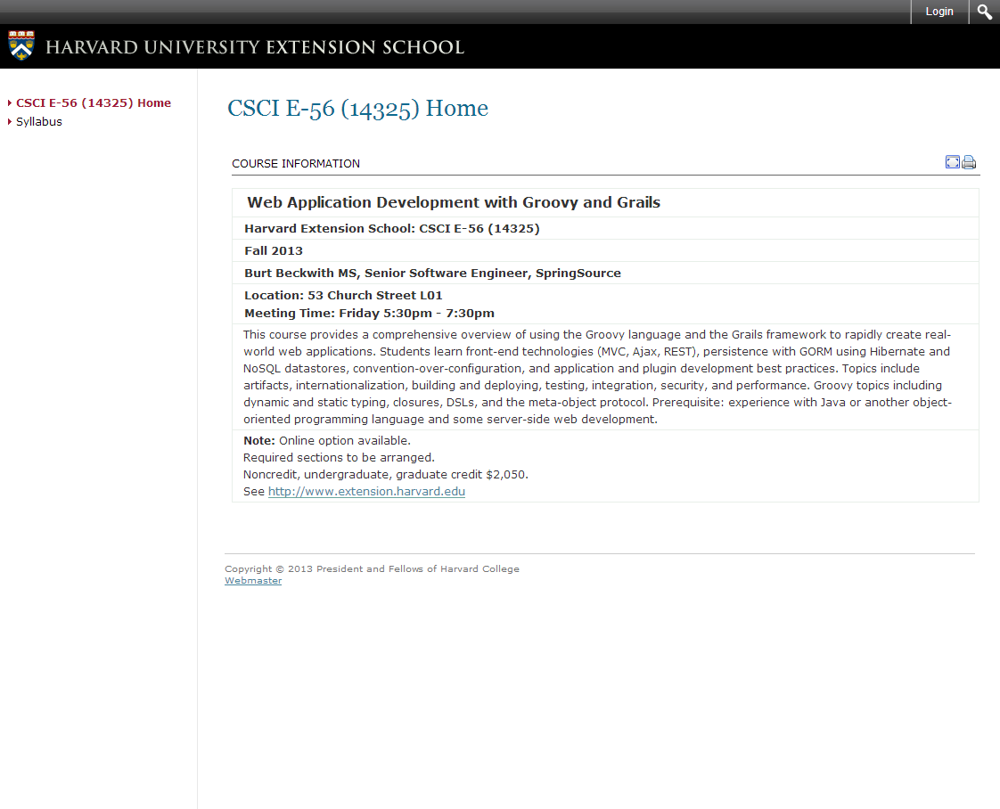

Do you want to learn Groovy & Grails? Have you ever wanted to attend Harvard? Well now you can do both thanks to a class being offered at Harvard. If you're near the campus you can attend the class in person but if not, don't worry there is an option for you. This class is also available online on Friday's from 5:30-7:30 or you can watch a recording of it.

Course Description

> This course provides a comprehensive overview of using the Groovy language and the Grails framework to rapidly create real-world web applications. Students learn front-end technologies (MVC, Ajax, REST), persistence with GORM using Hibernate and NoSQL datastores, convention-over-configuration, and application and plugin development best practices. Topics include artifacts, internationalization, building and deploying, testing, integration, security, and performance. Groovy topics including dynamic and static typing, closures, DSLs, and the meta-object protocol. Prerequisite: experience with Java or another object-oriented programming language and some server-side web development.

If you click on the link below you can find the syllabus for the class. It looks like a really well put together course along with a little bit of homework and 2 exams. Did I mention that [Burt Beckwith](https://twitter.com/burtbeckwith) is teaching this class? He is a really smart guy and I am not sure anyone is more qualified than him to be leading this class. I can think of many worse ways to spend 2 hours of my week. What are you waiting for? Sign up today!

[http://isites.harvard.edu/icb/icb.do?keyword=k97690](http://isites.harvard.edu/icb/icb.do?keyword=k97690)