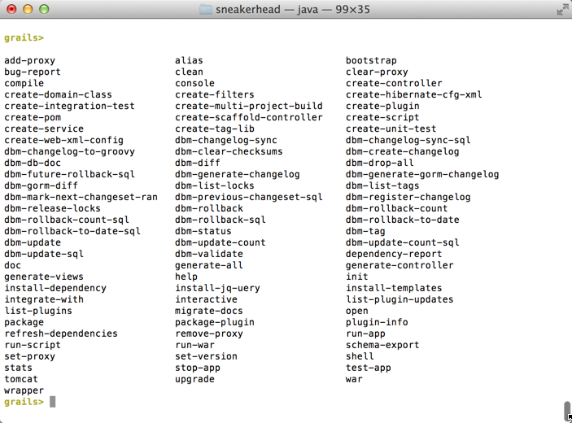

When you first start playing around with grails you may have the IDE execute commands for you or you may end up running the commands yourself from a shell. I have been running commands in terminal and for the sake of playing around it was fine. Now that I am working on a project and constantly developing running commands using the traditional grails run-app syntax just won't work.

This process is very slow and there is a reason for that. Every single time you run grails {insert\_command\_here} you are firing up a new JVM. You can use interactive mode by simply by typing the grails command from in your project. The advantage to this is that it keeps the JVM running and allows for quicker execution of commands. Now when you run a command you can omit the grails prefix.

> run-app
> stop-app
> create-controller
> generate-all
> etc...

Another great feature about interactive mode is that you get tab completion. Start typing something like create and click tab to see a list of available options. Want to see a list of all commands? Simply hit tab once you are in interactive mode.

Finally there are times when you still want to run an external process. I was trying to run clear from the terminal and grails kept complaining that it couldn't find a script with the name clear. Luckily they thought of everything over there and gave us a way to run external processes. Simply start the command with a !. This is ideal for external commands that operate on the file system such as 'clear', 'ls', 'cat', 'git', etc.

Get used to using interactive mode, its quick and intuitive and more fun than waiting for JVMs to load!
