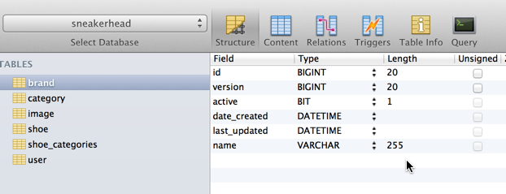
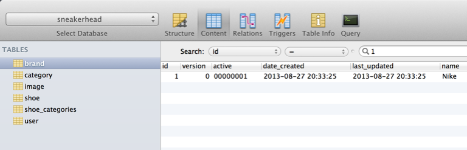
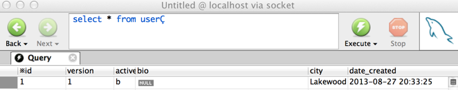
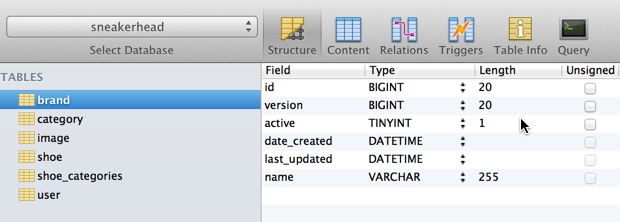
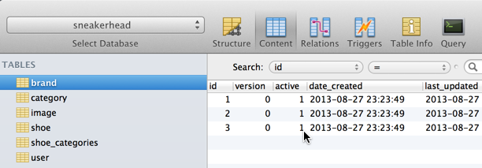

In the small app I am writing for fun I decided that it was time to switch over to a MySQL database. It was suprisingly easy to get Grails to talk to this new database. I won't go over every little step because [Joe Rinehart already wrote up a nice guide for connecting grails to mysql](http://compiledammit.com/2012/08/12/connecting-grails-to-mysql-and-others/). One comment I will make on that article and this was mentioned in the comments is that you can avoid downloading the mysql drivers and having to drop it in the lib folder. Go into grails-app/conf/BuildConfig.groovy & under dependencies uncomment the following line. Grails will then [go out and download the dependency](http://search.maven.org/#browse) for you.

> runtime 'mysql:mysql-connector-java:5.1.22'

So now that we have MySQL up and running we can take a look at the big GOTCHA I ran into tonight. I have a domain class (many actually) that define an active flag (boolean). If we take a look at my Brand domain you will see our boolean active property. This is meant as a flag to tell if the Brand should be active or not.

```groovy
package com.vega.sneakerhead

class Brand {

    String name
    boolean active = true
    Date dateCreated
    Date lastUpdated

    static hasMany = \[shoes:Shoe\]

    static constraints = {
    	name blank:false
    }

    String toString() {
    	"${name}"
    }
}
```

After I was done with the domain model I fired up my application with some default data getting created in the Bootstrap. When I looked at the table structure and content this is what I saw.







The problem with this is that our boolean is actually mapping to a BIT column type where we actually want it to be a TINYINT(1). This is actually a [bug that you can read about right here](https://hibernate.atlassian.net/browse/HHH-468). If you don't feel like reading the entire JIRA ticket this is the main take away from it.

> I didn't track down how java.lang.Boolean gets mapped to Types.BIT in hibernate, but you probably don't want to map to "bit" like you do in MysqlDialect.

It looks like they fixed this issue in Hibernate 4.0 but the current version that ships with Grails is still 3.6. If anyone reading this knows when the plugin will update to 4.0 can you please post it in the comments. (Thank You)

The good news is that there is a solution to this and I want to say a big thank you to [Burt Beckwith](https://twitter.com/burtbeckwith) for pointing me to it. What we are going to do is create our custom dialect. It might sound a little scary but I promise you its really easy. The first step is to create the following class in src/groovy/ and whatever package and class name you want. All we are doing here is extending the base dialect class and in the constructor registering a new column type to correctly map our BIT type to a boolean and not a bit.

```groovy
package com.vega.sneakerhead

import org.hibernate.dialect.MySQL5InnoDBDialect
import java.sql.Types

class MyCustomMySQL5InnoDBDialect extends MySQL5InnoDBDialect {

	MyCustomMySQL5InnoDBDialect() {
		registerColumnType(Types.BIT, 'boolean')
	}

}
```

Open up grails-app/conf/DataSource.groovy and add your new custom dialect to whatever environment you're in.

```groovy
development {
    dataSource {
        dbCreate = "create-drop"
        url = "jdbc:mysql://localhost:3306/sneakerhead"
        username = "sneakerhead"
        password = "\*\*\*\*\*\*\*\*\*\*\*\*\*"
        dialect = com.vega.sneakerhead.MyCustomMySQL5InnoDBDialect
        logsql = true
    }
}
```

That is all there is to it. The next time we fire up the up the application we will have that field correctly using a TINYINT type and a value of 1 or 0. 


