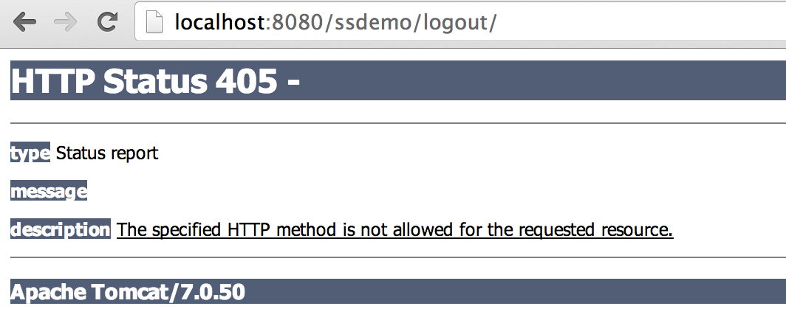

I had a question come in about a setting in Spring Security so I thought I would take a quick minute and explain it in case anyone else also has the same question. There is a setting

> 'grails.plugin.springsecurity.logout.postOnly = true'

that is true by default. If you look at the LogoutController's index action this make a little more sense.

```java
@Secured('permitAll')
class LogoutController {

	/\*\*
	 \* Index action. Redirects to the Spring security logout uri.
	 \*/
	def index() {

		if (!request.post && SpringSecurityUtils.getSecurityConfig().logout.postOnly) {
			response.sendError HttpServletResponse.SC\_METHOD\_NOT\_ALLOWED // 405
			return
		}

		// TODO put any pre-logout code here
		redirect uri: SpringSecurityUtils.securityConfig.logout.filterProcessesUrl // '/j\_spring\_security\_logout'
	}
}
```

All this is saying is that to Logout we must have that request made in the form of a post. An easy way to do that is create a link to the logout controller (remember index is our default action).

```groovy
 [Logout](${createLink(controller: 'logout')})
```

If you try and just visit the URL http://localhost:8080/{your\_context}/logout you can tell by the code that this should throw a 405 error, and it does.


