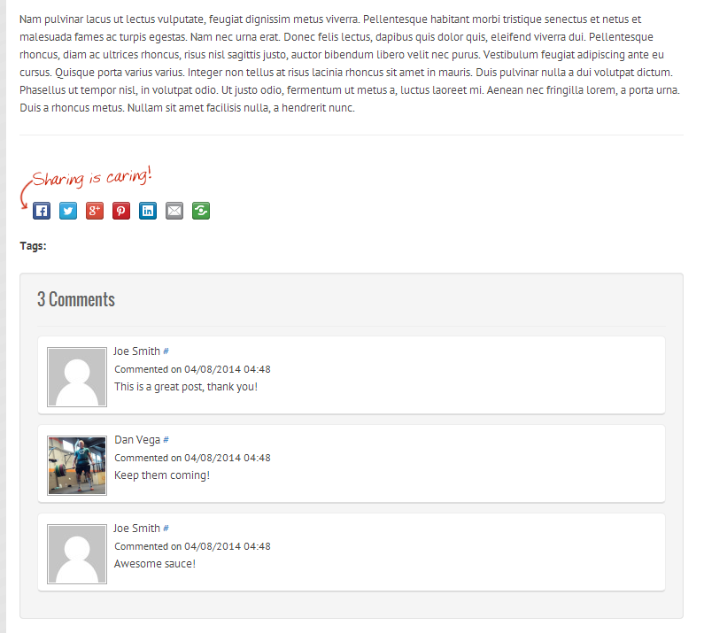

Building out my new site in Grails I needed the ability to show a [Gravatar](http://en.gravatar.com/) in the comments. I know there are usually plugins out there but I there are a lot of things I am going to do on my own just so I have an excuse to blog about them. First off visit the [Gravatar docs](http://en.gravatar.com/site/implement/images/) to get an idea of how to request an image. This is what the finished product is going to look like.  The most basic image request URL looks like this:

> http://www.gravatar.com/avatar/HASH

where HASH is replaced with the calculated hash for the specific email address you are requesting. For example, here is my base URL:

> http://www.gravatar.com/avatar/205e460b479e2e5b48aec07710c08d50

If you look at the docs there are ways to customize the size and default image if an account is not found. There are a couple different approaches we can take but this is the route I decided to go. Since a comment is just going to be inserted why not store the email hash in the db. We have an easy way of doing this with GORM events. On insert I am going to get the MD5hash of the email address and store it.

```groovy
package com.vega.blog

class Comment {

    String name
    String email
    String emailHash
    String website
    String content
    Boolean subscribe = false
    Date dateCreated

    static belongsTo = \[post:Post\]

    static constraints = {
        emailHash nullable: true
    }

    static mapping = {
        sort dateCreated: 'desc'
    }

    // event handlers
    def beforeInsert(){
        emailHash = email.encodeAsMD5()
    }

}
```

That is really all there is to it. Now we can call ${comment.emailHash} and grab that value right from the db. Here is what the final comments template looks like.

```html
<div class="comments well">
	<div class="title">
		<h4>${post.comments.size()} Comments</h4>
	</div>
	<a name="comments"></a><a name="${comment.id}"></a>
	<ul class="comment-list">
		<li class="comment">
			<div class="comment-author">${comment.name} <a title="permalink" href="#">#</a></div>
			<div class="cmeta">Commented on ${comment.dateCreated.format('MM/dd/yyyy hh:mm')}</div>
			${comment.content}
			<div class="clearfix"></div>
		</li>
	</ul>
</div>
<div class="clear"></div>
```
