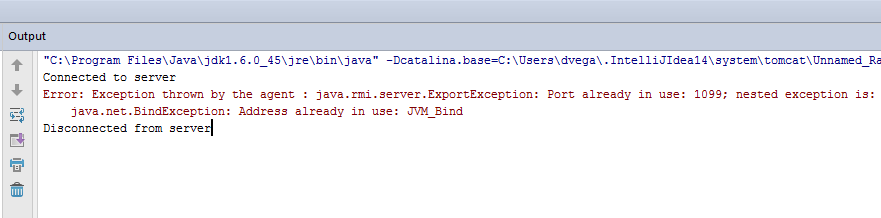
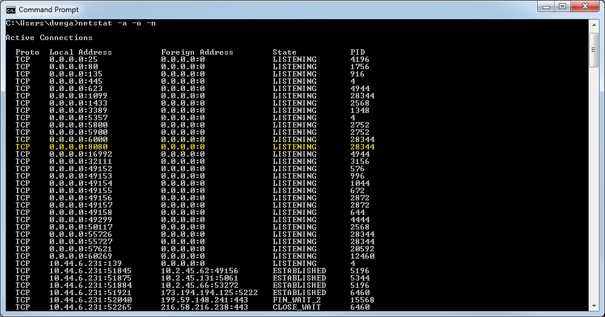
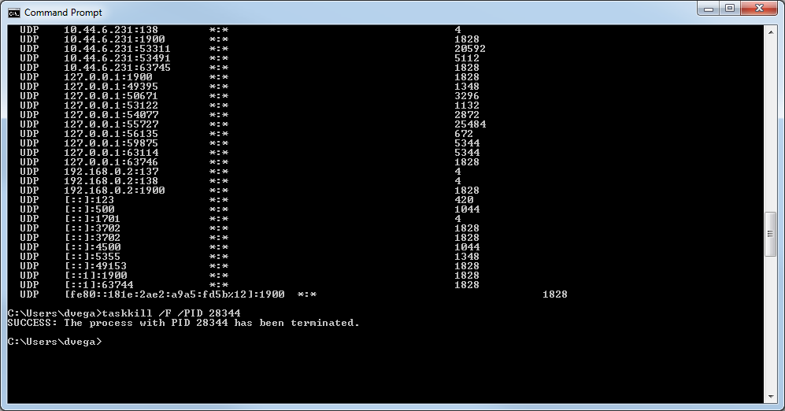

In this short tutorial, we will look at how to kill a process by port number on Windows. I am doing a lot of Java development these days and I have about 5 different applications that I may fire up during a day and because they all run on my local machine most of them use port 8080 by default. Once in a while, I will forget to kill an application. When I try and start another application I will receive this error.

[](./port_already_in_use.png)

If you need to kill a process manually on Windows it's actually pretty easy. First, fire up a command prompt and type the following command.

```bash
> netstat -a -o -n
```

To kill the process we need to find the PID of the process in question. I just run down the list by port until I find port 8080 and here you will see the process id was 28344. [](./netstat_1.png) Finally, with the PID we can run the following command to kill the process

> taskkill /F /PID 28344

[](./netstat_2.png)

Pretty easy solution to a pretty simple problem. Hope this helps!
