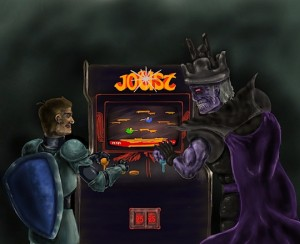

### The Book

I recently finished the book [Ready Player One](http://www.amazon.com/Ready-Player-One-Ernest-Cline/dp/0307887448/ref=sr_1_1?ie=UTF8&qid=1429924661&sr=8-1&keywords=ready+player+one) and I thought I would take this opportunity to give it a quick review. I don't give a ton of book reviews on this website but I enjoy talking about what is going on in my life and I love to hear from my readers so let's give it a try. I'm not going to give any spoilers away so if you haven't read the book yet you can continue reading without worry.

I don't think I would of ever come across this book if it were not for [Loot Crate](https://www.lootcrate.com/). Loot Crate is wonderful monthly subscription box and I highly recommend checking them out. A couple months ago I got a new Loot Crate that contained the book Ready Player One. It was a pretty small book so it was right in my wheel house. Not having heard of or having any idea what this book was about I decided to read the synopsis that went something like this

> In the year 2044, reality is an ugly place. The only time teenage Wade Watts really feels alive is when he's jacked into the virtual utopia known as the OASIS. Wade's devoted his life to studying the puzzles hidden within this world's digital confines—puzzles that are based on their creator's obsession with the pop culture of decades past and that promise massive power and fortune to whoever can unlock them. But when Wade stumbles upon the first clue, he finds himself beset by players willing to kill to take this ultimate prize. The race is on, and if Wade's going to survive, he'll have to win—and confront the real world he's always been so desperate to escape.

I was immediately hooked. In fact if you call yourself a geek I just can't imagine how you don't get excited reading that. The book centers around a virtual world called the Oasis. The Oasis was a way to escape the reality that at the time wasn't that great for a lot of people so it was easy to see why it became so popular. When the book was written Virtual Reality technology was still in its infancy but what really excites me is that I could totally see this becoming reality. Its not that far fetched to think that we could all be logging into a virtual reality to escape the real world in the not to distant future. Thrown in are some really great references to 80's pop culture and video games play a huge role throughout the book.

I mean the creator of the Oasis ends up turning the entire hunt into one large video game. I read about half the book and then I just couldn't find any time to finish it. I really wanted to find out how this story ended so I decided to check out the audio book which is narrated by [Wil Wheaton](https://twitter.com/wilw). I run a lot on the treadmill at lunch so this was a perfect way to kill 2 birds with one stone. I made the decision that I would just start from the beginning and I am really glad I did because I immediately learned a few more things the 2nd time through.

I fell in love with the characters and how they developed throughout the book. Wade Watts, our fearless leader shows such devotion to his quest. It was also a very suspenseful book. I found myself running on the treadmill at lunch pumping my fist in excitement at certain points in the quest.

I really don't want to give away too much so I will leave it at this. The book is very well written and the story is packed with excitement from start to end. There are also some surprises throughout, a fantastic ending and a huge moral to the story.

### The Movie

When I finished the book I was just surfing the web and trying to find more info about the book when [I came across the official website](http://readyplayerone.com/). There were some really great fan submitted art that helped visualize certain aspects of the book. This is one of my favorite images and I don't want to give much away but if you have read the book you should recognize it.

             

There was also a mention on the website that the book had plans to be turned into movie. This was exactly what I wanted to hear. This magical adventure is going to be turned into something I can see with my eyes I thought? My next thought was I really hope they find someone great to direct it. [I found the story on Deadline](http://deadline.com/2015/03/ready-player-one-movie-steven-spielberg-ernest-cline-warner-bros-1201398299/) and to my amazement Steven Spielberg had signed on to direct it. This was not only great news but actually pretty funny as a ton of his movies are referenced throughout the book. Here is a quick breakdown of the news by [Nerdist](http://nerdist.com/).  

https://www.youtube.com/watch?v=zwcpM0mXoPg  

### Read It. Listen to It. Watch It.

I hope that this is the first you're hearing about this book and I have you excited to get this book ASAP. If you have heard of it before and were on the fence what are you waiting for?  This is a must read / listen and I would encourage all of you to find some time to enjoy this wonderful fantasy thrill ride.

If you have already read the book I would love to hear your thoughts on it. Please remember though people reading the comments may not have read it yet so don't give anything big away. If you read the book based on this review I would certainly like to hear that as well. All in all this is by far one of the best books I have ever read. Thank you [Ernest Cline](https://twitter.com/erniecline)!
