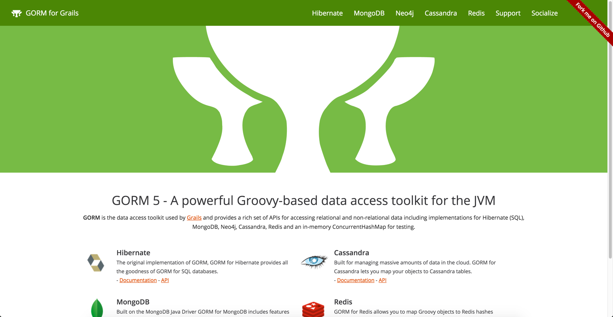
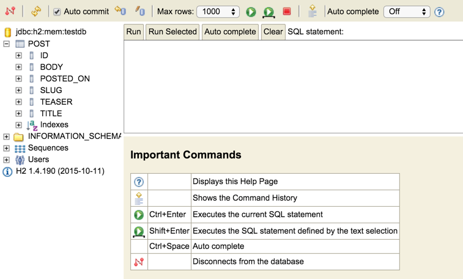

In this tutorial I am going to explain how to use [GORM](http://grails.github.io/grails-data-mapping/latest/) in Spring Boot. If you have been following along on this blog lately you know that I have been working a lot with [Spring Boot](http://projects.spring.io/spring-boot/). So much so that [I created a course on it](http://udemy.com/spring-boot-intro).

I really do like Spring Data in the limited time that I have had to play around with it and this is by no means an article against it. I like to play outside the sandbox sometimes and thats what we are going to do here. I have been working with Grails the past few years and really have grown to love GORM.

If you don't know what GORM is it stands for Grails Object Relational Mapper. **GORM** is the data access toolkit used by [Grails](http://grails.org/) and provides a rich set of APIs for accessing relational and non-relational data including implementations for Hibernate (SQL), MongoDB, Neo4j, Cassandra, Redis and an in-memory ConcurrentHashMap for testing. They just released a new website to go along with

       

### GORM in Spring Boot Demo

The first thing you will want to do is create a new project using the [Spring Initializr](https://start.spring.io/). You will want to include the Web & H2 database dependencies. I am also selecting Groovy ( [Apache Groovy FTW](http://www.groovy-lang.org/) ) as my language and Gradle as my build system. I am using IntelliJ here but you can use whatever your comfortable using. When the project has loaded we are going to add a new dependency to our build.gradle.

```java
compile("org.grails:gorm-hibernate4-spring-boot:5.0.0.RC1")
```

Now that we have the appropriate dependencies included we can begin building our application. I will talk through a couple GORM specific things in here but this is no way a GORM 101 tutorial. If you want to learn more about how to use GORM [please read through the documentation](http://grails.github.io/grails-doc/latest/guide/GORM.html). As a convention I like to keep my entities in a separate package so I will create a new one called domain. I will create a new Groovy class and call it Post.

### Creating the domain object

```java
package com.therealdanvega.domain

import grails.persistence.Entity

@Entity
class Post {

    String title
    String body
    String teaser
    String slug
    Date postedOn

    static mapping = {
        version false
        body type: 'text'
        teaser type: 'text'
    }

}
```

When we create domain objects in Grails we use a convention of placing them in a specific location. In Spring Boot we don't have that convention so we need a way to mark this class as an domain class and we can do so by using the @Entity annotation. The default convention by GORM is to use the class name as the table name. If the class was separated by camel case "BlogPosts" the table name would be "blog\_posts". You can override that by using the mapping closure but we are just going to leave it as is.

You also might of noticed that we didn't import the Date class and that is because Groovy imports that along with a bunch of others by default. Finally we have some specific information about the body and teaser. By default a String data type would be a _varchar_ and we actually want these columns to hold a bunch of text.

In Spring Data we would do something similar and at this time we would now create a new repository. In GORM we don't have to do that and the domain object itself is going to give us the power to do basic CRUD, dynamic finders and so much more. I would read through the docs to learn more about what GORM can do but the good news for you is all we had to do was create that domain object to get it all.

### Running the application

Before we go creating a controller we should test out our changes. Before we can do that lets open up our application.properties file and add the 2 lines of configuration.

```java
spring.h2.console.enabled=true
spring.h2.console.path=/console
```

This allows us to hit the H2 web console and see our brand new table created. Run the application and visit [http://localhost:8080/console ](http://localhost:8080/console)to see the POST table created.

        

### Accessing the data

Now that we have our domain object we need to create a controller and some mappings to grab some data from the database. Enforcing some good standards here we are going to move our business logic (data retrieval) to a service and we are going to program to an interface.

```java
package com.therealdanvega.service

import com.therealdanvega.domain.Post

interface PostService {

    ArrayList<Post> list()

    Post read()
}

package com.therealdanvega.service

import com.therealdanvega.domain.Post
import org.springframework.stereotype.Service

@Service('postService')
class PostServiceImpl implements PostService {

    @Override
    ArrayList<Post> list() {
        Post.list()
    }

    @Override
    Post read(int id) {
        Post.get(id)
    }

}
```

Again if you're not familiar with GORM there is some dynamic programming going on with our domain object that gives us methods like

*   list
*   get
*   save
*   delete
*   findWhere
*   findByTitle
*   etc...

Finally we create a controller with some mappings that simply call our service to get the data.

```java
package com.therealdanvega.controller

import com.therealdanvega.service.PostService
import com.therealdanvega.service.PostServiceImpl
import org.springframework.beans.factory.annotation.Autowired
import org.springframework.web.bind.annotation.PathVariable
import org.springframework.web.bind.annotation.RequestMapping
import org.springframework.web.bind.annotation.RestController

@RestController
@RequestMapping("/posts")
class PostController {

    PostService postService

    @Autowired
    PostController(PostService postService) {
        this.postService = postService
    }

    @RequestMapping("/")
    public String list(){
        postService.list()
    }

    @RequestMapping("/{id}")
    public String get(@PathVariable(value = "id") int id){
        postService.get(id)
    }

}
```

This would appear like everything we need to run our application right? I want you to go ahead and run this application now without looking below. What happened? Do you know why it happened?

### The Hibernate Session

If you ran the example we have been building you should of seen an error similar to this one.

```shell
org.hibernate.HibernateException: No Session found for current thread
	at org.grails.orm.hibernate.GrailsSessionContext.currentSession(GrailsSessionContext.java:117) ~\[grails-datastore-gorm-hibernate4-5.0.0.RC1.jar:na\]
	at org.hibernate.internal.SessionFactoryImpl.getCurrentSession(SessionFactoryImpl.java:1014) ~\[hibernate-core-4.3.11.Final.jar:4.3.11.Final\]
	at org.grails.orm.hibernate.GrailsHibernateTemplate.getSession(GrailsHibernateTemplate.java:225) ~\[grails-datastore-gorm-hibernate4-5.0.0.RC1.jar:na\]
	at org.grails.orm.hibernate.GrailsHibernateTemplate.doExecute(GrailsHibernateTemplate.java:183) ~\[grails-datastore-gorm-hibernate4-5.0.0.RC1.jar:na\]
	at org.grails.orm.hibernate.GrailsHibernateTemplate.execute(GrailsHibernateTemplate.java:140) ~\[grails-datastore-gorm-hibernate4-5.0.0.RC1.jar:na\]
	at org.grails.orm.hibernate.GrailsHibernateTemplate.execute(GrailsHibernateTemplate.java:110) ~\[grails-datastore-gorm-hibernate4-5.0.0.RC1.jar:na\]
	at org.grails.orm.hibernate.HibernateGormStaticApi.list(HibernateGormStaticApi.groovy:76) ~\[grails-datastore-gorm-hibernate4-5.0.0.RC1.jar:na\]
	at org.grails.orm.hibernate.HibernateGormStaticApi.list(HibernateGormStaticApi.groovy:75) ~\[grails-datastore-gorm-hibernate4-5.0.0.RC1.jar:na\]
	at org.grails.datastore.gorm.GormEntity$Trait$Helper.list(GormEntity.groovy:639) ~\[grails-datastore-gorm-5.0.0.RC1.jar:na\]
	at org.grails.datastore.gorm.GormEntity$Trait$Helper$list.call(Unknown Source) ~\[na:na\]
	at org.codehaus.groovy.runtime.callsite.CallSiteArray.defaultCall(CallSiteArray.java:48) ~\[groovy-2.4.4.jar:2.4.4\]
	at org.codehaus.groovy.runtime.callsite.AbstractCallSite.call(AbstractCallSite.java:113) ~\[groovy-2.4.4.jar:2.4.4\]
	at org.codehaus.groovy.runtime.callsite.AbstractCallSite.call(AbstractCallSite.java:125) ~\[groovy-2.4.4.jar:2.4.4\]
	at com.therealdanvega.domain.Post.list(Post.groovy) ~\[main/:na\]

...
```

The main takeaway from that error message is this

No Session found for current thread

This is because we currently don't have a Hibernate session to work with. In Grails we could of run Post.list() directly from our controller and it would of worked. So why does it work there an not here? I mean at the end of the day Grails 3 is a Spring Boot app, what funny business is going on behind the scenes? This is a good explanation by Burt Beckwith...

> Grails registers a customized subclass of OpenSessionInViewInterceptor (it adds WebFlow awareness). So anything done in the context of a web request will have an open session and lazy-loaded references and collections will resolve.

This means that our request would have an open session and that is what gives us the ability to call our list method. We can do something similar but lets talk through our 2 options here.

#### @Transactional

We could manually write the logic in every single method to start a transaction, open a hibernate session, perform our business logic and then close the session and commit the transaction but that would be a huge pain in the butt. The @Transactional annotation gives us a shortcut of doing all that by using AOP. The first thing we need to do to is to enable Spring's annotation-driven transaction management capability  by adding the following annotation to our main application class.

@EnableTransactionManagement

The  `@Transactional`  annotation is metadata that specifies that an interface, class, or method must have transactional semantics; for example, "<span style="emphasis">_start a brand new read-only transaction when this method is invoked, suspending any existing transaction_</span>". The default  `@Transactional`  settings are as follows:

*   Propagation setting is  `PROPAGATION_REQUIRED.`
*   Isolation level is  `ISOLATION_DEFAULT.`
*   Transaction is read/write.
*   Transaction timeout defaults to the default timeout of the underlying transaction system, or to none if timeouts are not supported.
*   Any  `RuntimeException`  triggers rollback, and any checked  `Exception`  does not.

Those settings can be changed using attributes in the annotation. To learn more about those settings [please read the documentation](http://docs.spring.io/spring/docs/current/spring-framework-reference/html/transaction.html#transaction-declarative-annotations). With that little knowledge we can go and apply the annotation to our service class.

```java
package com.therealdanvega.service

import com.therealdanvega.domain.Post
import org.springframework.stereotype.Service
import org.springframework.transaction.annotation.Transactional


@Service('postService')
@Transactional
class PostServiceImpl implements PostService {

    @Override
    ArrayList<Post> list() {
        Post.list()
    }

    @Override
    Post read(int id) {
        Post.get(id)
    }

}
```

If you run the example now you should be able to visit the /posts mapping without error.

#### Open Session In View

Another option is to use the Open Session in View pattern. In Grails there is a subclass of the [OpenSessionInViewInterceptor from Spring](http://docs.spring.io/autorepo/docs/spring/current/javadoc-api/org/springframework/orm/hibernate3/support/OpenSessionInViewInterceptor.html) configured for us and that is why we don't have to worry about it.This is a Spring web request interceptor that binds a Hibernate  `Session`  to the thread for the entire processing of the request. The important part is that the session is available to us **In View.** If you aren't using a view technology than this doesn't make a lot of sense and some would say even if you are this isn't the best answer.

Take a post object that has a relationship to author. The author on the object is lazy loaded. This means that if we wrapped transactional to get our post and then tried to call post.getAuthor() in the view there would no longer be a session available to load that author object. This is where the need for it comes into play.

Another approach is you could add a new attribute to the model called author in your controller method and set it there eliminating the need for that call in the view. This is for you to decide and do a little reading up on. I am just going to present you with a solution if you decide to go that route. Create a new package called config and create a new class called WebMvcConfig.

```java
package com.therealdanvega.config

import org.hibernate.SessionFactory
import org.springframework.beans.factory.annotation.Autowired
import org.springframework.context.annotation.Configuration
import org.springframework.orm.hibernate4.support.OpenSessionInViewInterceptor
import org.springframework.web.servlet.config.annotation.InterceptorRegistry
import org.springframework.web.servlet.config.annotation.WebMvcConfigurerAdapter

@Configuration
class WebMvcConfig extends WebMvcConfigurerAdapter {

    @Autowired
    SessionFactory sessionFactory

    @Override
    void addInterceptors(InterceptorRegistry registry) {
        OpenSessionInViewInterceptor openSessionInViewInterceptor = new OpenSessionInViewInterceptor()
        openSessionInViewInterceptor.setSessionFactory(sessionFactory)
        registry.addWebRequestInterceptor( openSessionInViewInterceptor )
    }

}
```

We are creating a new OpenSessionInViewInterceptor, setting the session factory and adding that as a web request interceptor. You could at this point remove the transactions and our program would again run correctly. Just a quick not though that this doesn't eliminate the need for transactions. The next problem you are going to come across is serializing / deserializing objects. We will leave that discussion for another day.

### Conclusion

At this point I don't want to start a discussion on GORM vs Spring Data. To me they are both awesome and I think the more I use them both in Spring Boot the better equipped I will be to answer those questions. In the meantime I just wanted to show you that you can use GORM in Spring Boot and 1 of the main issues I came across setting it up. [You can grab the source code for this demo here.](https://github.com/danvega/gorm-spring-boot-demo)
