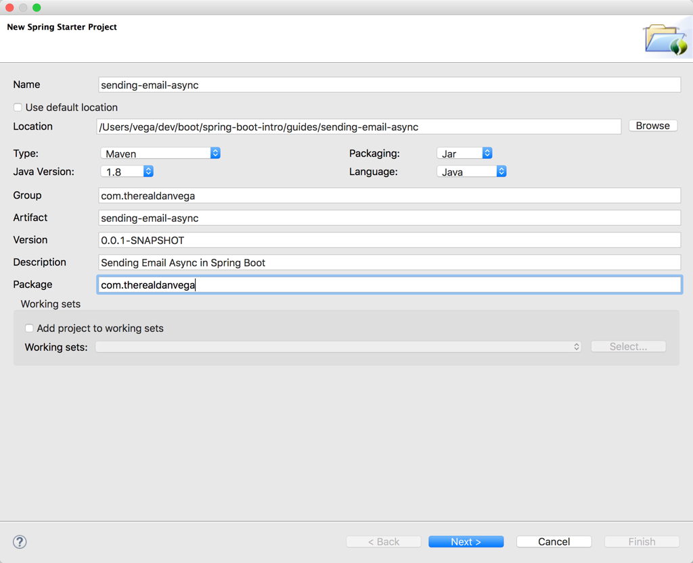
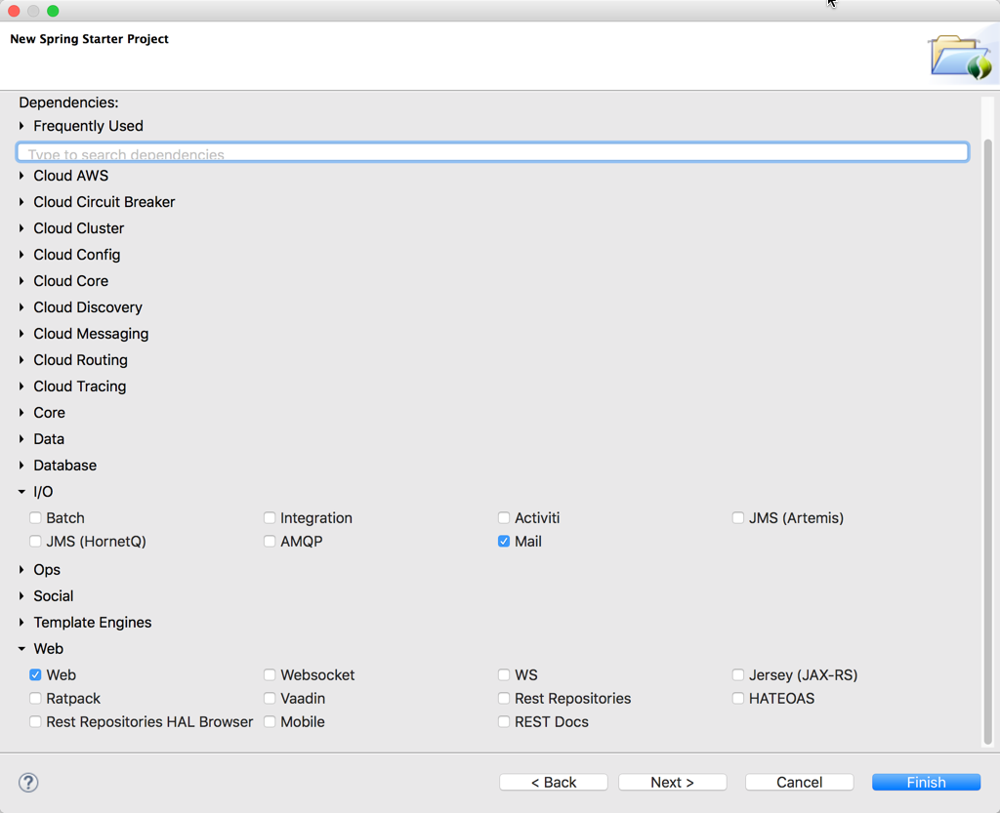

I have a student taking my course that sent me the following question

> It would be really cool to show how to send this email asynchronously. Because it's never a good idea to send any sort of notification synchronously.

I do agree with him in that there is no reason for us block program execution for something like sending an email. I am going to take this chance to walk you through sending email asynchronously using Spring Boot. Start off by creating a basic new Spring Boot project using the Spring Initializr from the web or your favorite IDE. We are going to select Web & Mail as dependencies.



              

By selecting web and mail as dependencies we should have these two starter dependencies included included in our build file.

```xml
<dependency>
	<groupId>org.springframework.boot</groupId>
	<artifactId>spring-boot-starter-mail</artifactId>
</dependency>
<dependency>
	<groupId>org.springframework.boot</groupId>
	<artifactId>spring-boot-starter-web</artifactId>
</dependency>
```

With the starter mail dependency in place we need to configure our mail server properties.

```bash
spring.mail.host = smtp.gmail.com
spring.mail.username = username@gmail.com
spring.mail.password = xxxxxxxxxxxxxxxxxx
spring.mail.port=587
spring.mail.properties.mail.smtp.starttls.enable = true
```

The first thing we are going to do is create a controller. This controller is going to have a request mapping of signup-success. This method is going to create a user (just a simple POJO) and then try to send a notification using our notification service.

```java
@RestController
public class RegistrationController {

	private Logger logger = LoggerFactory.getLogger(RegistrationController.class);

	@Autowired
	private NotificationService notificationService;

	@RequestMapping("/signup-success")
	public String signupSuccess(){

		// create user
		User user = new User();
		user.setFirstName("Dan");
		user.setLastName("Vega");
		user.setEmailAddress("dan@clecares.org");

		// send a notification
		try {
			notificationService.sendNotificaitoin(user);
		}catch( Exception e ){
			// catch error
			logger.info("Error Sending Email: " + e.getMessage());
		}

		return "Thank you for registering with us.";
	}

}
```

The Notification Service is where the real magic happens. At the start of our send notification method we are going to simulate a long process by using the sleep method. Notice that we have add the [@Async annotation](https://docs.spring.io/spring/docs/current/javadoc-api/org/springframework/scheduling/annotation/Async.html) to the method that marks a method as a candidate for _asynchronous_ execution.

```java
@Service
public class NotificationService {

	private JavaMailSender javaMailSender;

	@Autowired
	public NotificationService(JavaMailSender javaMailSender){
		this.javaMailSender = javaMailSender;
	}

	@Async
	public void sendNotificaitoin(User user) throws MailException, InterruptedException {

		System.out.println("Sleeping now...");
        Thread.sleep(10000);

        System.out.println("Sending email...");

        SimpleMailMessage mail = new SimpleMailMessage();
		mail.setTo(user.getEmailAddress());
		mail.setFrom("danvega@gmail.com");
		mail.setSubject("Spring Boot is awesome!");
		mail.setText("Why aren't you using Spring Boot?");
		javaMailSender.send(mail);

		System.out.println("Email Sent!");
	}

}
```

We have one final task to make all of this work. Go to the main application class and add the [@EnableAsync annotation](https://docs.spring.io/spring/docs/current/javadoc-api/org/springframework/scheduling/annotation/EnableAsync.html).

```java
package com.therealdanvega;

import org.springframework.boot.SpringApplication;
import org.springframework.boot.autoconfigure.SpringBootApplication;
import org.springframework.scheduling.annotation.EnableAsync;

@SpringBootApplication
@EnableAsync
public class SendingEmailAsyncApplication {

	public static void main(String\[\] args) {
		SpringApplication.run(SendingEmailAsyncApplication.class, args);
	}
}
```

Start the application and go to [http://localhost:8080/signup-success](http://localhost:8080/signup-success). You will see the message "Thank you for registering with us." right away and in the console you will see the Sleeping/Sending/Sent messages printed out to the console. If you aren't familiar with Async this is where the real power comes in. The program is not blocking a task like sending an email and returns execution to the user while it performs that task in the background.

You can grab the source for this application below.

[https://github.com/danvega/spring-boot-intro/tree/master/guides/sending-email-async](https://github.com/danvega/spring-boot-intro/tree/master/guides/sending-email-async)
