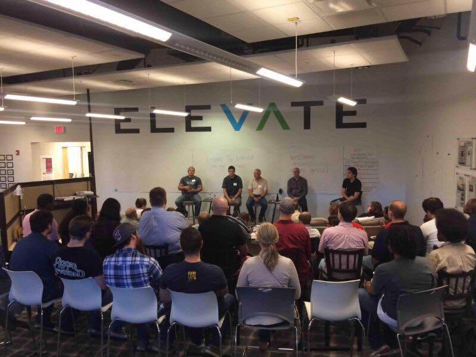

Last night I was lucky enough to be asked to [speak on a panel at Tech Elevator](http://www.meetup.com/Cleveland-learntocode/events/233766635/). The panel was made up of Senior Developers from the area and it was to a group of Jr. developers. The presentation was Lessons I've Learned in my programming career. It was great to talk to developers that are in the same spot I was in 15+ years ago and I really hope my advice was good for them to hear.

     

We had a list of questions that the moderator was going to ask us as well as questions from the audience. These are the questions and I thought some of them were really good. I am actually going to try and create some you YouTube videos with my answers to these and get them posted. Thanks again to everyone who came out.

*   Why did you decide to be a developer?
*   What was your first role as a developer? Talk about the career path and/or phases (junior dev to senior dev).
*   Types of industries and how they compliment strengths students may have (they all have completed the StrengthsFinder assessment)
*   Job titles and what they mean.
*   What’s it like working for a startup vs corporate vs mid size?
*   What’s the biggest misconception about being a developer?
*   What’s one thing you would have done differently?
*   What other dev-related roles within a company should students be considering?
*   How can students get involved in the local tech community? Meetups, etc.
*   How can students continue to learn and grow their skills?
*   Where can a student be embraced by senior developers as a learner?
*   What is the hardest thing about being a developer?
*   What type of person does it take to be a developer?
*   What’s the difference between a really great developer and an average developer?
*   What advice would you give to someone just entering the field?
*   What kind of things do you look for in a team/organization that you are considering joining?
*   What are your favorite tools / technologies / platforms to work with and why?
*   What are your favorite kinds of projects to work on?
*   What are your least favorite kinds of projects to work on?
*   What was the most important lesson that you have learned as a developer? How did you learn it?
