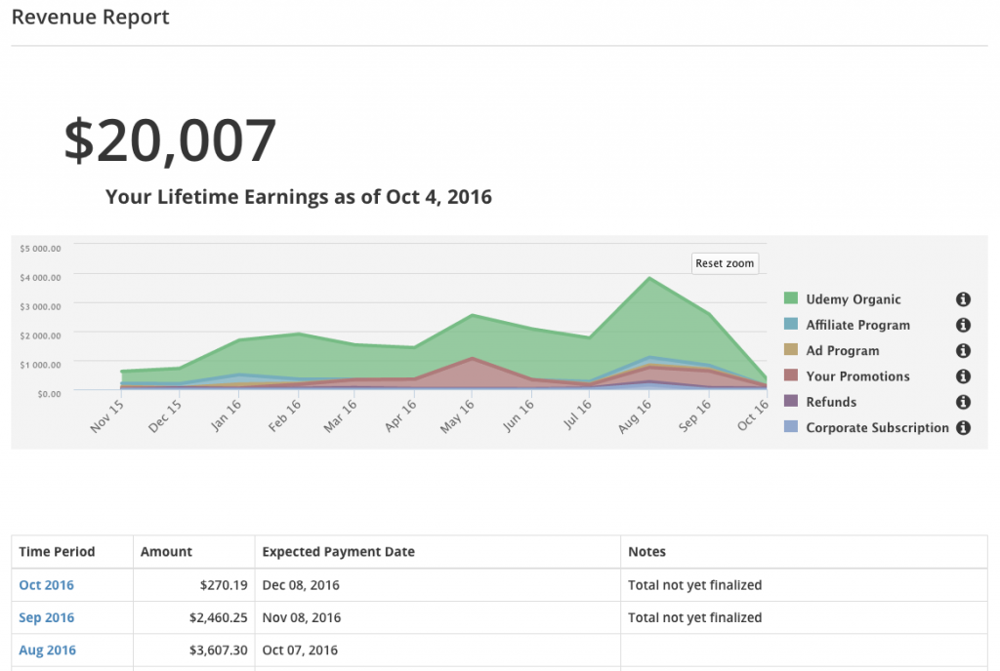

About a year ago, I set out on a journey that has forever changed my life. The title of this article might be a little bit misleading but I had to get your attention so that I could share my story with you. My hope is that anyone in a similar situation will be inspired by this and take action now.

This story actually started about 2 years ago in November. I have always been someone who enjoys learning from a variety of sources. I enjoy reading books and articles on the web, listening to podcasts, going to conferences and even watching videos online.

I loved watching videos online even if I knew the subject because I felt like I would always pick up one little tip or trick that would always make it all worth it. I can remember using [www.lynda.com](http://www.lynda.com) in the past but the idea of an online course was still very new to me. While you can find individual videos on YouTube for free it is very hard to stitch all of these videos together to teach you an entire subject.

In November of 2014 Udemy was running a Black Friday promotion where courses were only $10 each. I ended up watching the promo videos, reading reviews and purchased 5 courses that day. I think over the next year I bought a few more courses and probably went through half of them. I would compare this to purchasing books in the sense that I get really excited to read a new one but sometimes they sit on the shelf for awhile.

When October 2015 rolled around Udemy started running a promotion for all new instructors. Anyone who wanted to be a first time instructor could get involved. If you followed their guidelines and created a new course they would select a few winners and promote you to all of the Facebook & Twitter followers. I can't quite remember the numbers but I do remember that it was a lot. So I started to think about and asked myself "Why not me?". I was a blogger, YouTuber and conference speaker. I really enjoy helping others and I always believed that my background made me a great instructor. I was never the smartest guy in the room and I know what problems beginners were facing.

Just coming back inspired from the Spring One Conference I decided I was going to create my first course on Spring Boot. I spent the next 45 days or so working my tail off. I didn't know a whole lot about course creation or video production but I was willing to learn. All of the videos for my first course were shot in my home office on my iPhone. It wasn't the easiest thing to do but it ended up turning out ok. I also knew that the promo video was going to be important so I spent some time on that as well. At the end of the day though students want to learn Spring Boot and they are purchasing this course for the content.

I didn't end up being selected by Udemy to be in their promotions but I was included in the Black Friday sale and that was the most important thing. With 2,300 students at the time of this writing and 528 ratings I couldn't be happier with the way things turned out. So many students leave positive reviews on a regular basis and it just makes me so happy to be helping others.

[https://www.udemy.com/spring-boot-intro/](https://www.udemy.com/spring-boot-intro/?couponCode=TRDV20K)

https://www.youtube.com/watch?v=sEvZf70qyv4

When that course was complete I already started working on my next course. One of the first things I did was upgrade my camera to a Canon 70D. This camera shot amazing video but one of the main features was a flip out screen so I could actually see what I was recording. With some experience on my hands I felt like it was less about the production this time around and now I could focus on the content. I choose to teach a course on the Groovy Programming Language. I have been using this language for years and it was just something I was really passionate about. I ended up launching this course towards the end of May 2016 and at the current time of this article it has almost 420 students and 75 reviews. This course has gotten nothing but positive feedback and I really don't feel like I would change anything about it at this time.

[https://www.udemy.com/apache-groovy/](https://www.udemy.com/apache-groovy/?couponCode=TRDV20K)

https://www.youtube.com/watch?v=NBe0NrSqPrU

So here we are on October 4th which is 1 year from when I decided to commit to this and about 10 1/2 months from the time my first course launched. As you can see from the image below I have made about $20,000 over that time period. There are instructors making a lot more than this but I wanted to post these very real numbers to prove a point to you. If you have a passion for helping others this can be you. It is not going to be easy and there will be times where you might want to give up but I promise you it is all worth it. I have a full time job that I love doing and all of this can be done on nights and weekends.

  

The reason for the title is where the passive income lifestyle comes into play. I won't lie there is a lot of up front work but the idea of waking up and seeing that you made money overnight is very cool. I also took a couple vacations this year and making money while you're lying on the beach is equally as rewarding.

You will have some work to do keeping the course updated and answering student questions but to be honest if you do the work up front there won't be a ton of work post launch. The time to take action is right now though. With the big Black Friday sale around the corner you will want to be a part of that.

I am currently working on course #3 with my friend John Thompson and we are really excited about this one. I am also branching out and already have course outlines completed for my next 2 courses which are going to be a little bit of a pivot for me, but an exciting one. I would love to hear your comments and questions so please leave them below or contact me.

This is just the start of my story and I have so much more to tell you about my experience. I have learned so much on my journey and I can't wait to share it with you. If you're interested in learning more about teaching online or anything else I am up to please sign up for my newsletter below.
