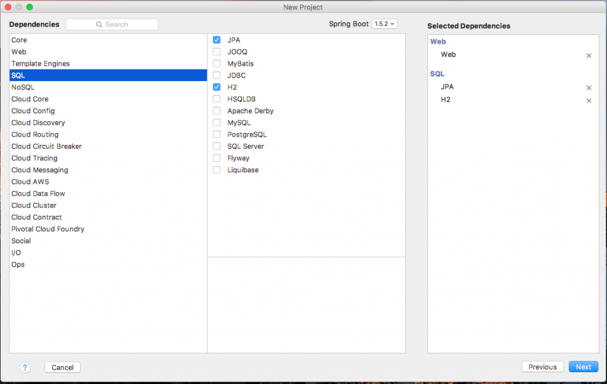
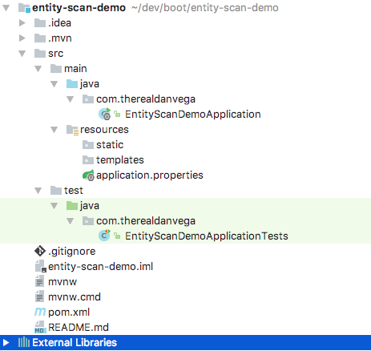
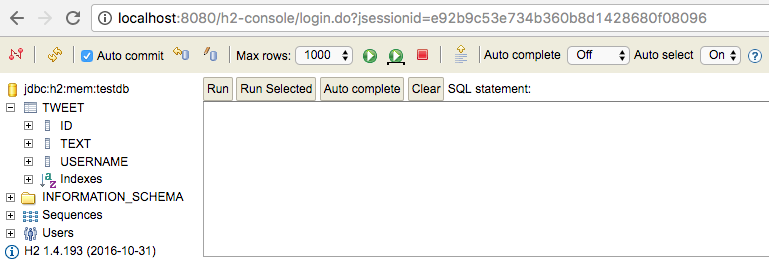

I had a question from a student come up that a lot of new Spring developers come across. It has to do with creating components and in this case more specifically, entities. Let's take a look at the question and then dive into the solution.

## The Problem

> Hey, I'm trying to get JPA to create the post and author tables and view them in the H2 console.  I copied every step in the video and tried the suggestions to change the JDBC url to :testdb.  I've also tried changing spring.datasource.name: to both test and testdb, all with no luck.  When the console comes up, there are no tables.  Any help would be most appreciated!!  Here is the code in a repo, if that helps!

## The Solution

I had to dive into the student's code to figure out what was going on but usually, there is a pretty good explanation as to why something like this is happening. When entities aren't being picked up and database tables aren't being created there are a few places to look. The first thing I do is make sure we are connecting to the correct database and in this case, we were. Next, I like to take a look at the entities and make sure there are no issues with those. We could have issues with the code or it simply could be an issue with Spring not finding the entity based on its location. 

### Create a new Spring Boot Project

To demonstrate the issue at hand we are going to create a brand new Spring Boot project. This will give us a chance to see what the problem is in a simplified version. Create a new project using the Spring Initializr and select the Web, JPA, and H2 dependencies.  

[](https://therealdanvega.com/wp-content/uploads/2017/03/entity-demo-starter.png)   

When you are creating the project you will be asked to give your main package a name. I named mine com.therealdanvega and as you can see from the image below it created the main application class under that package.  

[](./entity-scan-project.png)              

### Create an Entity

In the project, I asked the student to create a package named domain and create a new entity there. The student did just that and here is what that class look likes. 

```java
package domain;

import javax.persistence.Entity;
import javax.persistence.GeneratedValue;
import javax.persistence.Id;

@Entity
public class Tweet {

    @Id @GeneratedValue
    private Long id;
    private String username;
    private String text;

    private Tweet() {}

    public Long getId() {
        return id;
    }

    public void setId(Long id) {
        this.id = id;
    }

    public String getUsername() {
        return username;
    }

    public void setUsername(String username) {
        this.username = username;
    }

    public String getText() {
        return text;
    }

    public void setText(String text) {
        this.text = text;
    }
    
}
```

If you know what you're looking for you can probably see the issue on line 1 of that code. The student created the domain package under the java folder and not inside of the main com.therealdanvega package. The student started the application and the table wasn't being created and as we will see this is expected behavior. 

### @EntityScan Annotation

The easy fix is to move the package and class under the main package and this will work as expected. Another way we can solve this problem is by telling Spring where to find our entities. We can do so by using the [@EntityScan annotation](http://docs.spring.io/spring-boot/docs/current/api/org/springframework/boot/autoconfigure/domain/EntityScan.html). We can use the base packages attribute and point to one or many packages to include when scanning for entities. We will add this annotation to our main application class. 

```java
package com.therealdanvega;

import org.springframework.boot.SpringApplication;
import org.springframework.boot.autoconfigure.SpringBootApplication;
import org.springframework.boot.autoconfigure.domain.EntityScan;

@SpringBootApplication
@EntityScan( basePackages = {"domain"} )
public class EntityDemoApplication {

	public static void main(String\[\] args) {
		SpringApplication.run(EntityDemoApplication.class, args);
	}
}
```

Now if you start up the application and go to your H2 console you should see that the tweet table was created for you.  

[](./tweet_class.png)   

## Conclusion 

As you can see this is a pretty easy mistake to make. If you would like to check out this project you can find the [source code for it on Github](https://github.com/cfaddict/entity-scan-demo). I hope you found this tutorial helpful and with that, I will leave you with a question.  **Question:** _What is a common mistake you made in your first few Spring Boot projects? _