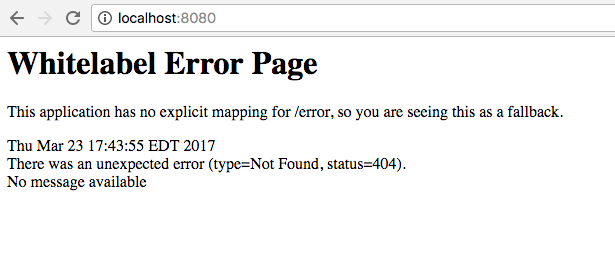
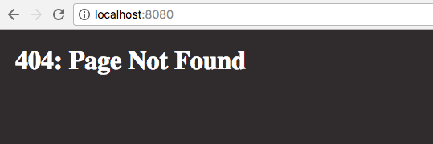

We have to remember that when we put applications out into the wild that things will go wrong. This can be in the form of a user going to a wrong URL or entering invalid data. As much as we like to always blame the users (it must be user error, right?) there are times when we as developers make mistakes.

What we need to understand is that it is ok for both the users and us to make mistakes as long as we account for them. When a user requests a URI that doesn't exist we need to show them a proper 404 (page not found) error page. We can even take this one step further and provide additional resources on this page to help them find what they are looking for. In this article, we will look at some improvements in Spring Boot 1.4 that help us define convention based error pages. In this article, we will look at some improvements in Spring Boot 1.4 that help us define convention based error pages.

## Custom Error Pages

I have [created a very simple project](https://github.com/cfaddict/custom-errors/tree/master/src/main/java/com/therealdanvega/controller) that has a single home controller with no methods defined. If we launch that application and visit [http://localhost:8080](http://localhost:8080) we will get this default white label error page. This is of course because we have no mapping defined for "/".



## HTML Templates

What you are seeing above is the default, global error handler for the servlet container. As you can see the status code 404 (page not found) is being thrown. In previous versions of Spring Boot if we wanted a custom 404 page we had to create a custom error controller that implemented the [error controller interface](http://docs.spring.io/spring-boot/docs/current/api/org/springframework/boot/autoconfigure/web/ErrorController.html).

Now we can just create the templates and by convention place them in a folder. If we are just using static HTML files we can place them in the /src/main/resources/public/error directory. If we want to catch a specific error code like 404 we can create a 404.html. If we want to map all 4xx errors, simply create a 4xx.html. With that, I am going to drop in my custom 404.html.

```html
<html>
  <head>
    <title>404: Page Not Found</title>
    <style>
      body {
        background-color: #2a2627;
        margin: 20px;
      }
      h1 {
        color: #ffffff;
      }
    </style>
  </head>
  <body>
    <h1>404: Page Not Found</h1>
  </body>
</html>
```



## Dynamic Templates

If you are using a templating engine in your application we can also take advantage of this convention based error handling. You will need to place your templates in the src/main/resources/templates/error directory. I have almost the same error template but because we are using Thymeleaf I can access the error object and display more information on the page.

```html
<!DOCTYPE html>
<html
  lang="en"
  xmlns="http://www.w3.org/1999/xhtml"
  xmlns:th="http://www.thymleaf.org"
>
  <head>
    <meta charset="utf-8" />
    <meta http-equiv="X-UA-Compatible" content="IE=edge" />
    <meta name="viewport" content="width=device-width, initial-scale=1" />
    <title>404: Page Not Found</title>
    <style>
      body {
        background-color: #2a2627;
        margin: 20px;
      }
      h1,
      p {
        color: #ffffff;
      }
    </style>
  </head>
  <body>
    <h1>Page Not Found</h1>
    <p th:text="${error}">Error Info</p>
  </body>
</html>
```


## Conclusion

If create an error template in both public and templates the dynamic template will win out. As you can see the improvements in Spring Boot 1.4 made it really easy for us to handle errors. As I said when I started this article, errors are going to happen. We just need to make sure that we are handling them and making the user experience a pleasant one.

**Question:** What problems are you facing when trying to handle errors in your Spring applications?
