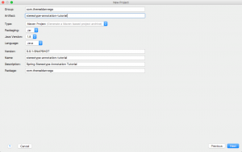
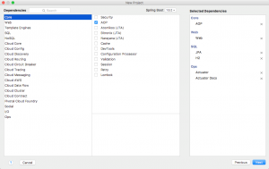
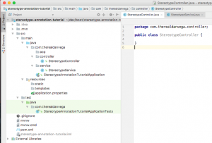
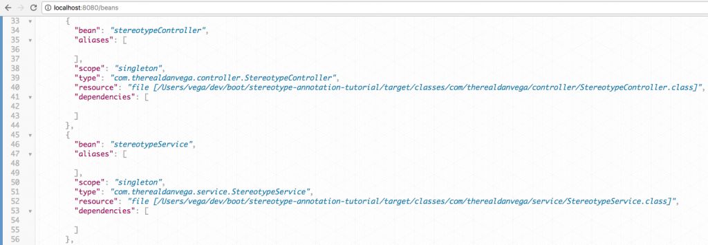

When software developers get introduced to the Spring Framework there are some concepts that can be a little confusing. The good news is once we wrap our head around them they can become second nature. Spring has some specialized annotations called Stereotype Annotations. If that concept is new to you don’t worry, we are going to break everything down for you in this article.

## Stereotype & Annotation Defined

Before we dive into what Spring Stereotype annotations are I think it's important for us to understand what these two words mean. The word stereotype is defined in the [Merriam-Webster dictionary](https://www.merriam-webster.com/dictionary/stereotype) as:

> _**stereotype: (noun)** something conforming to a fixed or general pattern; especially : a standardized mental picture that is held in common by members of a group and that represents an oversimplified opinion, prejudiced attitude, or uncritical judgment_

You have probably come across stereotypes in real life. Examples of this could be that all Irish people are drunks or all blondes are unintelligent. We know that this, of course, is not only wrong but also extremely hurtful. In real life, you shouldn’t judge someone based on characteristics or because they belong to a particular group. While this isn’t a good practice in real life it is something we will do this in Spring.

We know that a controller's role in MVC pattern is to direct traffic and route requests. We know that a service is a place where we can place all of our business logic. Finally, we know that a repository is a place for us to implement data access layers for various persistence stores. In a Spring MVC project, it is important for us to group classes based on their role in the application.  The word annotation is defined in the Merriam-Webster dictionary as:

> **annotation: (noun)**  _a note added (as to a statute) by way of comment or explanation often furnishing summaries of relevant court decisions_

In the real world, we use the word annotation as a note or comment to describe something further. In Java, we use them much as the same but there are some technical things going on behind the scenes. We describe a class in our project as being a controller by using the @Controller annotation. We know just by looking at that class that it is a Controller but so does the framework which will do some cool things to this class behind the scenes.

## Spring Stereotypes and how to use them

Now that we understand what these words mean it might give us some insight as to what role they play in our Spring projects. When a class is annotated with one of the following Stereotypes Spring will automatically register them in the application context. This makes the class available for dependency injection in other classes and this become vital to building out our applications. These classes can all be found under the [org.springframework.stereotype package](http://docs.spring.io/spring/docs/current/javadoc-api/org/springframework/stereotype/package-summary.html).

| Annotation  | Description                                                                                                                                                                                                                      |
| ----------- | -------------------------------------------------------------------------------------------------------------------------------------------------------------------------------------------------------------------------------- |
| @Component  | Indicates that an annotated class is a "component"                                                                                                                                                                               |
| @Controller | Indicates that an annotated class is a "Controller" (e.g.                                                                                                                                                                        |
| @Service    | Indicates that an annotated class is a "Service", originally defined by Domain-Driven Design (Evans, 2003) as "an operation offered as an interface that stands alone in the model, with no encapsulated state."                 |
| @Repository | Indicates that an annotated class is a "Repository", originally defined by Domain-Driven Design (Evans, 2003) as "a mechanism for encapsulating storage, retrieval, and search behavior which emulates a collection of objects". |

> You might have expected to see [@RestController](https://docs.spring.io/spring/docs/current/javadoc-api/org/springframework/web/bind/annotation/RestController.html) in this list but it was omitted on purpose.  @RestController is a convenience annotation that is itself annotated with [@Controller](https://docs.spring.io/spring/docs/current/javadoc-api/org/springframework/stereotype/Controller.html "annotation in org.springframework.stereotype") and [@ResponseBody](https://docs.spring.io/spring/docs/current/javadoc-api/org/springframework/web/bind/annotation/ResponseBody.html" annotation in org.springframework.web.bind.annotation").

There is a reason that `@Component` was at the top of this list. `@Component` is a generic stereotype annotation for any Spring-managed component. This means that if you want to register a class in the application context you can use `@Component` to do so. The other stereotypes (Controller, Service, Repository) are simply specializations of the `@Component` class. In fact, if you look at their source code you will see they themselves are annotated with `@Component`. If this is true, why wouldn't we just annotate everything with `@Component`? First, it helps us and other developers classify a particular class. We can look at a class with the @Controller annotation and understand right away what its purpose is. Second, as we will see in the demo, it also helps us define well crafted point-cut demarcations when we get into using AOP. This should all make a little more sense as we move through a demo, so let's get to it.

## Spring Stereotype Annotation Demo Project

Now that we know what classes are available to us I want to [create a project](https://github.com/cfaddict/stereotype-annotation-tutorial) that shows this off. In this project, we are going to select the AOP, Web & Actuator dependencies.







I am going to keep this demo intentionally simple so we can focus on the issue at hand. No matter how small or large the project is going to be I like to break my classes up into packages. In this case, I am going to create a controller, service and aop package.   I am going to create both a Stereotype Controller and Service in their respective packages but I am not going to annotate these classes just yet.



If you try and run the project at this point it will run but it won't do much. If you hit the /beans actuator endpoint you won't see the controller or service registered in the application context. If we were to annotate these 2 classes with the component annotation they would now be registered beans. We could do that but this goes back to us defining (stereotyping) what these classes are going to be used for. I am going to update these classes with the @Controller & @Service annotation respectively.

```java
package com.therealdanvega.controller;

import org.springframework.stereotype.Controller;

@Controller
public class StereotypeController {

}
```

```java
package com.therealdanvega.service;

import org.springframework.stereotype.Service;

@Service
public class StereotypeService {

}
```

If I run this project now and pull up the /beans actuator endpoint I will see these classes registered in the application context.



This means that these classes are now available for dependency injection. If we go into our controller we can auto wire the service into our controller using constructor injection. This is new to Spring 4.3 and we no longer need to annotate this with `@Autowired` if there is only a single constructor.

```java
package com.therealdanvega.controller;

import com.therealdanvega.service.StereotypeService;
import org.springframework.web.bind.annotation.RequestMapping;
import org.springframework.web.bind.annotation.RestController;

@RestController
public class StereotypeController {

    private StereotypeService stereotypeService;

    public StereotypeController(StereotypeService stereotypeService) {
        this.stereotypeService = stereotypeService;
    }

    @RequestMapping("/")
    public String home(){
        return stereotypeService.sayHello();
    }

}
```

This works great but one of the questions that constantly comes up is what benefit does marking our classes with the appropriate annotation have? Why not just mark everything with `@Component` and make all of our lives a little easier. This is a great question and I will try to answer in the next section.

## Spring AOP

If you're not familiar with Aspect Oriented Programming (AOP) don't worry at all. I am going to give you a very quick introduction and hopefully, it will make more sense as to why we are using different stereotypes in our application. If you would like to read up on AOP before we dive in [you can do so here](https://docs.spring.io/spring/docs/current/spring-framework-reference/html/aop.html).  AOP is one of those tools that we developers need to have in our toolbox. We might not always have the need to bring it out but like a good wrench, it's really nice to have. I think Wikipedia does a really good job of explaining AOP so let's dive in.

> In computing, aspect-oriented programming (AOP) is a programming paradigm that aims to increase modularity by allowing the separation of cross-cutting concerns. It does so by adding additional behavior to existing code (an advice) without modifying the code itself, instead separately specifying which code is modified via a "pointcut" specification, such as "log all function calls when the function's name begins with 'set'". This allows behaviors that are not central to the business logic (such as logging) to be added to a program without cluttering the code core to the functionality. AOP forms a basis for aspect-oriented software development.

If the business came to us and asked to add logging calls before each of the controller methods in our application were called, we could take the following approach.

```java
package com.therealdanvega.controller;

import com.therealdanvega.service.StereotypeService;
import org.apache.log4j.Logger;
import org.springframework.web.bind.annotation.RequestMapping;
import org.springframework.web.bind.annotation.RestController;

@RestController
public class StereotypeController {

    private static final Logger logger = Logger.getLogger(StereotypeController.class);

    private StereotypeService stereotypeService;

    public StereotypeController(StereotypeService stereotypeService) {
        this.stereotypeService = stereotypeService;
    }

    @RequestMapping("/")
    public String home(){
        logger.info("StereotypeController.home method called");
        return stereotypeService.sayHello();
    }

    @RequestMapping("/list")
    public String list(){
        logger.info("StereotypeController.home method called");
        return "list";
    }

    @RequestMapping("/add")
    public String add(){
        logger.info("StereotypeController.add method called");
        return "add";
    }

    @RequestMapping("/save")
    public String save(){
        logger.info("StereotypeController.save method called");
        return "save";
    }

}
```

As you can tell this becomes quite repetitive and this is just a single class. Can you image the complexity and unwanted noise this would add to our application? Thanks to AOP we can remove this type of boilerplate code. In this example, I am creating an aspect that will log before each controller method in our application. Please don't focus too much on the code but rather the solution that this brings.

```java
package com.therealdanvega.aop;

import org.apache.log4j.Logger;
import org.aspectj.lang.JoinPoint;
import org.aspectj.lang.annotation.Aspect;
import org.aspectj.lang.annotation.Before;
import org.springframework.stereotype.Component;

@Component
@Aspect
public class ControllerAspect {

    private static final Logger logger = Logger.getLogger(ControllerAspect.class);

    @Before("within(com.therealdanvega.controller..\*)")
    private void before(JoinPoint joinPoint){
        String caller = joinPoint.getSignature().toShortString();
        logger.info(caller + " method called.");
    }

}
```

In the previous example, we are targeting any class in our com.therealdanvega.controller package. What if we had @Controller & @RestControllers in this package. We can also target a particular set of classes or methods via annotations.

```java
package com.therealdanvega.aop;

import org.apache.log4j.Logger;
import org.aspectj.lang.JoinPoint;
import org.aspectj.lang.annotation.Aspect;
import org.aspectj.lang.annotation.Before;
import org.aspectj.lang.annotation.Pointcut;
import org.springframework.stereotype.Component;

@Component
@Aspect
public class ControllerAspect {

    private static final Logger logger = Logger.getLogger(ControllerAspect.class);

    @Pointcut("@target(org.springframework.web.bind.annotation.RestController)")
    public void targetRestControllers(){}

    @Before("within(com.therealdanvega.controller..\*) && targetRestControllers()")
    private void before(JoinPoint joinPoint){
        String caller = joinPoint.getSignature().toShortString();
        logger.info(caller + " method called.");
    }

}
```

## Conclusion

I hope this article was able to help you understand the Spring Stereotype Annotations a little bit more.

_**Question:** What concept in Spring do you find most difficult to grasp? _
