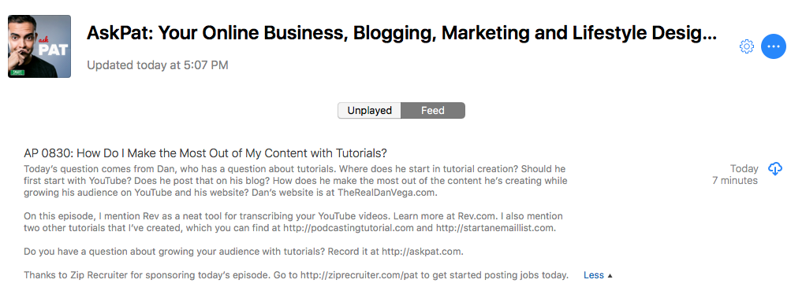

I recently had my question featured on the Ask Pat Podcast. For those of you who don't know Pat Flynn, he's a very successful entrepreneur who runs the website [Smart Passive Income](https://www.smartpassiveincome.com). Smart Passive Income is a resource to teach you proven strategies for running an online business and optimizing it for passive income. The Ask Pat podcast is your business questions answered in a bite-sized podcast five days a week, Monday through Friday. I can hear the questions coming in now. Dan, I thought you were going to stop blogging about business related topics. That is still my focus but in this case, I can assure you this article has some real value for my audience.  

## My Ask Pat Question

Before we get going I would suggest [heading over to the podcast](https://www.smartpassiveincome.com/ask-pat/) and listen to episode #830. The whole podcast is only 6 minutes and 45 seconds so it will be a quick listen. If you're new to the podcast I would suggest subscribing, it is an awesome resource.  

 
*Ask Pat: Your Online Business, Blogging, Marketing and Lifestyle Design Questions Answered Daily!   If you didn't get a chance to listen to the episode, here is a quick summary of my question.*

> When I come up with a new idea for a tutorial where should I start and can I use that tutorial on various platforms. When I have an idea for new content should I start by posting that on YouTube and then maybe a week later post that on the blog.

This is really useful to anyone who is currently blogging and trying to use that same content on multiple channels. I am trying to produce great content for both my Blog & YouTube channel so that I can grow subscribers on each. This can be a tough thing to do when trying to come up with fresh content for each. 

## Pat Flynn's Answer

Pat suggest that I start with a video on the YouTube channel and make sure that subscribers know this is the place where content will come out first. This will encourage people to get that content quicker by subscribing to the YouTube channel. We can then take that content from the YouTube video and move it over to the blog.  We can take advantage of cross-promotion between the blog and YouTube channel. When we post this content to the YouTube channel we can push users back to the blog for even more tips, tricks, and tutorials. When we post content on the Blog we can let visitors know that this content actually came out a week ago on YouTube so if you want to get this content early, subscribe to my channel.  Another suggestion from Pat which I have already begun working on his to provide incentives for visitors who subscribe to my mailing list. When I post a tutorial there could be x number of steps and I could provide those steps as part of a checklist download. This is very important and I am working on providing more valuable downloads to my visitors who subscribe.  If you're going to take your YouTube videos and you want an easy way to transcribe them you can check out [Rev](https://www.rev.com/). This should cut down on some of the writing when I move a YouTube video over to the blog. I can then post the video and the text and this service will definitely save some time. 

## Conclusion

I ended my question to Pat with this but I just want to say it again. Thank you, Pat, for all the valuable content you provide and thank you so much for answering my question. These are some great actionable items I have to move forward with and I am looking forward to implementing them.  

_**Question:** Do you face similar issues in cross-promoting content? What have you found to be successful for you? _