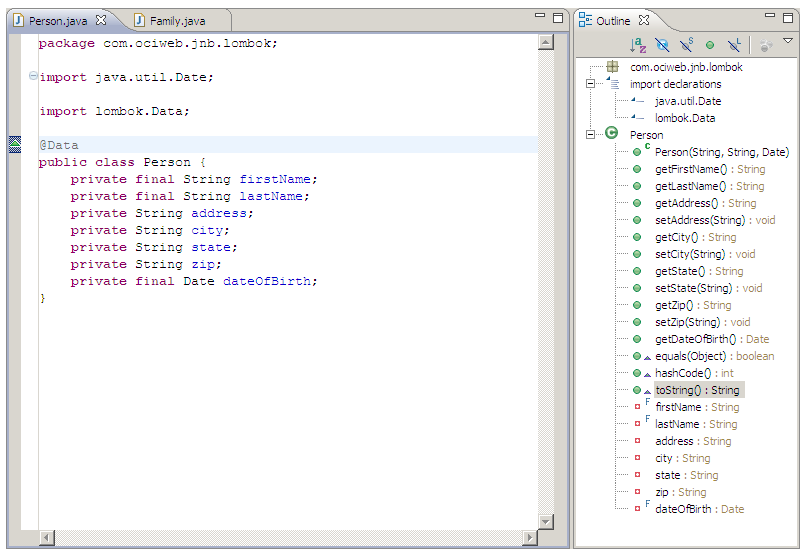
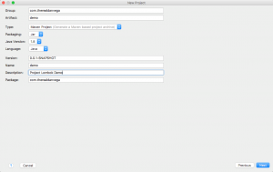
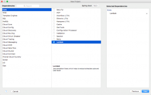
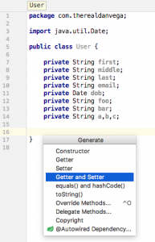
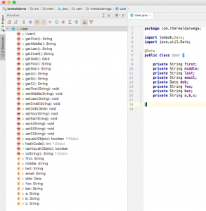

In this article, we get to take a look at an awesome little project called [Project Lombok](https://projectlombok.org/). If you have been following me for awhile now then you already know [I am a huge fan](http://courses.danvega.dev/p/the-complete-apache-groovy-developer-course) of the [Groovy Programming Language](http://groovy-lang.org/). It takes a lot of the things I don't like in Java and makes them better. Like, way better! Groovy is also really _GOOD_ at cutting down the amount of ceremonious code you have to write. If you are working on a Java project and are looking for a way to cut down some of the noise in your code I have a great solution for you. In this article, we are going to look at Project Lombok and dive into what it is and how to use it in your next Spring Boot Application. 

## What is Project Lombok?

As I said in the introduction to this article, one of the biggest complaints against Java is how much noise can be found in a single class. Project Lombok saw this as a problem and aims to reduce the noise of some of the worst offenders by replacing them with a simple set of annotations.  One of the worst offenders in Java are classes that have a ton of fields in them and consist of a getter & setter for each property. I will refer to these "types" of classes as data classes going forward. IDEs have a come a long way and help us generate this code but every single time you make a change to that data class you will need to go back and regenerate that code or even worse, write it yourself. In this example below, straight from the documentation, all of the getters, setters and a to string method were created for us just by adding the @Data annotation to our Data class.

 *Project Lombok in Action*

Pretty awesome right? Project Lombok consists of more than just this single annotation. If you want to learn about them please [read through the documentation](http://jnb.ociweb.com/jnb/jnbJan2010.html#intro). For now, we are just going to run through a basic demo. 

## Project Lombok Demo

### Before Project Lombok

We are going to create a new Spring Boot application. If you want to grab the [project source code you can do so here](https://github.com/cfaddict/lombok). You can select Lombok right from the core section of the Spring Initilizr. 





I am going to create a new user object with a bunch of fields. 

```java
package com.therealdanvega;

import java.util.Date;

public class User {

    private String first;
    private String middle;
    private String last;
    private String email;
    private Date dob;
    private String foo;
    private String bar;
    private String a,b,c;

}
```

That looks like a pretty clean class, but we aren't done yet. Now we need to create a getter & setter for each of those properties. We also would probably want to add a toString, equals and hashCode method to our class. If you didn't know this already, you can generate these using cmd + n on the mac (cntrl+n on a PC).



Now our class is correct but that is a whole bunch of unwanted code. Not to mention what a maintenance nightmare this is. Every single time this class changes we need to update the getters, setters, and methods by generating them over or even worse, actually writing code. 

```java
package com.therealdanvega;

import java.util.Date;

public class User {

    private String first;
    private String middle;
    private String last;
    private String email;
    private Date dob;
    private String foo;
    private String bar;
    private String a,b,c;

    public String getFirst() {
        return first;
    }

    public void setFirst(String first) {
        this.first = first;
    }

    public String getMiddle() {
        return middle;
    }

    public void setMiddle(String middle) {
        this.middle = middle;
    }

    public String getLast() {
        return last;
    }

    public void setLast(String last) {
        this.last = last;
    }

    public String getEmail() {
        return email;
    }

    public void setEmail(String email) {
        this.email = email;
    }

    public Date getDob() {
        return dob;
    }

    public void setDob(Date dob) {
        this.dob = dob;
    }

    public String getFoo() {
        return foo;
    }

    public void setFoo(String foo) {
        this.foo = foo;
    }

    public String getBar() {
        return bar;
    }

    public void setBar(String bar) {
        this.bar = bar;
    }

    public String getA() {
        return a;
    }

    public void setA(String a) {
        this.a = a;
    }

    public String getB() {
        return b;
    }

    public void setB(String b) {
        this.b = b;
    }

    public String getC() {
        return c;
    }

    public void setC(String c) {
        this.c = c;
    }

    @Override
    public String toString() {
        return "User{" +
                "first='" + first + '\'' +
                ", last='" + last + '\'' +
                ", email='" + email + '\'' +
                '}';
    }

    @Override
    public boolean equals(Object o) {
        if (this == o) return true;
        if (o == null || getClass() != o.getClass()) return false;

        User user = (User) o;

        if (!first.equals(user.first)) return false;
        if (middle != null ? !middle.equals(user.middle) : user.middle != null) return false;
        if (!last.equals(user.last)) return false;
        if (!email.equals(user.email)) return false;
        if (!dob.equals(user.dob)) return false;
        if (foo != null ? !foo.equals(user.foo) : user.foo != null) return false;
        if (bar != null ? !bar.equals(user.bar) : user.bar != null) return false;
        if (a != null ? !a.equals(user.a) : user.a != null) return false;
        if (b != null ? !b.equals(user.b) : user.b != null) return false;
        return c != null ? c.equals(user.c) : user.c == null;
    }

    @Override
    public int hashCode() {
        int result = first.hashCode();
        result = 31 * result + (middle != null ? middle.hashCode() : 0);
        result = 31 * result + last.hashCode();
        result = 31 * result + email.hashCode();
        result = 31 * result + dob.hashCode();
        result = 31 * result + (foo != null ? foo.hashCode() : 0);
        result = 31 * result + (bar != null ? bar.hashCode() : 0);
        result = 31 * result + (a != null ? a.hashCode() : 0);
        result = 31 * result + (b != null ? b.hashCode() : 0);
        result = 31 * result + (c != null ? c.hashCode() : 0);
        return result;
    }
}
```

### After Project Lombok

Now that we have Lombok in our application we can reduce this noise. Just add that @Data annotation to your class. This will create a getter and setter for each property defined in your class. It will also create a to string, equals and hash code method. You can get pretty granular control with some of the annotations so again I would [refer you to the documentation](http://jnb.ociweb.com/jnb/jnbJan2010.html). 

```java
package com.therealdanvega;

import lombok.Data;
import java.util.Date;

@Data
public class User {

    private String first;
    private String middle;
    private String last;
    private String email;
    private Date dob;
    private String foo;
    private String bar;
    private String a,b,c;

}
```

The great thing about Lombok is that it integrates well with the IDE. I am using IntelliJ but this will work in Eclipse as well. If you look over at your project structure you can see that all of these methods now exist without us having to write them. We also don't have to guess as to whether it worked or not, we can clearly see that it did. Not to mention, look how clean our class looks! 



## Conclusion

There is absolutely no reason you shouldn't be using Project Lombok today. If it's not a brand new project you can simply drop in the dependency and go. I hope you found this tutorial useful and I want to leave you with a question to hopefully kick start a discussion. 

_**Question**: What are some of your favorite tools & libraries to help in the creation of better, cleaner code? _
