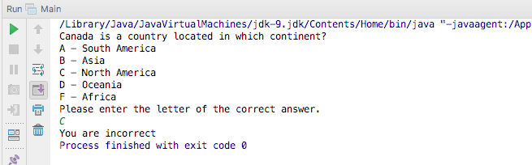

This is going to be a fun and personal post for me. The problem that we are going to look at in this article is something we are taught as young software developers.  \[featured-image single\_newwindow="false" alt="Java Equals vs '=='"\] I saw this question on a facebook group that I am a part of and I made the same mistake at work debugging a critical ticket. If you want to find out what trips up newbies and veterans alike, continue reading this article. 

## The Problem

The problem we are going to look at today has to do with comparing values in Java. This is language agnostic issue though as every language has its own way to deal with object values and references.  We are going to start by looking at a question I saw in the facebook group I am in. Given the title and subject of this article, you might be able to easily find the problem. What is the output of this code and why is that output returned to us? 

import java.util.Scanner;

public class Main {

    public static void main(String\[\] args) {

        Scanner input = new Scanner(System.in);

        String answer;

        System.out.println("Canada is a country located in which continent?");
        System.out.println("A - South America");
        System.out.println("B - Asia");
        System.out.println("C - North America");
        System.out.println("D - Oceania");
        System.out.println("F - Africa");
        System.out.println("Please enter the letter of the correct answer.");
        answer = input.nextLine();

        if (answer == "C") {
            System.out.print("You are correct");
        } else {
            System.out.print("You are incorrect");
        }

    }

}

If you run this code and enter "C" as your answer, the program will print out "You are incorrect".   So what happened here? Why didn't the program print out "You are correct"? The problem with this program is with the following code. 

if (answer == "C") {
    System.out.print("You are correct");
} else {
    System.out.print("You are incorrect");
}

The variable answer is a String and we are using == to compare the value to "C". We know that if we compare the value "C" to "C" that they should be equal. In fact, they are equal but the problem lies with the operator. 

### The "==" Operator

In Java, we use the "==" operator to compare 2 objects to see if the refer to the same place in memory. When we create the variable answer and assign it a value that is a reference to that object. When we compare that object in memory to the value "C" those are not the same so "==" will return false. The following is an example of where 2 variables reference the same object. 

public class Main {

    public static void main(String\[\] args) {

        String name = "Dan";
        String myName = name;

        if( name == myName ){
            System.out.println("name is equal to myName");
        }

    }

}

## The Solution

If that is the case how can we fix our program? The String class actually contains a method called .equals. With that knowledge, we can fix our application by replacing that "==" with .equals. 

import java.util.Scanner;

public class Main {

    public static void main(String\[\] args) {

        Scanner input = new Scanner(System.in);

        String answer;

        System.out.println("Canada is a country located in which continent?");
        System.out.println("A - South America");
        System.out.println("B - Asia");
        System.out.println("C - North America");
        System.out.println("D - Oceania");
        System.out.println("F - Africa");
        System.out.println("Please enter the letter of the correct answer.");
        answer = input.nextLine();

        if( answer.equals("C") ) {
            System.out.print("You are correct");
        } else {
            System.out.print("You are incorrect");
        }

    }

}

Now instead of comparing objects, we are simply comparing values. That is why you will often hear programmers say "compare by value, not reference". We probably fix a couple other issues with this program but that is neither here nor there. 

## Conclusion

Remember when I told you that I made this same mistake at work? There is actually a good reason for this. I was working in a Java program and this gives me some problems from time to time because of my love for the [Groovy Programming language](http://bit.ly/2n5SBn6). I would say I am writing Groovy 90% of the time and because of that, I become used to the syntax. In Groovy we actually overload the "==" operator so that comparison would actually work.  _**Question:** What are some of the fundamental programming concepts that still trip you up once in awhile?_