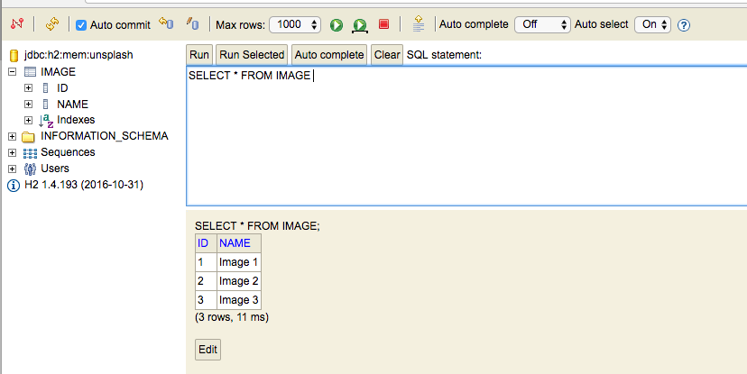
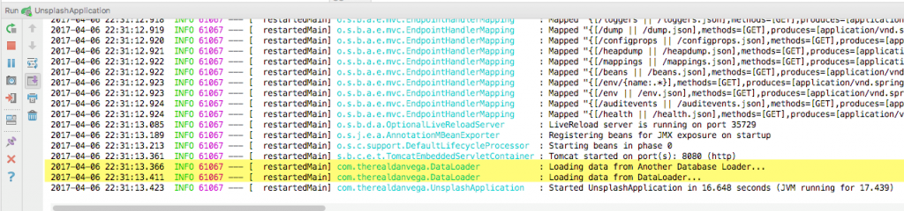

A student asked me the other day what a Command Line Runner was and when can we use one. If you watch demos of Spring Boot features or applications you have probably seen this and said to yourself "What the heck is that?". \[featured-image single\_newwindow="false" alt="Command Line Runner"\] If you take a look a look at the API Documentation for Command Line Runner you will get this elegant explanation. 

> Interface used to indicate that a bean should _run_ when it is contained within a SpringApplication. Multiple CommandLineRunner beans can be defined within the same application context and can be ordered using the Ordered interface or @Order annotation.

In this article, I will explain what a Command Line Runner is and how we can take advantage of it in our applications. 

## Command Line Runner

As we saw from the API documentation definition the Command Line Runner is an interface. This means that we can't create an instance of it but we can implement it.  If we define an implementation of the Command Line Runner interface we will need to override the run method. This method will be executed after the application context is loaded and right before the Spring Application run method is completed. 

package com.therealdanvega;

import org.springframework.boot.SpringApplication;
import org.springframework.boot.autoconfigure.SpringBootApplication;

@SpringBootApplication
public class UnsplashApplication {

	public static void main(String\[\] args) {
		SpringApplication.run(UnsplashApplication.class, args);
	}
}

Before we dive in and create one we should talk about some of the things you might want to use this for. Remember that this going to execute after the application context is loaded so you could use it to check if certain beans exist or what values of certain properties are.  Another reason to use it is to load some data right before your application fires up. I will say that I have used a Command Line Runner for these purposes before but they were both in development or demo environments. 

### Command Line Runner Demo

In this demo, we are going to create a DataLoader class that is going to load some initial demo data into our application. For demo purposes pretend we created a web application with JPA & H2 and a simple Image class that looks like this.

package com.therealdanvega.domain;

import lombok.Data;
import lombok.NoArgsConstructor;

import javax.persistence.Entity;
import javax.persistence.GeneratedValue;
import javax.persistence.Id;

@Entity
@Data
@NoArgsConstructor
public class Image {

    @Id @GeneratedValue
    private Long id;
    private String name;

    public Image(String name) {
        this.name = name;
    }
}

When my application starts up I want to load a couple of images into our database. I could place a SQL script in the resources folder, but I don't care for writing SQL from scratch.  The first thing we need to do is create a DataLoader class in our main package. This class is going to implement the Command Line Runner interface and override the run method. The other important thing to note here is that we need to annotate our class with @Component or Spring will never find it. 

package com.therealdanvega;

import org.slf4j.Logger;
import org.slf4j.LoggerFactory;
import org.springframework.boot.CommandLineRunner;
import org.springframework.stereotype.Component;

@Component
public class DataLoader implements CommandLineRunner {

    private final Logger logger = LoggerFactory.getLogger(DataLoader.class);

    @Override
    public void run(String... strings) throws Exception {
        logger.info("Loading data...");

    }
}

Now I want to load some data. I have an Image Service that has a save method that calls a JPA repository. I will simply call that save method and pass in a few new image instances. 

package com.therealdanvega;

import com.therealdanvega.domain.Image;
import com.therealdanvega.service.ImageService;
import org.slf4j.Logger;
import org.slf4j.LoggerFactory;
import org.springframework.boot.CommandLineRunner;
import org.springframework.stereotype.Component;

@Component
public class DataLoader implements CommandLineRunner {

    private final Logger logger = LoggerFactory.getLogger(DataLoader.class);

    private ImageService imageService;

    public DataLoader(ImageService imageService) {
        this.imageService = imageService;
    }

    @Override
    public void run(String... strings) throws Exception {
        logger.info("Loading data...");

        imageService.save(new Image("Image 1"));
        imageService.save(new Image("Image 2"));
        imageService.save(new Image("Image 3"));

    }
}

If we fire up the application and look at the H2 console we will see our new database rows.  

### Advanced Command Line Runner Examples

What if you wanted to create 2 Command Line Runners that did contained completely separate logic? No problem, just use the annotation Order to specify the order in which they should run. 

package com.therealdanvega.service;

import com.therealdanvega.DataLoader;
import com.therealdanvega.domain.Image;
import org.slf4j.Logger;
import org.slf4j.LoggerFactory;
import org.springframework.boot.CommandLineRunner;
import org.springframework.core.annotation.Order;
import org.springframework.stereotype.Component;

@Component
@Order(1)
public class AnotherDatabaseLoader implements CommandLineRunner {

    private final Logger logger = LoggerFactory.getLogger(DataLoader.class);

    private ImageService imageService;

    public AnotherDatabaseLoader(ImageService imageService) {
        this.imageService = imageService;
    }

    @Override
    public void run(String... args) throws Exception {
        logger.info("Loading data from Another Database Loader...");

        imageService.save(new Image("Image 4"));
        imageService.save(new Image("Image 5"));
        imageService.save(new Image("Image 6"));

    }

}

package com.therealdanvega;

import com.therealdanvega.domain.Image;
import com.therealdanvega.service.ImageService;
import org.slf4j.Logger;
import org.slf4j.LoggerFactory;
import org.springframework.boot.CommandLineRunner;
import org.springframework.core.annotation.Order;
import org.springframework.stereotype.Component;

@Component
@Order(2)
public class DataLoader implements CommandLineRunner {

    private final Logger logger = LoggerFactory.getLogger(DataLoader.class);

    private ImageService imageService;

    public DataLoader(ImageService imageService) {
        this.imageService = imageService;
    }

    @Override
    public void run(String... args) throws Exception {
        logger.info("Loading data from DataLoader...");

        imageService.save(new Image("Image 1"));
        imageService.save(new Image("Image 2"));
        imageService.save(new Image("Image 3"));

    }
}

If we look in the console we can see that Another Database Loader ran first.  You might also see examples where the Command Line Runner is created right in the main application class. Thanks to Java 8, when we have an interface with a single method we can implement it using a lambda expression. This helps us cut down some of the boilerplate code that creating a class to implement an interface that contains a single method creates. 

package com.therealdanvega;

import org.springframework.boot.CommandLineRunner;
import org.springframework.boot.SpringApplication;
import org.springframework.boot.autoconfigure.SpringBootApplication;
import org.springframework.context.annotation.Bean;

@SpringBootApplication
public class UnsplashApplication {

	public static void main(String\[\] args) {
		SpringApplication.run(UnsplashApplication.class, args);
	}

	@Bean
	CommandLineRunner runner(){
		return args -> {
			System.out.println("CommandLineRunner running in the UnsplashApplication class...");
		};
	}

}

## Conclusion

I hope this helped clear up some confusion on what a Command Line Runner is and how to use it. If you're already using a Command Line Runner in your applications I would like to leave you with this question to kick start a discussion.  _**Question:** What are some other uses for a Command Line Runner?_