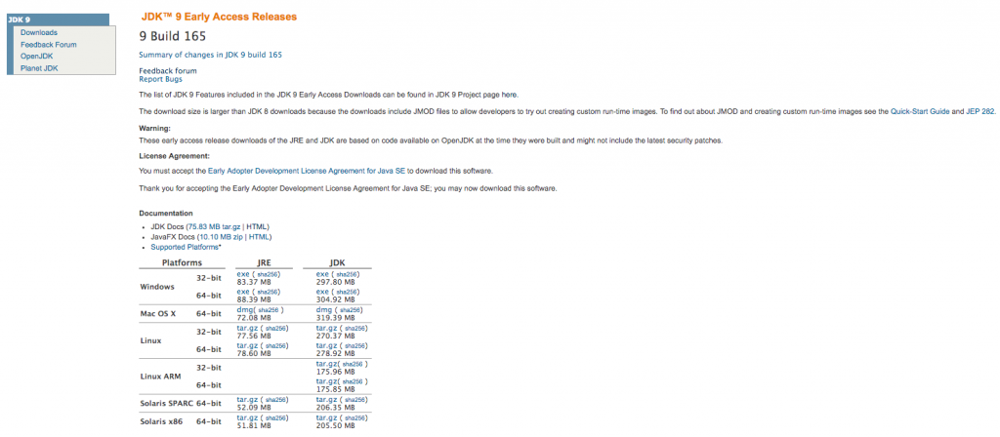
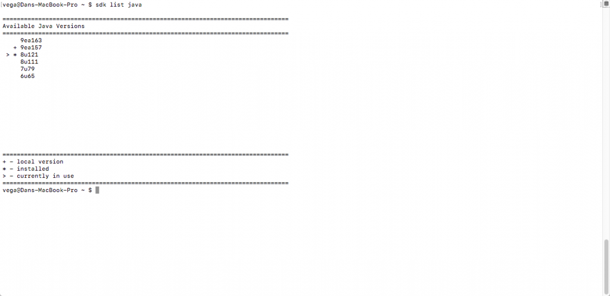
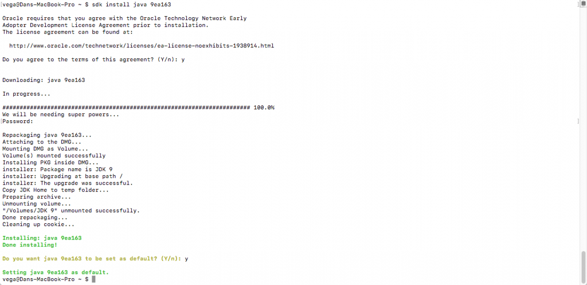
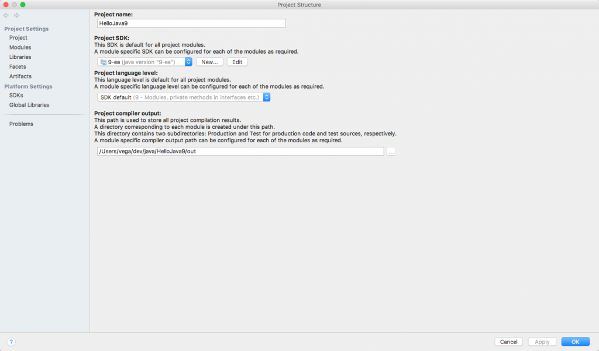

I don't know about you but I love to play around with pre-releases of software. There is something really fun being one of the first to use a new feature and learn how the new release is going to make our lives as developers a little bit easier. Java 9 is coming soon and I am really looking forward to some of the new features.  \[featured-image single\_newwindow="false" alt="Java 9"\] Java 9 has had a couple of delays to date but as I am writing this article (April 2017), it is set to be released in July 2017. There are so many great features in Java 9 and you don't have to wait until July to start checking them out today. In this article, we will go through a quick tutorial on where to get Java 9 and how to get yourself setup. 

## Installing Java 9

The first thing we need to do if we want to use Java 9 is to install it. You will head over to [https://jdk9.java.net](https://jdk9.java.net) and bookmark this site as it contains a bunch of great information and links about Java 9. From there you are going to click on **_Downloads_** in the upper left-hand menu.  The build may be a different one if you're reading this at a later date but that is OK. Accept the user agreement and then download the correct version of the _**JDK**_ for your platform. The Installation is pretty straight forward so just follow the instructions.   If you follow me at all you might know what a huge fan of [SDKMan](http://sdkman.io/) I am. What you might not know is that you can use SDKMan to manage your Java installs as well now. It is now easier than ever to install and switch between versions of Java. If we run the command "sdk java list" we can see that there is a new version for me to install.   Now I can run the install command and SDK will pull down that version, make it my default and add the appropriate environment variables.   It seriously couldn't be any easier! 

## Java 9 New Features

Now that you have Java 9 installed what are the new features we can start to play with? If you have heard any news yet about Java 9 you have probably heard about Modularity. The most significant JDK 9 enhancement is the Java Platform Module System, which divides the JDK into a set of modules. This isn't the only new feature though, here are a list of my favorites. 

*   Module System
*   Unified JVM Logging
*   Java 9 REPL (JShell)
*   HTTP 2 Client
*   Stream API Improvements
*   Reactive Streams
*   Optional Class Improvements

You can read all about these new features on the [JDK 9 Project Page](http://openjdk.java.net/projects/jdk9/). You can also subscribe to this blog as I will be writing up articles and creating video tutorials for YouTube about some of my favorite new features. 

## Java 9 & IntelliJ 

IntelliJ 2017 brings up Java 9 support. When you open an existing project or create a brand new you just want to make sure you are using the correct version of Java. In your project go to File > Project Settings. Make sure that you are using the Java 9-ea (Early Access) SDK and that the language level is set to Java 9 as well.  

## Getting Started with Java 9 Screencast

I created a screencast that goes through the information we mentioned in this article. If you're not subscribed to my YouTube channel please do so now so that you can get these videos before they hit my blog.  https://www.youtube.com/watch?v=D-O7eDbdcKg

## Conclusion

This is a great time to start playing with the new features in Java 9. I am working on a curriculum for a **_What's new in Java 9 Course_**. If you would be interested in learning more about that please [head over to the course landing page](https://therealdanvega.com/java-9).  _**Question:** What are you most looking forward to in Java 9?_