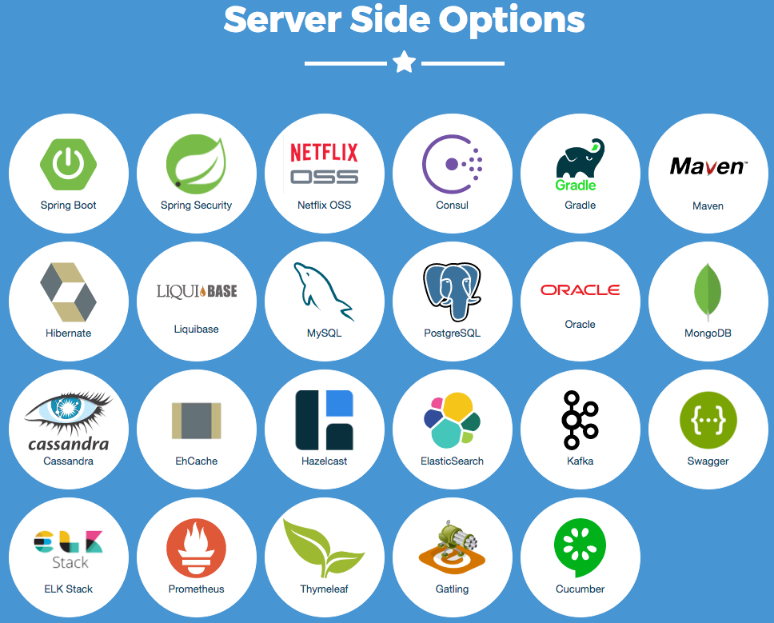
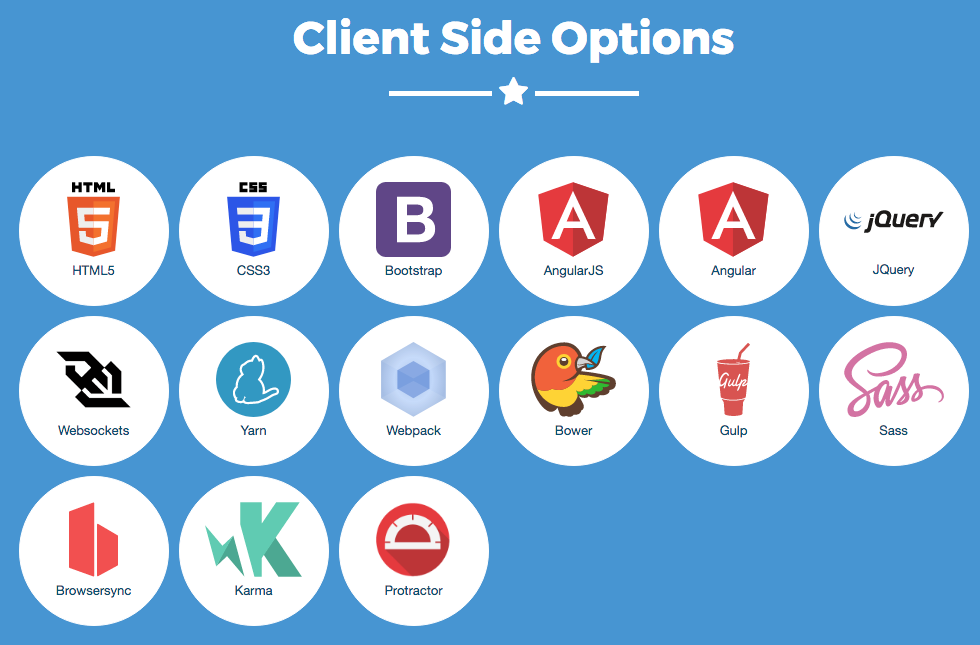
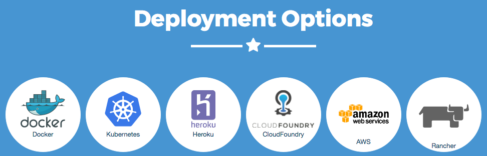
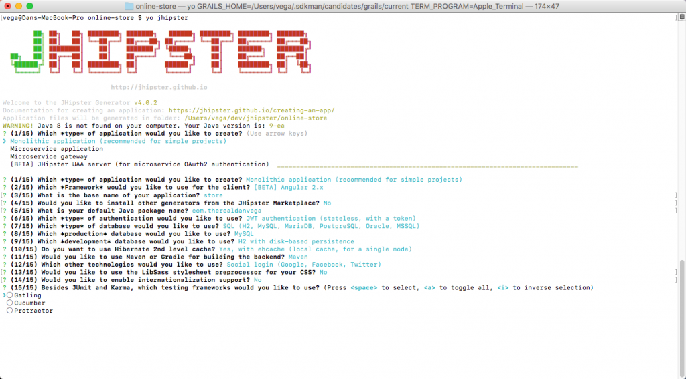

In today's post, I want to talk to you about one of my favorite open source projects around, [JHipster](https://jhipster.github.io/). In short, JHipster is a [Yeoman Generator](http://yeoman.io/) used to create a [Spring Boot](http://projects.spring.io/spring-boot/) and [Angular](https://angular.io/) project. When you get past building sample and demo projects there is a lot of different technologies and stacks that go into building a scalable, complete and modern web application.

The goal of the project is to generate for you a complete and modern Web app, unifying:

*   A high-performance and robust Java stack on the server side with Spring Boot
*   A sleek, modern, mobile-first front-end with Angular and Bootstrap
*   A powerful workflow to build your application with Yeoman, Webpack/Gulp and Maven/Gradle

## What is JHipster

JHipster in simple terms is a way to generate a project around some of my favorite technologies. There are generally 3 sides of a story in every modern web application.

*   What does the server side stack look like?
*   What does the front end stack look like? 
*   How do we deploy our application? 

### Server Side

If you follow me at all you know that I am a huge fan of [Spring Boot](http://projects.spring.io/spring-boot/), so much so that [I teach a course on it](http://courses.danvega.dev/p/spring-boot-intro). It isn't enough to just understand Spring Boot though when it comes to building complete and modern web applications.  When we begin building the back end we start asking questions like:

*   What does the security model look like?
*   What does the data layer look like?
*   Will we need a distributed caching system?
*   Is this application scalable?  
*   How can we provide API documentation?
*   How can we make sure that we are testing our application and that we have sufficient code coverage?

When we start looking at the Server Side Options we are talking about technologies like these.  

### Front End

We spent a lot of time thinking about the back end of the project but now we need to make sure it's functional. Angular is one of the most popular front-end technologies around but it doesn't come without some confusion. There are all these different versions and they seem drastically different. Lucky for you JHipster is going to support all of them. We also want to create a web application that looks good using the latest technologies in HTML 5, CSS 3 & Bootstrap. There are also build tools on the front end to think about. How are we going to test that front end code? When we think about all of these technologies these are our options on the front end.  

### Deployment Options

Now that we have our application built we need to deploy it. JHipster gives us a bunch of options for easily deploying our applications.  

## Why JHipster

I hope you are starting to see why JHipster is needed. Sure you could go out and piece together all of these technologies but why on earth would you want to do that. The number of hours it would take to make all of those play together nicely would blow you away. That doesn't sound like fun at all so I will stick to using JHipster. I fire up a command line and type "yo jhipster" and I am presented with a list of options of how my application is going to look.  

If you want to see what a sample JHipster application looks like without installing it you can [check it out here](https://github.com/jhipster/jhipster-sample-app).

## Upcoming Course

I want all of you reading this to that I love this project so much that I have decided to launch a course on it. If you want to find out more about this please click on the link below.  

[Spring Boot & Angular Course](https://danvega.dev/jhipster)

## Conclusion

We will get into how to install JHipster in future posts and how to use it but I wanted to start off here with a gentle introduction to the project. If you are using JHipster I want to hear from you. Please let me know what questions you have in building Spring & Angular applications.  

_**Question:** What are some of your favorite open source projects? _