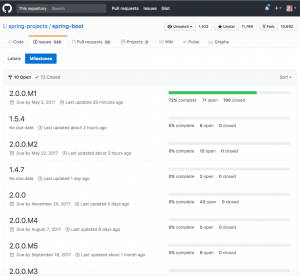
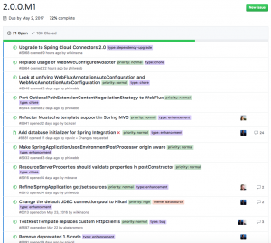

I am a huge fan of open source projects but I love a well-maintained project even more. I like to know when milestones are scheduled to be released and what are some of the features we can expect in them. The Spring Boot team does a very good job of making this information available to the public. Thanks to that we have a pretty good idea of when Spring Boot 2.0 is going to land and some of the features that it will include. In this article, I want to talk about that roadmap and share with you a pretty big announcement. 

## Spring Boot 2.0 Milestones

The current date is April 24, 2017, just so you understand my perspective looking at this roadmap. Obviously, if you look at it months from now it might look a little different so please keep that in mind. If you head over to the [Github project page](https://github.com/spring-projects/spring-boot/) you will have access to all of the source code as well as the readme to get you started.  If you click on the issues tab though and then [click on milestones](https://github.com/spring-projects/spring-boot/milestones) you will be looking at something that looks like this.  

What you are looking at here is a list of milestone releases. Clicking on the release, in this case, 2.0.0.M1 you will be shown a list of all that tasks that belong to that milestone.  

From here you can see that there is a due date of May 2 and that it is 72% completed. This gives you some awesome insight into what the Spring Boot team is working on in each release and how far along they are.  The big milestones that I care about are the release candidates (RC) because this means we are getting real close to the actual release. 

*   [2.0.0.RC1](https://github.com/spring-projects/spring-boot/milestone/56) (October 23, 2017)
*   [2.0.0.RC2](https://github.com/spring-projects/spring-boot/milestone/80) (November 9, 2017) 
*   2.0.0.RELEASE (December 4th???)

If we look at this timeline and then take a look at what is around the corner can take a good guess at when Spring 2.0 will be released. The [SpringOne conference](https://springoneplatform.io/) takes place in San Francisco on December 4th. It is safe to assume we will probably see the release the night before or on December 4th. So, if you haven't already booked your ticket for SpringOne you might want to start thinking about doing so soon.

## Spring 2.0 Features

Please remember that I am not on the Spring Boot Team and anything written here is purely based off of information I found. This means that something might change by the time we actually get to the release. I am pulling this information from the milestones, release notes and anything that I can find on the interwebs. 

### Spring Framework 5.0

Spring Boot 2.0 builds on and requires Spring Framework 5.0. There are a number of nice refinements in Spring Framework 5.0 including extensive support for building reactive applications. Please refer to the [Spring Framework Wiki](https://github.com/spring-projects/spring-framework/wiki/What%E2%80%99s-New-in-the-Spring-Framework#whats-new-in-spring-framework-5x) for details. This is probably the biggest feature of the release and I know many of use have been looking forward to this release for awhile now. Spring Framework 5.0 brings with it a bunch of new features but none bigger than their Reactive initiative. 

### Java 8 Baseline

Spring Boot 2.0 is going to require that you run Java 8. This means that Java 6 & 7 will no longer be supported. My guess is that one of the 1.5.x releases will be the last version to support this. I also am excited that [Java 9 is going to be supported as well](https://github.com/spring-projects/spring-boot/issues/7226). 

### New Gradle Plugin

Spring Boot’s Gradle plugin no longer automatically applies the dependency management plugin. Instead, Spring Boot’s plugin now reacts to the dependency management plugin being applied by importing the correct version of the spring-boot-dependencies bom. This gives you more control over how and when dependency management is configured. 

[https://spring.io/blog/2017/04/05/spring-boot-s-new-gradle-plugin](https://spring.io/blog/2017/04/05/spring-boot-s-new-gradle-plugin)

### Thymeleaf 3

Spring Boot 2.0 will now support Thymeleaf 3. This will be an update to both the Thymeleaf & Spring Security Thymeleaf dependencies. If you want to read more about Thymeleaf 3 you can do so [here](http://www.thymeleaf.org/doc/articles/thymeleaf3migration.html).

### @ConditionalOnBean

 `@ConditionalOnBean`  now uses a logical AND rather than a logical OR when determining whether or not the condition has been met.

### JUnit 5

This is probably a huge _maybe_ at this point. There is a [task to investigate](https://github.com/spring-projects/spring-boot/issues/6402) if an upgrade to JUnit 5 makes sense. 

### Jetty

The minimum supported version of Jetty is now 9.4

### [Tomcat](https://github.com/spring-projects/spring-boot/wiki/Spring-Boot-2.0-Release-Notes#tomcat)

The minimum supported version of Tomcat is now 8.5

### [Hibernate](https://github.com/spring-projects/spring-boot/wiki/Spring-Boot-2.0-Release-Notes#hibernate)

The minimum supported version of Hibernate is now 5.2

### [Gradle](https://github.com/spring-projects/spring-boot/wiki/Spring-Boot-2.0-Release-Notes#gradle)

The minimum supported version of Gradle is now 3.4

### Bug Fixes & Feature Enhancements

There is plenty more to come and I will try and keep this article up to date as I find them.

## Spring 2.0 Course

If you haven't already had a chance to check out my [Spring Boot Introduction course](http://courses.danvega.dev/p/spring-boot-intro) please do. This course is based on Spring Boot 1.3 and was very much an introduction. My announcement today is that a Spring 2.0 course is coming and I will be releasing it sometime around SpringOne.  

 

This is not just going to be a repeat of the previous course with a few new features. First off, I am going to create 2 free courses for setting up your development environment on both Windows 10 and Mac OS. Next, I will incorporate the feedback I have received from my current students. My current course is the best selling course on one platform and I know there is tons of room for improvement.  These courses will allow me to extract that portion of the course that some find necessary and others find boring. These courses will be bundled for free into the Spring Boot 2.0 course. I am working on the curriculum now but if you would like to receive updates check out my [Spring Boot 2.0 Course Page](https://danvega.dev/spring-boot-2-0) and signup for updates. Anyone on this list will be the first to find out when it's released and will receive a discount. 

## Conclusion

A lot of exciting things happening around Spring Boot 2.0. You have the release itself, The Spring One Conference and now a course to along with it. Invest in yourself and some pretty amazing things can happen. Take care friends!  

_**Question:** What are you looking forward to in Spring Framework 5.0 & Spring Boot 2.0?_