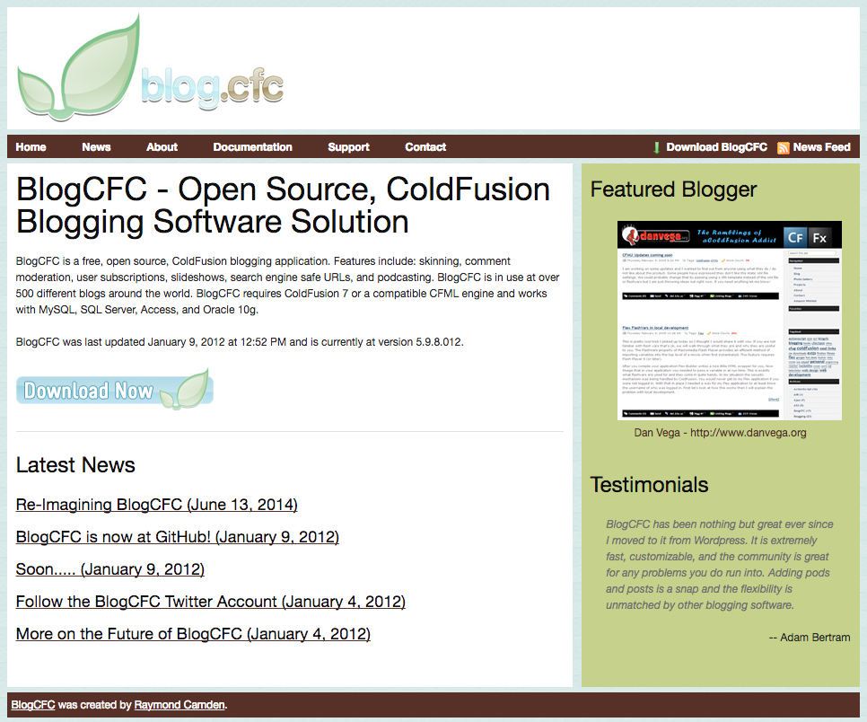

In this article, I want to dive into why I believe that every developer should start a blog right now. This will be a little bit of a bias opinion because I believe this is where both my career and my life's mission started. \[featured-image single\_newwindow="false" alt="Developer Blog"\]  I realize that not everyone is walking the same path as I am in life. With that said I do see some real value in sharing your experiences as a developer with others. I am going to share my journey with you and give you the one thing I wish I would have known when I started blogging.

## Why I started Blogging

I know that a lot of people start blogging because they want to have their voice heard. That wasn't the case for me when I started writing and it doesn't need to be your reason either.

### BlogCFC

When I started I did it because I honestly wanted to learn how to build stuff. I looked up to a bunch of developers in the ColdFusion community and all of them all had blogs. One of those bloggers was [Ray Camden](https://www.raymondcamden.com/) and he had this cool open source blogging software called [BlogCFC](http://www.blogcfc.com/index.cfm).   Below is a screenshot of the website that I would one day help Ray create. It might not look like much but I was really excited to be a part of an open source project. If you look closely you can see a screenshot of my old blog.   So there was this community of bloggers and I really wanted to be one of them. I downloaded this open source blogging software and I learned how to install it locally, customize it and publish it to a production server.  So not only was I now blogging but I was also involved in the community and a part of an open source project. This point of being involved in a community is a special one and we will dive into that deeper later in this article. I started writing in October 2005 and while my focus might have changed over the years my goal hasn't. I wanted to learn "stuff" and I wanted to understand it to the point where I could help other people understand it as well.  This innate sense to want to help others ultimately led me to what I am doing today.  This innate sense to lead and help others ultimately led me to what I am doing today. 

## Why You Should Start Blogging

As I said at the beginning of this article I completely understand that everyone's goals are not the same as mine. I do believe there are some real good reasons for you starting your own blog and we will discuss those here. Before we jump into those I also want to stress that this isn't just for new developers. It is **never** too late to start writing and be a part of a community so please don't let silly numbers like age or years on the job stop you from being a part of something great. 

### Improve your writing skills

I don't think there is anyone that is reading this that couldn't benefit from improving your writing skills. This is a skill that will follow you around in life and it doesn't hurt to constantly work on it. Whether you're writing a resume or an email to a friend, good writing and more importantly, terrible writing is easy to spot.    _Pro Tip:_ _If you aren't already using [Grammarly](https://www.google.com/url?sa=t&rct=j&q=&esrc=s&source=web&cd=1&cad=rja&uact=8&ved=0ahUKEwiqgvCNlcfTAhVrqlQKHZuxB0wQFgg1MAA&url=https%3A%2F%2Fwww.grammarly.com%2F&usg=AFQjCNEEJC76jVSls2ggmUw2JGlwSqyTtQ&sig2=CCSGHVYnlTRRQgZ96zRpAA) you need to check it out._

### Boost You Resume

A personal blog where talk passionately about what you do is only going to help your career. You have to remember that potential employers are Googling you to see what comes up. If your personal blog, YouTube channel and Github account come up, that is a **WIN**. This screams that you are passionate about what you do and that it isn't just a job. 

### Community

When I started writing I would write about stuff that I came across as an everyday developer. In doing so I would start to conversate with other members of the community. To me, this is very important for all developers.  If you work for a smaller company chances are you don't have a large number of developers that you can look up to. If you get involved in the community you have a chance to have discussions about the problems you face with developers who have real world experience.  The biggest part of the community for me was the connections I made. I am blessed to have met some really great people just by chatting them up at conferences. A majority of these conversations started because of my blog and being involved in the community.  Did I happen to mention that I have my current job because of connections I have made in the community? I'm also proud to say that 4 coworkers will be attending my wedding later on this year. These are just work connections, these are friends for life connections.  

### My Top 10 Reasons to Blog

As I was writing this I realized that I have a top 10 list of reasons every developer should start a blog. I am adding this to my task list and when I get that published I will let you guys know! 

## The 1 Thing you must do when starting your blog

I said at the start of this article that I was going to give you 1 thing you must do today. You absolutely need to start an email list. If I could go back in time to 2005 when I started this blog the one thing I would do is start collecting email addresses.  This is an audience your building and you need to stay engaged with them. If it's just letting them know about a new post or telling them about a new product your working on. These readers subscribe because of the value that you bring to them and they want to stay up to date with what you are doing.   There are many tools that can help you with building your list but my absolute favorite is [Convertkit](https://therealdanvega.com/convertkit). 

## Conclusion

I am tired of hearing people scream from the rooftops that blogging is dead. Is video on the rise, of course, it is. This doesn't mean that there is real value in starting your own blog. I hope this pushes anyone thinking about starting a blog into action. It was one of the best decisions I have ever made and I hope you will give it a shot. Please let me know if you have any questions on getting started, finding content or anything related to blogging. Happy Friday friends! _**Question:** What is stopping you from starting a blog right now?_