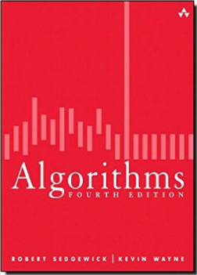
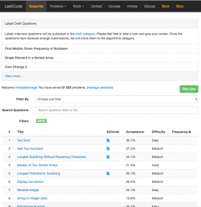

I have been writing software for a fairly long time now. I have worked on applications that range from open source projects to a suite of applications that run a $5B dollar company. If you want to stay relevant in this industry though you have always got to be learning and improving your craft. One of the best things you can do is identify an area of weakness and work on improving it. \[featured-image single\_newwindow="false" alt="Computer Science Problem Sets"\] A friend of mine is preparing for an interview next week and asked for some help. I haven't been on an actual coding interview in probably 10 years so I might not be the best person to ask but, what are friends for. In this article, we are going to look at some exercises he was trying to tackle. These questions led me to realize that I have a weakness that I would like to improve on. 

## The Interview

In preparing for his interview he broke down his preparation into 2 different categories, language material, and problem sets. 

### Language Material

My advice here is to simply break down the primary language into several categories and write a bunch of questions down. If you can write down about 5-10 questions in each of the following categories and understand who you want to answer them you will be fine. 

*   Java Basics 
*   Java Classes
*   Object Oriented Programming (OOP)
*   Java Collections
*   Threads
*   Exception Handling 
*   Garbage Collection
*   Java 8
*   Java 9

The main point of this is to not script answers. You should know these answers and you need to answer them in your own words, not some textbook definition. I also threw in Java 9 as a category for one simple reason. If they ask you if there is anything in the language that you are looking forward to this would be an opportunity for a huge win. If this comes up you can mention 1 or 2 of the new features in Java 9 and what excites you about them. This shows that you are constantly learning and that you are passionate about the language you use. 

### Coding Exercises

In the form of exercises, I thought that it would look something like this.

*   Create an interface that has at least 1 default method and then implements that interface
*   Construct a class that shows the difference between overloading and overriding 
*   Construct a class to read in a directory and then filter on the filename using a lambda.

When I sent him a bunch of examples like this he was a little thrown off and rightfully so. Again, I haven't interviewed in 10 years so I was just throwing out things that I might use to test someone's knowledge. He was looking for more algorithm based problem sets.  Interviews are apparently much more likely to throw someone up on the whiteboard and give them problem sets to solve. This accomplishes 2 things, you get an idea of how someone solves a problem and you can watch their thought process and how they handle a stressful situation.  After walking through some examples on [LeetCode](https://leetcode.com/problemset/algorithms/) I found 3 pretty good examples to share with you. If you want to try and go through these remember that you have no IDE to help out and its just you and whiteboard talking out your solution. 

#### Intersection of Two Arrays

Given two arrays, write a function to compute their intersection. **Example:**

Given nums1 = \[1, 2, 2, 1\], nums2 = \[2, 2\], return \[2\].

**Note:**

*   Each element in the result must be unique.
*   The result can be in any order.

#### Two Sum

Given an array of integers, return **indices** of the two numbers such that they add up to a specific target. You may assume that each input would have **_exactly_** one solution, and you may not use the _same_ element twice. **Example:**

Given nums = \[2, 7, 11, 15\], target = 9,

Because nums\[**0**\] + nums\[**1**\] = 2 + 7 = 9,
return \[**0**, **1**\].

#### Palindrome Number

Determine whether an integer is a palindrome. Do this without extra space. **Some Hints:**

*   Could negative integers be palindromes? (ie, -1)
*   If you are thinking of converting the integer to string, note the restriction of using extra space.
*   You could also try reversing an integer. However, if you have solved the problem "Reverse Integer", you know that the reversed integer might overflow. How would you handle such case?
*   There is a more generic way of solving this problem.

## Make your weakness a strength

After going through some of these problem sets I realized that I have a real weakness. Now, some of this stuff I won't ever use in my day to day job. I don't need to learn how to manually sort a list of objects because these are methods are given to me in the Java API. This, on the other hand, isn't an excuse not to understand how to solve problems that I was pretty good at in college. I also realize that the ability to break down a problem and solve it is what I do on a day to day basis so getting better at that can only help me out. 

### Resources

Now that I realized this is something I wanted to improve on I need get to work. I learn best when I have a variety of resources to learn from. In this case, I found a book, a website and a set of lectures that I think are really going to help out. 

#### Algorithms (Fourth Edition)

I decided to pick up Algorithms (Fourth Edition) by Robert Sedgewick. This book not only had a ton of great reviews but all of the examples in the book are in Java. With that said I am going to try and focus on solving the problem and not the language because that is the point of this.  

[http://amzn.to/2pBWwbf](http://amzn.to/2pBWwbf)

#### LeetCode

Another great resource that we mentioned earlier was [LeetCode](https://leetcode.com). This website gives you some awesome problem sets to solve. You can solve the problem yourself and then look at other solutions and discussions around these problems. 

#### Courses

[Intro to Algorithms](https://www.coursera.org/specializations/algorithms?action=enroll) This course looks like it is really well designed. If I wasn't planning for a wedding, bachelor party and honeymoon I think this would be the course I would want to jump into. I won't be able to take this one but I did want to share it as a resource with you.  [Practical Data Structures & Algorithms in Java](https://www.udemy.com/practical-data-structures-algorithms-in-java/) I decided to enroll in this course because it had a really good amount of lectures on both data structures and algorithms. The combination of my new course, book and a list of problem sets is going to help me get to where I want to be. 

## Conclusion

There is nothing wrong with having weaknesses. We all have them and anyone who tells you they don't is probably lying. If you want to be better you need to identify your weakness and instead of hanging your head, make it your strength. I hope to have more posts and videos to follow on this so stay tuned!  _**Question:** What are your weaknesses and what are you doing to improve them?_