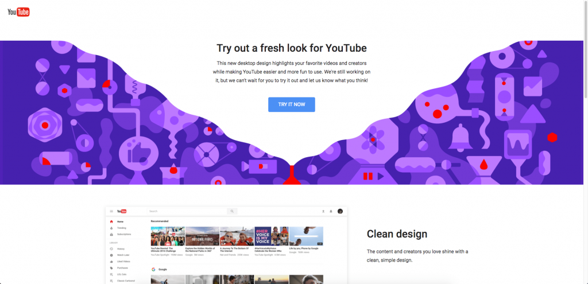
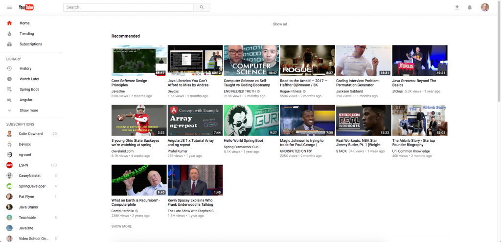
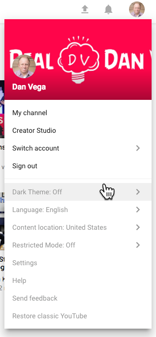
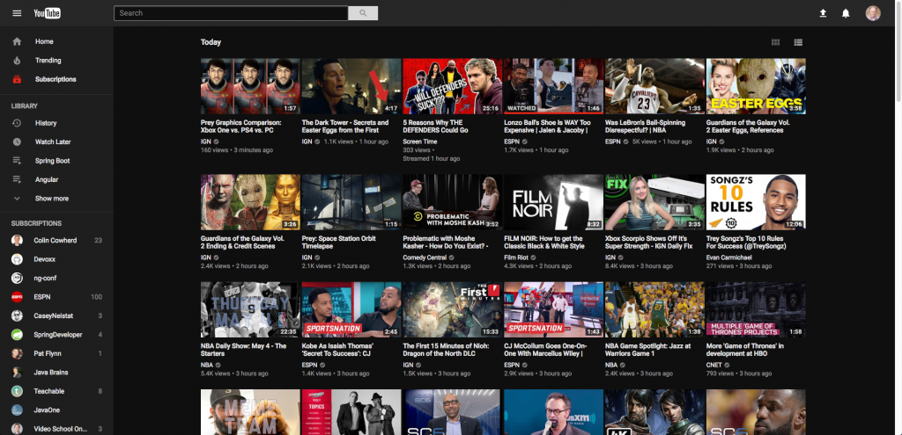
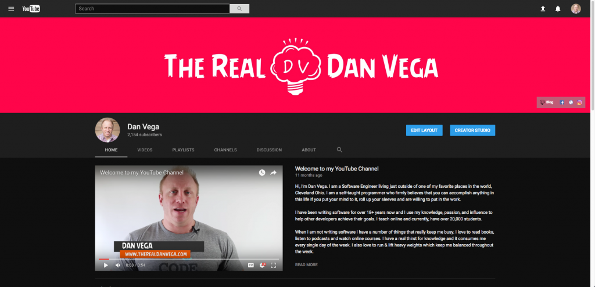

YouTube is working on rolling out a new design for their desktop application. This new design is cleaner, easier to use and gives channels a brand new look. All that is great but what really has me excited is the all new dark theme.  They are still in the process of testing this out but in this article, I will show you how you can take advantage of this today.  The 1st thing you need to do is go to [http://www.youtube.com/new](http://www.youtube.com/new) and click try it now to opt-in to the new design.  

The first thing you will notice is that the three tabs across the top are gone. We also have a cleaner tighter look along with some larger typeface across the board.  

To enable dark mode simply click on your profile icon in the upper right hand corner and select Dark Theme: Off.  

Finally, click on the activate dark theme. Welcome to the party!  

This is what the new channel view looks like for [mine](http://www.youtube.com/therealdanvega) in dark mode. 

