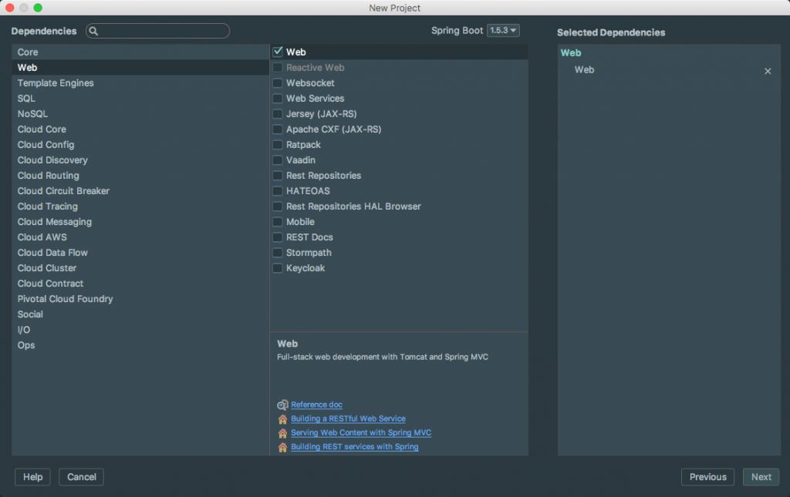

I love getting questions from students because it gives me a great idea of the real world problems people are trying to solve. Today's question comes from a student in my [Spring Boot Introduction Course](https://danvega.dev/spring-boot) and has to do with using something other than the default. 

> When I start a new Spring Boot Project and I include the web dependency I get Tomcat as the default servlet container. If I want to change that to something else like Jetty can I?

 The great thing about Spring Boot is that while it comes with some sensible defaults to get you up and running it doesn't stand in your way if you need to change something. The answer to this question is Yes and in this short tutorial, we will look at how you can do this.

## Replacing Tomcat with Jetty

If we create a new Spring Boot project and select web as a dependency the default servlet container is going to be Tomcat.  



The reason we know this is because if you dive into the spring-boot-starter-web dependency you will see the following dependencies declared. 

```xml
<dependencies>
    <dependency>
        <groupId>org.springframework.boot</groupId>
        <artifactId>spring-boot-starter</artifactId>
    </dependency>
    <dependency>
        <groupId>org.springframework.boot</groupId>
        <artifactId>spring-boot-starter-tomcat</artifactId>
    </dependency>
    <dependency>
        <groupId>org.hibernate</groupId>
        <artifactId>hibernate-validator</artifactId>
    </dependency>
    <dependency>
        <groupId>com.fasterxml.jackson.core</groupId>
        <artifactId>jackson-databind</artifactId>
    </dependency>
    <dependency>
        <groupId>org.springframework</groupId>
        <artifactId>spring-web</artifactId>
    </dependency>
    <dependency>
        <groupId>org.springframework</groupId>
        <artifactId>spring-webmvc</artifactId>
    </dependency>
</dependencies>
```

The first thing we need to do is remove the Tomcat dependency. We are going to do this in the starter dependency itself so we need some way of doing this in our Maven POM. Luckily we have a way to exclude a dependency using an exclusions block. 

```xml
<dependency>
    <groupId>org.springframework.boot</groupId>
    <artifactId>spring-boot-starter-web</artifactId>
    <exclusions>
        <exclusion>
            <groupId>org.springframework.boot</groupId>
            <artifactId>spring-boot-starter-tomcat</artifactId>
        </exclusion>
    </exclusions>
</dependency>
```

Now that we have excluded Tomcat we can add our Jetty dependency. 

```xml
<dependency>
    <groupId>org.springframework.boot</groupId>
    <artifactId>spring-boot-starter-jetty</artifactId>
</dependency>
```

```bash
If you go ahead and run the application you will see in the console that we are indeed now running on Jetty. 

2017-05-10 08:42:24.880  INFO 32757 --- [           main] .s.b.c.e.j.JettyEmbeddedServletContainer : Jetty started on port(s) 8080 (http/1.1)
```

## Conclusion

I hope this really helps drive home a point about Spring Boot. There are conventions and defaults that help us quickly and easily stand up a new Spring Application. Just because this is the default though doesn't mean that we can change something to fit our needs.  

_**Question:** What problems are you facing in your Spring Applications? _