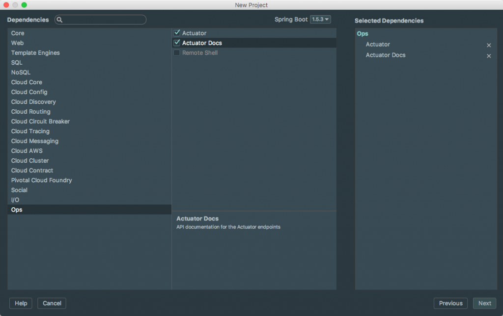
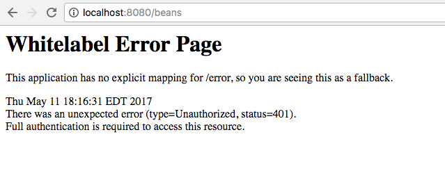

Spring Boot includes a number of additional features to help you monitor and manage your application when it’s pushed to production. You can choose to manage and monitor your application using HTTP endpoints, with JMX or even by a remote shell (SSH or Telnet). Auditing, health and metrics gathering can be automatically applied to your application. \[featured-image single\_newwindow="false" alt="Spring Boot Actuator"\] In this article, we will take a look at how to include the actuator in your next project and what endpoints are available. 

## Actuator Dependencies

If you look all the way down the list you find the ops category and this is where our Spring Boot Actuator & Actuator Docs dependencies live.  

If you want to add the actuator and actuator docs to an existing project simply include the following dependencies. 

<dependency>
    <groupId>org.springframework.boot</groupId>
    <artifactId>spring-boot-starter-actuator</artifactId>
</dependency>
<dependency>
    <groupId>org.springframework.boot</groupId>
    <artifactId>spring-boot-actuator-docs</artifactId>
</dependency>

_\* Actuator HTTP endpoints are only available with a Spring MVC-based application._

## Spring Boot Actuator Endpoints

Actuator endpoints allow you to monitor and interact with your application. Spring Boot includes a number of built-in endpoints and you can also add your own. This means that if you run the application and go to http://localhost:8080/health you will get the health endpoint.  Please create a simple application on your own and trying visiting some of the endpoints. 

ID

Description

Sensitive Default

 `actuator` 

Provides a hypermedia-based “discovery page” for the other endpoints. Requires Spring HATEOAS to be on the classpath.

true

 `auditevents` 

Exposes audit events information for the current application.

true

 `autoconfig` 

Displays an auto-configuration report showing all auto-configuration candidates and the reason why they ‘were’ or ‘were not’ applied.

true

 `beans` 

Displays a complete list of all the Spring beans in your application.

true

 `configprops` 

Displays a collated list of all  `@ConfigurationProperties` .

true

 `dump` 

Performs a thread dump.

true

 `env` 

Exposes properties from Spring’s  `ConfigurableEnvironment` .

true

 `flyway` 

Shows any Flyway database migrations that have been applied.

true

 `health` 

Shows application health information (when the application is secure, a simple ‘status’ when accessed over an unauthenticated connection or full message details when authenticated).

false

 `info` 

Displays arbitrary application info.

false

 `loggers` 

Shows and modifies the configuration of loggers in the application.

true

 `liquibase` 

Shows any Liquibase database migrations that have been applied.

true

 `metrics` 

Shows ‘metrics’ information for the current application.

true

 `mappings` 

Displays a collated list of all  `@RequestMapping`  paths.

true

 `shutdown` 

Allows the application to be gracefully shutdown (not enabled by default).

true

 `trace` 

Displays trace information (by default the last 100 HTTP requests).

true

If you are using Spring MVC, the following additional endpoints can also be used:

ID

Description

Sensitive Default

 `docs` 

Displays documentation, including example requests and responses, for the Actuator’s endpoints. Requires  `spring-boot-actuator-docs`  to be on the classpath.

false

 `heapdump` 

Returns a GZip compressed  `hprof`  heap dump file.

true

 `jolokia` 

Exposes JMX beans over HTTP (when Jolokia is on the classpath).

true

 `logfile` 

Returns the contents of the logfile (if  `logging.file`  or  `logging.path`  properties have been set). Supports the use of the HTTP  `Range`  header to retrieve part of the log file’s content.

true

## Actuator Security

If you tried to visit some of the endpoints you might have received an error that looks like this.   This is because by default the /beans endpoint is secured. It might have sensitive information and we wouldn't want this information available to just anyone in production. If you look at the list of endpoints above you can see which ones are secured by default.  If you want to disable the security of these endpoints in development you can do so by adding the following to your application.properties file.

management.security.enabled=false

## Spring Boot Actuator Screencast

I created a short tutorial on everything we walked through in this article.  https://youtu.be/uxGzRyfcSU8