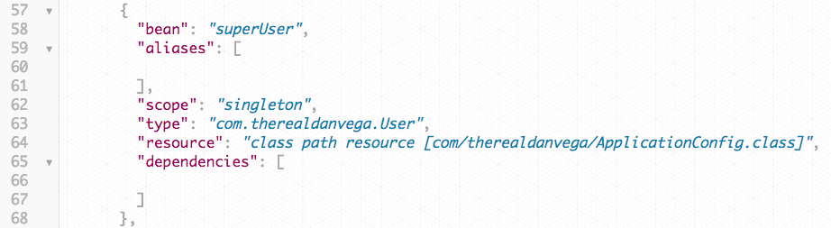

I received a question from a student in my [Spring Boot Introduction course](https://danvega.dev/spring-boot) that I would like to share with you. 

> Dan uses @Service annotation for the NotificationService to add it to the application context yet the User class doesn't need any annotation to be added to the class itself.  He just used the @Bean annotation in the SpringBeansApplication class for it to be added to the application context.  Why is that? 

This is actually something that a lot of people are confused by. In this article, we will look at the difference between @Component (Spring Stereotype Annotations) and @Bean.

## What are Spring Stereotype Annotations?

Before we get into the differences between @Bean and @Component I think it's important that we understand what @Component is. I could break this down for you here but luckily for me, I already wrote up a nice long post on what Spring Stereotype Annotations are and how to use them. Please read this article first and then come back and we will break this down. 

https://danvega.dev/blog/2017/03/27/spring-stereotype-annotations 

I hope you enjoyed that article and I hope you have a better understanding of the different annotations. 

## @Component

If we mark a class with @Component or one of the other Stereotype annotations these classes will be auto-detected using classpath scanning. As long as these classes are in under our base package or Spring is aware of another package to scan, a new bean will be created for each of these classes. 

```java
package com.therealdanvega.controller;

import org.springframework.stereotype.Controller;

@Controller
public class HomeController {

    public String home(){
        return "Hello, World!";
    }

}
```

There's an implicit one-to-one mapping between the annotated class and the bean (i.e. one bean per class). Control of wiring is quite limited with this approach since it's purely declarative.  _It is also important to note that the stereotype annotations are class level annotations. _

## @Bean

@Bean is used to explicitly declare a single bean, rather than letting Spring do it automatically like we did with @Controller. It decouples the declaration of the bean from the class definition and lets you create and configure beans exactly how you choose. With @Bean you **aren't** placing this annotation at the class level. If you tried to do that you would get an invalid type error. [The @Bean documentation](https://docs.spring.io/spring/docs/current/javadoc-api/org/springframework/context/annotation/Bean.html) defines it as:

> Indicates that a method produces a bean to be managed by the Spring container.

Typically,  `@Bean`  methods are declared within  `@Configuration`  classes. In this example, we have a user class that we needed to instantiate and then create a bean using that instance. This is where I said earlier that we have a little more control over how the bean is defined. 

```java
package com.therealdanvega;

public class User {

    private String first;
    private String last;

    public User(String first, String last) {
        this.first = first;
        this.last = last;
    }
}
```

```java
package com.therealdanvega;

import org.springframework.context.annotation.Bean;
import org.springframework.context.annotation.Configuration;

@Configuration
public class ApplicationConfig {

    @Bean
    public User superUser() {
        return new User("Dan","Vega");
    }

}
```

The name of the method is actually going to be the name of our bean. If we pull up the /beans endpoint in the actuator we can see the bean defined.  



## Conclusion

I hope that cleared up some things on when to use @Component and when to use @Bean. It can be a little confusing but as you start to write more applications it will become pretty natural.