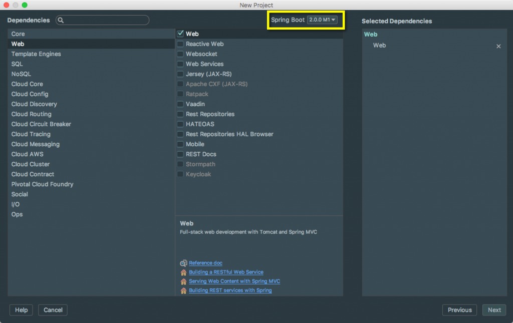

I have had a lot of fun watching the Spring Boot project grow into an amazing product over the last few years. A month ago I looked at the [Spring 2.0 Roadmap](https://therealdanvega.com/blog/2017/04/24/spring-boot-2-0-roadmap) and today we get to start walking down that road.  \[featured-image single\_newwindow="false" alt="Spring Boot 2.0"\] It is so exciting to see all of the new features coming in both Spring Framework 5 and Spring Boot 2.0. In this article, we are going to look at the first milestone release of Spring Boot 2.0. We will talk about how to update your current projects, start a new one and a brief look at the new features. 

## Getting Started with Spring 2.0

The first thing you need to do to get started with Spring 2.0 is to update the version number to 2.0.0.M1. 

<parent>
    <groupId>org.springframework.boot</groupId>
    <artifactId>spring-boot-starter-parent</artifactId>
    <version>2.0.0.M1</version>
    <relativePath/> <!-- lookup parent from repository -->
</parent>

If you're creating a new project in IntelliJ just change the version number on the dependencies screen to 2.0.0.M1.   If you are upgrading from 1.5 there are a few things that you should know. 

### Java 8 baseline

Spring Boot 2.0 requires Java 8 or later. Java 6 and 7 are no longer supported.

###  `@ConditionalOnBean` 

 `@ConditionalOnBean`  now uses a logical AND rather than a logical OR when determining whether or not the condition has been met.

### Remote CRaSH shell

Following its depreciation in 1.5, support for the [CRaSH project](http://www.crashub.org/) and remote actuator SSH support that it provided has been removed.

### Spring Loaded

As the Spring Loaded project has been moved to the attic, its support has been removed. We advise using Devtools instead.

### Dedicated Hazelcast auto-config for Caching

It is no longer possible to auto-configure both a general  `HazelcastInstance`  and a dedicated  `HazelcastInstance`  for caching. As a result, the  `spring.cache.hazelcast.config` property is no longer available.

### Default connection pool

The default connection pool has switched from Tomcat to HikariCP. If you used  `spring.datasource.type`  to force the use of Hikari in a Tomcat-based application, you can now remove that override.

### Servlet Filters

The default dispatcher types for a Filter are now  `DipatcherType.REQUEST`  this aligns Spring Boot’s default with the Servlet specification’s default.

### Spring Security

Spring Security’s filter is now auto-configured with  `ASYNC` ,  `ERROR` , and  `REQUEST`  dispatcher types. This aligns Spring Boot’s default configuration with Spring Security’s default configuration.

### Spring Session

Spring Session’s filter is now auto-configured with  `ASYNC` ,  `ERROR` , and  `REQUEST`  dispatcher types. This aligns Spring Boot’s default configuration with Spring Session’s default configuration. Note that as of Spring Session 2.0, Mongo and GemFire support has been removed.

### Jetty

The minimum supported version of Jetty is now 9.4

### Tomcat

The minimum supported version of Tomcat is now 8.5

### Hibernate

The minimum supported version of Hibernate is now 5.2

### Gradle

The minimum supported version of Gradle is now 3.4

### SendGrid

The minimum supported version of SendGrid’s Java client is now 3.2. In support of this upgrade, the  `username`  and  `password`  properties have been removed as an API key is now the only supported means of authentication.

### Starter transitive dependencies

Previously several Spring Boot starters were transitively depending on Spring MVC with  `spring-boot-starter-web` . With the new support of Spring WebFlux,  `spring-boot-starter-mustache`  and  `spring-boot-starter-thymeleaf`  aren’t depending on on those anymore. It is the developer’s responsibility to choose and add  `spring-boot-starter-web`  or  `spring-boot-starter-webflux`  as dependencies.

### Solr health indicator

The detail of the health check for Solr no longer defines a  `solrStatus`  attribute. Rather a  `status`  property is now defined and corresponds to the integer value of the standard  `status`  property.

### Default Proxying strategy

Spring Boot now uses CGLIB proxying by default, including for the AOP support. If you need proxy-based proxy, you’ll need to set the  `spring.aop.proxy-target-class`  to  `false` .

### CLI-based testing

Testing support has been removed from Spring Boot’s CLI in favour of moving to building the application with Maven or Gradle and using their rich testing support.

###  `@ConfigurationProperties` 

The  `ignoreNestedProperties`  attribute has been removed.

### Multipart configuration

To better reflect their Servlet-specific nature, the multipart  `spring.http.multipart.` configuration properties have been renamed to  `spring.servlet.multipart.` .

### Mustache templates default file extension

The default file extension for Mustache templates was  `.html` , it is now  `.mustache`  to align with the official spec and most IDE plugins. You can override this new default by changing the  `spring.mustache.suffix`  configuration key.

## Spring 2.0 New Features

### Spring Framework 5.0

Spring Boot 2.0 builds on and requires Spring Framework 5.0. There are a number of nice refinements in Spring Framework 5.0 including extensive support for building reactive applications. Please refer to the [Spring Framework Wiki](https://github.com/spring-projects/spring-framework/wiki/What%E2%80%99s-New-in-the-Spring-Framework#whats-new-in-spring-framework-5x) for details.

### WebFlux and WebFlux.fn support

Spring Boot 2.0 provides a new starter for supporting the Reactive Spring web frameworks, for both annotation and functional based variants.  `spring-boot-starter-webflux`  brings WebFlux itself, plus Reactor Netty as a default web engine ( `spring-boot-starter-reactor-netty` ).

### Reactive data support

Spring Boot 2.0 provides auto-configuration for the following data store with reactive support:

*   MongoDB ( `spring-boot-starter-mongodb-reactive` )
*   Redis ( `spring-boot-starter-redis-reactive` )
*   Cassandra ( `spring-boot-starter-cassandra-reactive` )

 `@DataMongoTest`  also enables reactive repositories if necessary.

###  `@WebFluxTest`  support

Reactive controllers can be tested using  `@WebFluxTest`  that provides a similar support than  `@WebMvcTest`  for Spring MVC. In particular a  `WebTestClient`  is auto-configured.

###  `WebTestClient`  auto-configuration with  `@SpringBootTest` 

When using  `@SpringBootTest`  with an actual server (that is, either  `DEFINED_PORT`  or  `RANDOM_PORT` ), a  `WebTestClient`  is available the same way  `TestRestTemplate`  is.

### Gradle plugin

Spring Boot’s Gradle plugin has been largely rewritten to enable a [number of significant improvements](https://github.com/spring-projects/spring-boot/issues?utf8=%E2%9C%93&q=label%3A%22theme%3A%20gradle-plugin%22%20milestone%3A2.0.0.M1%20). You can read more about the plugin’s capabilities in its [reference](https://docs.spring.io/spring-boot/docs/2.0.0.BUILD-SNAPSHOT/gradle-plugin/reference) and [api](https://docs.spring.io/spring-boot/docs/2.0.0.BUILD-SNAPSHOT/gradle-plugin/api) documentation.

#### Building executable jars and wars

The  `bootRepackage`  task has been replaced with  `bootJar`  and  `bootWar`  tasks for building executable jars and wars respectively. Both tasks extend their equivalent standard Gradle jar or war task, giving you access to all of the usual configuration options and behaviour.

#### Dependency management

Spring Boot’s Gradle plugin no longer automatically applies the [dependency management plugin](https://github.com/spring-gradle-plugins/dependency-management-plugin). Instead, Spring Boot’s plugin now reacts to the dependency management plugin being applied by importing the correct version of the  `spring-boot-dependencies`  bom. This gives you more control over how and when dependency management is configured. For most applications applying the dependency management plugin will be sufficient:

apply plugin: 'io.spring.dependency-management'

Please note that the dependency management plugin remains a transitive dependency of  `spring-boot-gradle-plugin`  so there’s no need for it to be listed as a  `classpath` dependency in your  `buildscript`  configuration.

## SPRING 2.0 COURSE

If you haven’t already had a chance to check out my [Spring Boot Introduction course](http://courses.therealdanvega.com/p/spring-boot-intro) please do. This course is based on Spring Boot 1.3 and was very much an introduction. My announcement today is that a Spring 2.0 course is coming and I will be releasing it sometime around SpringOne.   This is not just going to be a repeat of the previous course with a few new features. First off, I am going to create 2 free courses for setting up your development environment on both Windows 10 and Mac OS. Next, I will incorporate the feedback I have received from my current students. My current course is the best selling course on one platform and I know there is tons of room for improvement.  These courses will allow me to extract that portion of the course that some find necessary and others find boring. These courses will be bundled for free into the Spring Boot 2.0 course. I am working on the curriculum now but if you would like to receive updates check out my [Spring Boot 2.0 Course Page](https://therealdanvega.com/spring-boot-2-0) and signup for updates. Anyone on this list will be the first to find out when it’s released and will receive a discount.   

## Conclusion

This is just the start of Spring 2.0 and we should have more exciting announcements to follow. _**Question:** What are you most looking forward to in Spring Boot 2.0?_