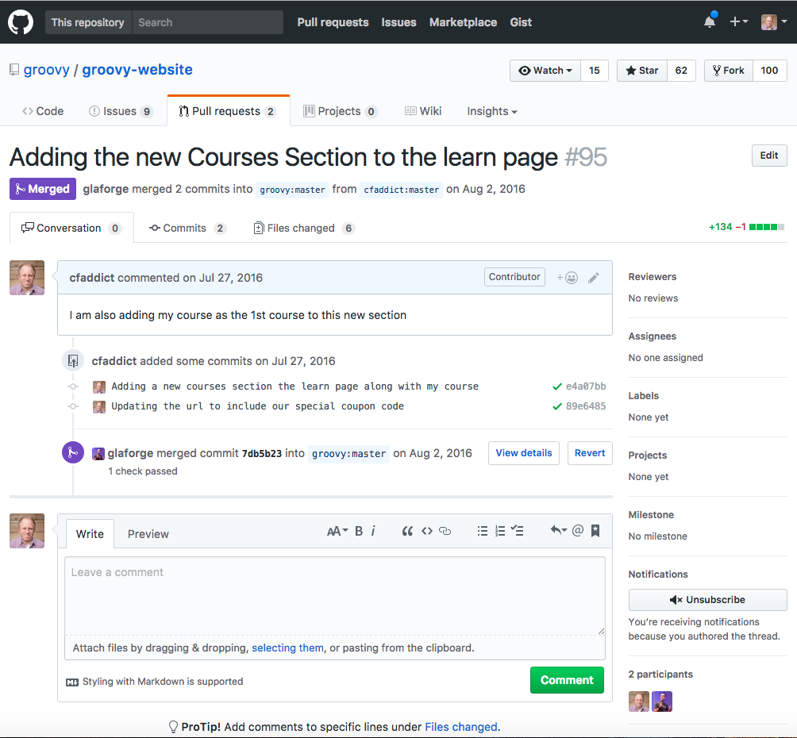
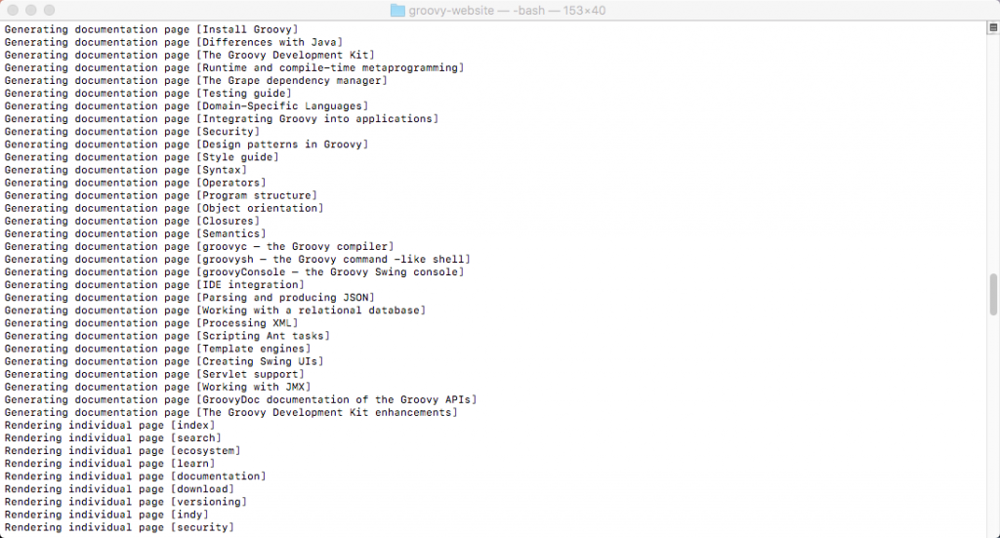

& Anyone who knows me knows that I am a huge fan of [The Groovy Programming Language](http://groovy-lang.org/). So much so that I did my part to spread the good word about Groovy by creating a course titled "[The Complete Apache Groovy Developer Course](https://therealdanvega.com/groovy)".  \[featured-image single\_newwindow="false" alt="Apache Groovy Website"\] I recently had the opportunity to contribute to the Groovy website. In this article, I will tell you all about what I did and how you can contribute as well. 

## Contributing to the Groovy Website

The website is [open source and on Github](https://github.com/groovy/groovy-website) so it was really easy to get started with. Contributing to an open source project isn't always all about adding that cool new feature to the core of the project.  I wanted to add a resource on the learn page so that people could find my course. I am probably a little biased but I think my course is one of the best resources around for learning Groovy. So now on top of teaching folks how to use the language I made some updates to the website.

## Fork & Pull Request

I am not an official committer to the project so the first thing we need to do is to fork the repo. To do this we are going to head over the repo for the [Groovy Website](https://github.com/groovy/groovy-website) and fork it. This means that we are going to make changes on our GitHub account and then send them a pull request. You can see my commits below along with the project lead [Guillaume Laforge](http://glaforge.appspot.com/) merging them into the master branch.  

## Contributing

Now that we understand the workflow we can take a look at how to make that change. If you look at the readme for the source code there is a ton of great information to get you started. The following information is straight from the readme.  The website is generated thanks to Gradle and makes use of the [Markup Template Engine](http://docs.groovy-lang.org/latest/html/documentation/markup-template-engine.html). The structure of the project consists of two modules:

generator                       : utility classes and model for generating the website
site                            : the website itself

The website subproject consists of:

src/main/site                   : sources for the static website
          |--- assets           : static resources such as images, CSS files, ...
          |--- html             : elements that templates include as raw HTML contents
          |--- includes         : includes used by templates
          |--- layouts          : layouts for the various pages
          |--- pages            : individual pages
build.gradle                    : website weaving logic

Additional details can be found in this [blog post](http://melix.github.io/blog/2014/07/new-groovy-website.html).

### Adding Courses to the Learn Page

There was no courses section when I started this so the first thing I needed to do was to add a new model for courses. 

package model

import groovy.transform.CompileStatic

@CompileStatic
class Course {

    String title
    String instructor
    String url
    String description
    String cover

    void title(String title) {
        this.title = title
    }

    void instructor(String instructor) {
        this.instructor = instructor
    }

    void url(String url){
        this.url = url
    }

    void description(String description){
        this.description = description
    }

    void cover(String cover){
        this.cover = cover
    }

}

Then in the sitemap which contains all of the data in markup form, I just add a new course. 

courses {
    course('The Complete Apache Groovy Developer Course') {
        instructor 'Dan Vega'
        url 'https://www.udemy.com/apache-groovy'
        description '''
            
I am going to teach you everything you need to know to start using The Groovy Programming language. This course is really designed
            for 2 different types of people and I think both will benefit from it. If you’re a beginner programmer with a some experience in
            another language like Python or Ruby this course is for you. Dynamic languages are generally thought of as easier for total beginners
            to learn because they’re flexible and fun. If you’re an existing Java Developer (Beginner or Experienced) this course is also for you.

            
This course is packed with almost 14 hours of content. We are going to start off with getting your development environment up and running
            and then go through the very basics of the language. From there we are going to build on that in each section cover topics like closures, meta-programming,
            builders and so much more. I feel like this is one of the most complete courses around and I am excited for you to join me on this adventure.

        '''
        cover 'groovy-course-cover.png'
    }
}

Finally, on the learn page, I will loop over and display my course.

hr(class: 'divider')

a(name: 'courses') {}
h2 {
    i(class: 'fa fa-film') {}
    yield ' Courses'
}
p '''
    Another great resource for learning Groovy is by watching a course. You could spend time hunting down
    various videos on the web but these courses have all the information you need packed into one place.
  '''

courses.each { Course course ->
    div(class: 'courses') {
        a(href: course.url, target: "\_blank") {
            img(class: 'screenshot', src: "img/courses/${course.cover}")
        }
        div(class: 'metadata') {
            a(href: course.url, target: '\_blank') {
                h1(class: 'title', course.title)
            }
            span(class: 'instructor', "By ${course.instructor}")
            div(class: 'description') {
                yieldUnescaped course.description
            }
        }
    }
}

## Generating a static site

Now that we made the changes to our source code we need to generate our website. The entire website is a static website that is generated from a whole bunch of groovy code. To generate the website go into the root of the project and run the following command. 

./gradlew generate

 If you look in the build/site directory you will see the generated website. If you go to that location in your browser you can check out the site and make sure everything looks ok.

## Contributing to the Apache Groovy Website Screencast.

In this screencast, I am going to show you how I did that. I really enjoyed learning how the entire website was built in Groovy and then they simply generate a static site. https://www.youtube.com/watch?v=BXw-YKxr94w

## The Complete Apache Groovy Developer Course

Are you looking to learn a new language? Learning a new language helps expand your skill set as a developer and make you more marketable. If you aren't learning a new language because it's not the one you use at work I think you're missing out on the benefits. I often found that seeing how other languages solve problems makes me a better developer with the languages I use on a day to day basis. I am here to tell you all about an awesome dynamic language called [Apache Groovy](http://www.groovy-lang.org). 

[The Complete Apache Groovy Developer Course](https://therealdanvega.com/groovy)

## Conclusion

I said this earlier in the article and I would like to repeat it again. You don't always have to contribute code to the core of a project to help an open source project out. I have contributed documentation, static websites, plugins and even just offering up suggestions on the mailing lists. There are tons of ways to get involved so If you really enjoy using an open source project contact them and see how you can get involved. _**Question:** What are ways that you like to contribute to a project?_