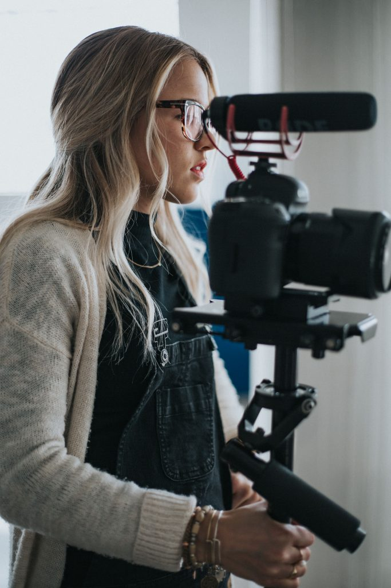

I recently wrote this article on [Medium](https://medium.com/@therealdanvega/so-you-want-to-create-an-online-course-8c2519da1863) and thought I would share it here with this audience today. I know there are a lot of Software Developers out there that want to get into creating courses and if that's you I think you're really going to enjoy this article. 

I get really fired up about teaching online because I enjoy doing something that is improving the life of someone else. It might be on a very small scale but I still like to think I am making a difference. I also enjoy that, on occasion, I get someone else fired up about teaching online.

\[featured-image single\_newwindow="false" alt="Creating Online Courses"\]

Lately, I have been receiving messages from friends and family about how they want to create their own courses. This week I got a message from a friend that I would like to share with you.

> Now that I don’t work at Apple anymore I’m not contractually locked to exclusively teaching in an Apple Store. So I’m currently working on my first Udemy course. Based on what I’ve seen you do I’ve been wanting to do this for years. I’m pretty excited about it! Just thought I’d shoot you a quick message and let you know.

I was not only excited that my friend was going to create his first course but that I had some small part in inspiring him to do so. This reminding me of a quote I love and a great way to look at how helping others can lead us to accomplish our goals.

> “You will get all you want in life if you help enough other people get what they want.” — Zig Ziglar

Now that you have a little idea of why I sat down and took some to write this article, here's what we are going to cover in it.

*   What are you going to teach?
*   Creating your course
*   Where will you publish?
*   Building an audience
*   Resources

I am going to give you a little information about each of these topics. This is meant as an introduction and I could probably write chapters to a book on each of these subjects so just remember that if we don’t go too far down the rabbit hole.

## What are you going to teach?

The first thing we need to figure out is what your course is going to be about. You probably have some ideas already and are just wondering if these ideas will translate into courses. In this section, we are going to talk about how finding your passion and validating your subject.

### Find your Passion

The first thing I need everyone reading this to do is to stop assuming that what you know is common knowledge. I run across so many people that think what they know or how they perform a specific task a certain way is just how the world works and that just isn’t true. You do have something to offer the world and it's about time you start realizing it.

The easiest subjects to build courses on are things you’re passionate about. If you love to share your experiences in health and fitness, for example, this is what you should be talking about. Talking about cats might be a popular subject but if you aren’t into it, you will get called out on it.

Your students will know if you’re passionate about a subject or not. If you’re not excited about teaching something, how do you expect students to be excited to learn it? So with that my #1 tip when it comes to teaching is you have to pick something you’re passionate about.

### Selecting a Niche

A big mistake new instructors often make is the belief that just because there are other courses in the marketplace already, that they can’t succeed. When I hear this I quickly turn this into a positive thing and get them even more excited.

Existing courses in the marketplace simply tell us that someone else has already done the hard work for us and validated that there is a demand for our course. Now if there 75 courses on the exact same thing then we need to go a layer deeper. In fact no matter how many courses there are I always suggest going at least 2 levels and maybe event 3 levels deep.

This sounds great Dan, but what do you mean to go a layer deeper? Going back to our example of health and fitness let's say that I wanted to create a course on yoga. It’s safe to assume that yoga has a very wide range of topics and not only will you run into competition there but if you were going to teach a course on everything you knew about yoga that would be a huge course.

So we start thinking about topics inside of yoga and realize that we are very good at standing our head. This is often tough for people new to yoga so we are going to teach them all about getting upside down. We just took a subject we are passionate about, yoga, and found a specific subject inside of that niche and created our Headstand Workshop class. This is what I mean by going to the 2nd or even 3rd level.

Sticking with our example, what if we wanted to create a course called “How to do a headstand for 20 min straight”. I am just making this up at this point but you get the idea. This is a very specific topic and if there are no other courses on the market we should probably validate this further before we run off and create a course on this subject.

### Validating your course idea

We already looked at how to select your niche if there is a market for your course but what if there are no existing courses on your topic? This doesn’t mean that people still don’t want to learn about it. This just means that we should do a little work upfront to validate our idea before we run off and create a huge course on the subject.

The first place you can always start is with friends and family. Going back to our yoga example it's probably safe to assume that if you’re passionate about yoga that you might do it with friends, take a class or even teach classes. In that case, it's pretty simple, ask those people what they think of your idea. If you come up with a good plan for the workshop you might even be able to teach it to them one day and get their opinion.

After running it by friends and family you can start to ask any social networks you’re involved in. Throw something on Facebook on your wall or in a specific group and see what they say.

If all of these things go well you could create a YouTube channel and test a couple videos out. If you get more interest you could create a blog and ask people to signup if there interested in your course.

This is, of course, the simplified version of this but hopefully, you get the idea. Make sure you validate your idea before you just run in blind. Some of the feedback might be great and you might get ideas you would have never thought of if you didn’t do this step first.

### How long Should it be?

Another question I hear a lot is how long does my course need to be. Your course should probably be at least an hour in length. After that, there are no restrictions. You can create a course that is 1 hour, I have created courses that are 14 hours and top online instructors have courses in the 40–60-hour range.

The key here is making sure your course has a solid title and description. Your students should be very clear on what they are going to get out of this course before they take it. At that point, your course should be as long as it needs to be to deliver on what you promised them they would learn.

## Creating your Course

When I start talking to people about creating courses they start dreaming of big budget Hollywood sets when all they need is a home office. There might be a few things you need to purchase but you can always start off small and scale up later on. In this section, I will give you a good, better and best_\*_options for equipment and my suggestions for starting off.

_\* Best doesn’t mean a $50,000 camera it just means it’s my suggestion for the next logical step._

This is obviously an important step so take your time here and get this one right.

### Creating a Curriculum

The first thing we need to do is create a course curriculum. The important part here to remember is that this is probably going to be fluid and can change during the course creation process.

I like to start with an outline of what each module or section will look like. It is probably a good idea to start with an introduction to you the instructor and what they can plan to get out of the course. If I was teaching a course on how to create your own course my initial outline might look like this.

*   Introduction
*   What are you going to teach
*   Creating your Course
*   Where will you publish
*   Marketing your course
*   Goodbye

This would be my initial outline but just looking at this I can already tell that the creating your course section would get very long. I would probably break curriculum, video, audio & lighting into their own sections. Here are a few tips that I have seen in other courses and try to stick to in any of my new courses.

*   Mix talking head and screen share videos
*   Keep your videos 4–7 min and no longer than 10 min unless needed
*   Try for 10 videos or less in a section
*   Keep students engaged with exercises & quizzes

Those are of course just guidelines. You have to remember that you are here to help your students accomplish a certain goal. If you need to go outside the lines to do that, then have at it.

_Some of my links below are affiliate links and if you’re going to purchase something please use my links to support this article._

### Video Equipment

I shot my first course entirely on my iPhone 6. The only downside to this is you can’t see yourself in the shot so you have to keep running around to see if the shot looks good. I eventually upgraded to the Canon 70d and I love the flip screen and auto focus on that camera.

*   (Good) [iPhone 7 Plus](http://amzn.to/2pH94eH)
*   (Better) [Canon 70D](http://amzn.to/2pHsPCX)
*   (Best) [Sony Alpha a7s Mirrorless Digital Camera](http://amzn.to/2rb0zd8)

#### Lighting Equipment

Lighting is one of those things that everyone forgets about. If you can get some good natural light that is great but that limits your production time to those perfect days.

*   (Good) [Photography Photo Portrait Studio Kit](http://amzn.to/2pIuZlP)
*   (Better) [Fancierstudio 2400 Watt Lighting Kit](http://amzn.to/2pvxprS)
*   (Best) [LimoStudio LED Lighting Kit](http://amzn.to/2qdHSqW)

#### Audio Equipment

Nothing ruins a video for me more than bad audio. If you asked me where you should spend money for a better quality product its here.

**Talking Head Videos**

These are videos where it is just you standing in front of the camera and having a conversation with your students.

*   (Good) [Stony-Edge Lavalier Microphone](http://amzn.to/2pIQyCF)
*   (Better) [Rode VideoMic Pro](http://amzn.to/2qDiCf7)
*   (Best) [Sennheiser Wireless Mic Kit](http://amzn.to/2qDkZOX)

**Screencast**

These are videos where you record your screen showing them a presentation or exactly what you’re doing on screen.

*   (Good) [Blue Snowball iCE Condenser Microphone](http://amzn.to/2r3RN3x)
*   (Better) [Audio-Technica AT2020 Condenser Microphone](http://amzn.to/2rbyrWB)
*   (Best) [Heil PR-40 Dynamic Studio Recording Microphone](http://amzn.to/2qDjtfx)

#### Backgrounds

If you have a great looking place around the house to shoot you should take advantage of that. If you don’t you can use [seamless background](http://amzn.to/2r4sP45) paper to give you a really good looking video. To hang that background paper you need either a stand or some type of wall mount.

[**LimoStudio Photo Video Studio 10Ft Adjustable Muslin Background Backdrop Support System Stand…** _Backdrop Support System with 10' Crossbar and Case 2 x Premire Muslin Backdrop Support System Stand \* Easy to set up…_amzn.to](http://amzn.to/2qDfmQQ "http://amzn.to/2qDfmQQ")

[**CowboyStudio Photography 3-Roller Wall Mounting Manual Background Support System** _This background support system is a smart choice for substitute of expensive electrical roller system. Durable yet…_amzn.to](http://amzn.to/2pIKKso "http://amzn.to/2pIKKso")

I have the 3 roller wall mount in my home studio and it works out great.

#### Software

There are a few pieces of software that you are going to need to create and publish your course. There are some free options in this category but as you can imagine a little money spent here goes a long way.

**Video Editing Software** When you create your videos you will take them from the source and there will be some editing needed.

*   [Final Cut Pro](https://www.apple.com/final-cut-pro/) (Mac)
*   [Adobe Premiere Pro](http://www.adobe.com/products/premiere.html) (Mac & Windows)

**Screen Recording Software** There are a bunch of options for recording screen presentations but I am going to leave you with 2 of my favorites for Mac and Windows.

*   [ScreenFlow](https://www.telestream.net/screenflow/overview.htm) (Mac)
*   [Camtasia Studio](https://www.techsmith.com/camtasia.html) (Windows)

### Where to publish your course?

Now that we have created our course the question is where do we publish it. There are plenty of options depending on your needs and what features you want. This decision is going to depend on what type of existing following you or your brand has or doesn’t have.

If you have an existing audience that comes with a large email list and social media following you are going to be self-hosting your course. If you don’t have an existing following we are going to start with marketplaces. The beauty of starting here is we can build our audience and then begin to move to a self-hosted platform.

#### Marketplace

A marketplace is a site that contains a collection of courses and already has an existing user base in place. What this means to you is that all you need to focus on is publishing the course. If you create a good title, description and eventually get some good reviews the course will sell itself.

Some examples of marketplaces that you can publish your course on are:

*   [Udemy](http://www.udemy.com/)
*   [SkillShare](https://www.skillshare.com/)
*   [Pluralsight](https://www.pluralsight.com/)

#### Self-Hosted

A self-hosted course is one that we host on our own website or we can use one the platforms below. The key in a self-hosted course is we have full control over all aspects of the course from collecting email addresses to what it will be priced at.

*   [Teachable](http://www.teachable.com/)
*   [Thinkific](https://www.thinkific.com/)
*   [Zippy Courses](https://zippycoursesplugin.com/)

#### Marketplace vs Self Hosted

There are pros and cons to each of our platforms. As I said earlier if you don’t have much of a following yet, that is ok, but I would start on a marketplace. With that said you should make the move that you think is right for you and your brand.

**Marketplace**

Pros

*   Existing Student Base
*   They will promote your courses

Cons

*   You can’t build your email list
*   Usually going to sell courses for less
*   Paid on a monthly basis
*   You have to go through an approval process
*   They have control over pricing limits

**Self-Hosted**

Pros

*   Build your email list
*   You can usually make more per sale
*   You can bundle courses together to create new products
*   You can get paid right away.

Cons

*   You have to do all the promotion for your course

## Building an Audience

The best thing you can do for yourself after you launch your course is to stay involved with your students. This is where I always tell people that there is no such thing as 100% passive income. You need stay involved and respond to questions and feedback you are going to establish trust with your audience.

When you can establish trust and build an audience everyone wins. Your students win because they get out of your course exactly what you promised. You win in both monetary value and knowing that you helped to improve someone's life.

### Course Feedback

The first thing you need to do when you launch your course is to get it in front of some people to get some initial feedback. I usually start with friends or family. In my case, my courses were programming related so I created free coupons for my coworkers. This is a great time to get some feedback and see if you can improve on anything.

If your course is in a marketplace this is also a good time to start getting reviews. Potential students are looking at your reviews to see what other people think of your course. I would send out free coupons and say in exchange for the free coupon please give me a review. It doesn’t need to be good just your honest review of the course.

## Promoting your Course

No matter where you publish your course you want to be out there promoting your course.

**Blog, Social Media & Email List** If you have a blog this is obviously the best place to start. I would write up a summary of what your course is about and what potential students can get out of it. Most of the time you will already have this copy in the course description.

If you have your own blog this a great chance to start building your email list. This list will help you market future courses to students who are already interested in what you’re doing.

**YouTube** This is one of the best places to market your course. Start a YouTube channel and post some of the videos on your channel. In the video you will want to link to your course landing page so they know where to go to purchase the full course.

**Webinar** Webinars are another great resource for promoting your course. This is a chance to give some real value to anyone attending your webinar and to teach them something. At the beginning of the webinar let them know that you have a special offer for them coming at the end of the presentation. This is where you can let them know about the course and good strategy here is to give them some kind of discount.

**Paid Advertising** I won’t get too far into strategy here because there is a lot that goes into this. You can use paid advertising (Google/Facebook/YouTube/Pinterest) to drive people to landing pages that will allow the to sign up for webinars or lead magnets related to your course. When you have their email address you can slowly introduce them to your course and eventually ask them to purchase it. Again this is for another article but pushing paid advertising directly to a course landing page usually doesn’t work.

## Learning / Resources

I really hope this article was useful for you. Now that you have a good idea what it’s going to take to build your course I want to leave you with some resources. These are all great ways to learn more about building your course.

**Courses**

*   [Udemy Masters 2017: Online Course Creation](https://www.udemy.com/online-course-masters/?couponCode=DANVEGA19)
*   [Official Udemy Insights](https://www.udemy.com/user/udemymanager/)

**Podcasts**

*   [Online Course Masters](https://onlinecoursemasters.com/blog)

**Facebook Groups**

*   [Online Course Masters](https://www.facebook.com/groups/onlinecoursemasters/)
*   [Teachable Tribe](https://www.facebook.com/groups/thefedorafamily/)
*   [Udemy Instructors Club](https://www.facebook.com/groups/udemyfacultylounge/)

While I do believe that investing in yourself and continuing to learn is the greatest gift you can give yourself you do need to take action at some point. Spend the time to learn but don’t procrastinate creating your first course. What do you have to lose? Take action and build something great!

## What’s Next Dan?

If you enjoyed this article you are really going to enjoy my next project. Subscribe to my mailing list and I will keep you in the loop on my next big thing. If you signup today I will give you a free eBook that will give you my top 10 side hustles to build a passive income.

[https://therealdanvega.com/sidehustle](https://therealdanvega.com/sidehustle)