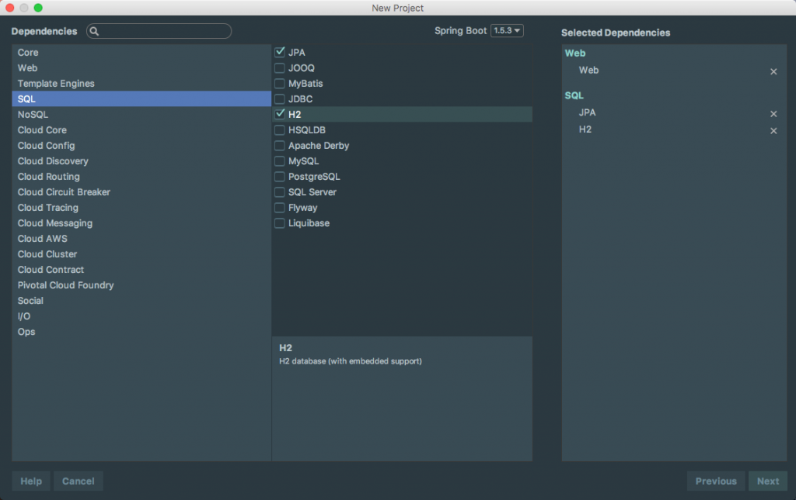
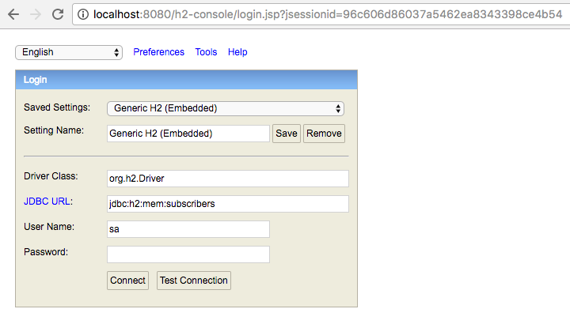
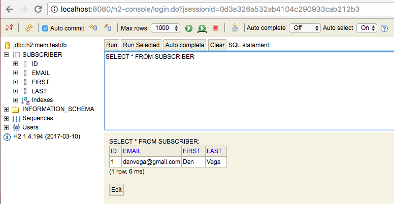

Today's Question & Answer came in from a student in my [Spring Boot Introduction course](https://danvega.dev/spring-boot) and it is one that I get a lot. This tells me that I probably need to address this in the course but it's also an opportunity for me to share this with you. The question is:  "I created a new application from scratch using the Web, Spring Data JPA & H2 dependencies. If I create an entity and then start the application up I don't see the tables created in the H2 database for me. What is going wrong?"

## Spring Boot Application

The first thing we are going to do is to create our Spring Boot Application using the Spring Initializer. In this demo, we are going to select the Web, JPA & H2 dependencies. 




### H2 Database Settings

The next thing we have to do is enable the H2 database console in our application.properties. You have to enable this if you want to be able to use this awesome little tool. There is also a property to change the path for the H2 console if you don't want to use the default. 

```javascript
spring.h2.console.enabled=true
#spring.h2.console.path=/h2-console
```

### Create an Entity

Now we need to create our entity. I am going to keep it simple here but you can create whatever entity you like. 

```java
package com.therealdanvega.domain;

import javax.persistence.Entity;
import javax.persistence.GeneratedValue;
import javax.persistence.Id;

@Entity
public class Subscriber {

    @Id @GeneratedValue
    private Long id;
    private String first;
    private String last;
    private String email;

    public Subscriber(String first, String last, String email) {
        this.first = first;
        this.last = last;
        this.email = email;
    }

    public Long getId() {
        return id;
    }

    public void setId(Long id) {
        this.id = id;
    }

    public String getFirst() {
        return first;
    }

    public void setFirst(String first) {
        this.first = first;
    }

    public String getLast() {
        return last;
    }

    public void setLast(String last) {
        this.last = last;
    }

    public String getEmail() {
        return email;
    }

    public void setEmail(String email) {
        this.email = email;
    }

    @Override
    public String toString() {
        return "Subscriber{" +
                "first='" + first + '\\'' +
                ", last='" + last + '\\'' +
                '}';
    }
}
```

Next, I will create a simple repository so that I can create some dummy data on startup. 

```java
package com.therealdanvega.domain;

import org.springframework.data.repository.CrudRepository;

public interface SubscriberRepository extends CrudRepository<Subscriber,Long> {

}
```

Finally, I will load some data using the Command Line Runner. 

```java
package com.therealdanvega;

import com.therealdanvega.domain.Subscriber;
import com.therealdanvega.domain.SubscriberRepository;
import org.springframework.boot.CommandLineRunner;
import org.springframework.boot.SpringApplication;
import org.springframework.boot.autoconfigure.SpringBootApplication;
import org.springframework.context.annotation.Bean;

@SpringBootApplication
public class H2demoApplication {

	public static void main(String\[\] args) {
		SpringApplication.run(H2demoApplication.class, args);
	}

	@Bean
	CommandLineRunner runner(SubscriberRepository repository){
		return args -> {
			repository.save( new Subscriber("Dan", "Vega", "danvega@gmail.com"));
		};
	}
}

```

## Running your Spring Boot Application

With all of that in place, this is where people usually run into this issue. If you were to start your application up and visit the H2 console using [http://localhost:8080/h2-console](http://localhost:8080/h2-console) you would see the following screen. What I would expect is when I login to the console to see my Subscriber table with a new row inserted. 



The issue here is usually with the JDBC URL that students use to connect to their database. If you put anything in the place of subscribers it would let you connect, but you wouldn't see anything. The URL is usually the last visited URL on your machine but I am not sure what comes up by default.  The problem is not understanding what the default datasource name is. In a Spring Boot application, the default datasource is named **_testdb_**_._ If you were to use the URL "jdbc:h2:mem:testdb" and connect to the database you would see your table created. 



If you don't want to use testdb as the datasource name for every application you build (and you shouldn't) you can change it using the following property. 


```bash
spring.datasource.name=subscribers
```


## Conclusion

As we saw in this demo it usually isn't the Spring Boot application not working correctly but more often than not my students were connecting to the wrong database. I hope this helped clear up this issue for someone out there and I would like to leave you with a question.

_**Question:** What are some common mistakes you run into in your Spring Boot Applications?_
