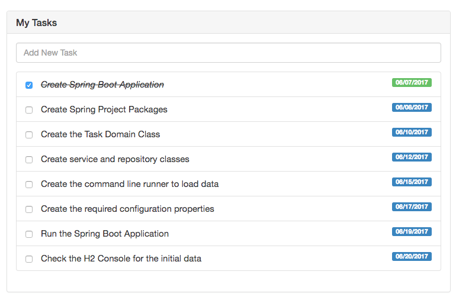

Recently I was working on an [Angular](https://angular.io/) Forms application and I needed the ability to clear an input field.

## How to clear an input field in Angular Forms.

In a normal HTML form you would use find the input on the page and just clear it's text value. In Angular you want to bind the value of a property to the input box and reset the properties value.

## Angular Forms Project

I have been learning a lot lately when it comes to building Angular applications. In this post we are going to talk about a tasks application that I was working on for my latest course. In the tasks application you can list out all of your tasks but I also allow you to add new ones. When a new task was added I wanted to clear the form out so you could quickly add another one. I ran into a problem doing so and I wanted to share that problem and my solution with you today.

### My Tasks Project

The application I am working on is a simple tasks application. It is broken down into 3 components

1.  Tasks - Main tasks component that has 2 sub components.
2.  Add Task - A way for you to add a new task
3.  Task List - A way to display all of the components. 



If you want to check out the project you can grab it on [Github](https://github.com/danvega/spring-angular2-tasks).

### Angular Forms

The first thing we have is the template for the add task form and it looks something like this. You will notice that we have an event handler for when the user hits the enter key. When that happens we will call a method onTaskAdd and pass in the event. 

```html
<div class="form-group">
    <input type="text"
           class="form-control"
           placeholder="Add New Task"
           (keyup.enter)="onTaskAdd($event)">
</div>
```

In this simple demo, we are creating a new task with the value from the input and calling a service to save the task. 

```javascript
onTaskAdd(event) {
    let task: Task = new Task(event.target.value,false, this.getTodayAsString());
    this.taskService.addTask(task)
      .subscribe(
          (newTask: Task) => {
              this.taskService.onTaskAdded.emit(newTask);
          }
      );
}
```

This was working great but after the task was saved I need a way to clear the input so the user could type another task and save it. This seemed like a great opportunity for property binding to work its magic. In the add task component, I would set up a value for the input field and initialize it to an empty string. 

```javascript
addTaskValue: string = "";
```

Then in the template, I would set the value to that property. 

```html
<div class="form-group">
    <input type="text"
           class="form-control"
           placeholder="Add New Task"
           (keyup.enter)="onTaskAdd($event)"
           \[value\]="addTaskValue">
</div>
```

Finally, when we add a new task I thought I could simply set that value back to an empty string. 

```javascript
onTaskAdd(event) {
    let task: Task = new Task(event.target.value,false, this.getTodayAsString());
    this.taskService.addTask(task)
      .subscribe(
          (newTask: Task) => {
              this.addTaskValue = '';
              this.taskService.onTaskAdded.emit(newTask);
          }
      );
}
```

This didn't work and it left me scratching my head. 

## Angular Forms: Clearing an input field

While the solution above didn't work I knew I was headed in the right direction. The next thing I tried was to set the string to a null value or an empty string with a space in it. 

```javascript
this.addTaskValue = ' ';
this.addTaskValue = null;
```

This actually works the very first time that you try it but it will not work on subsequent tries. 

### ngModel

If you have done any work with forms in Angular you have probably come across the [ngModel directive](https://angular.io/docs/ts/latest/api/forms/index/NgModel-directive.html). What does the ngModle directive do? 

> Creates a FormControl instance from a domain model and binds it to a form control element. The FormControl instance will track the value, user interaction, and validation status of the control and keep the view synced with the model. If used within a parent form, the directive will also register itself with the form as a child control.

The problem with the approach we did above is that it is only property binding and not event binding. Angular doesn't run change detection because no event is fired. If you we use ngModel to bind our value to our form control we can get the answer we were looking for. Now we are using 2-way data binding with  `[()]` syntax (also known as 'banana-box syntax'), the value in the UI will always be synced back to the domain model in your class as well.

```html
<div class="form-group">
    <input type="text"
           class="form-control"
           placeholder="Add New Task"
           (keyup.enter)="onTaskAdd($event)"
           \[(ngModel)\]="addTaskValue">
</div>
```

Now when we add a new task we can set our value to an empty string and Angular updates the input for us.

```javascript
onTaskAdd(event) {
    let task: Task = new Task(event.target.value,false, this.getTodayAsString());
    this.taskService.addTask(task)
      .subscribe(
          (newTask: Task) => {
              this.addTaskValue = '';
              this.taskService.onTaskAdded.emit(newTask);
          }
      );
}
```

## Conclusion

Angular gives us some really awesome ways to handle forms but there are some gotchas when you're trying to move from a submitting to a server to a single page application approach. 

_**Question:** What do you like or don't like about working with forms in Angular? What are your toughest challenges? _
