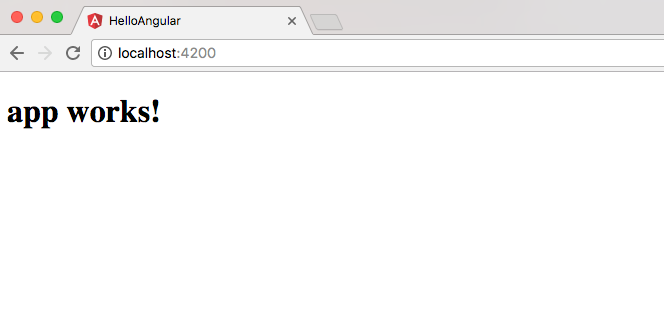

I recently wrote an article about how to get started with the Angular CLI. This is an awesome productivity tool when it comes to getting started with Angular. With it we can quickly create, build and run our applications. This is really helpful but it also adds a little layer of magic to your application. If you always use the CLI but don't take the time to appreciate what is happening behind the scenes you won't understand how to fix problems when they come up. In this article, we are going to look at how Angular boots up your application. 

## Creating a new Angular Application

When you use the Angular CLI to create a new application you get a bunch of files and directories created for you.  

 

We also know that we can use the CLI to run the application using the following command. 

```bash
ng serve
```

This is great and makes our lives easier as we don't have to worry about the nuts and bolts of the application. When we start our application though we don't know what Angular is doing under the hood so let's actually walk through that now. 

## Bootstrapping Angular

Every application we build has an entry point. When we run the hello-angular application above using **_ng serve_** it will first look at the file angular-cli.json. This file contains some information about the application but the main setting we want to look at here is line 15 which tells us "main.ts" is our main file.

```json
{
  "$schema": "./node_modules/@angular/cli/lib/config/schema.json",
  "project": {
    "name": "hello-angular"
  },
  "apps": [
    {
      "root": "src",
      "outDir": "dist",
      "assets": [
        "assets",
        "favicon.ico"
      ],
      "index": "index.html",
      "main": "main.ts",
      "polyfills": "polyfills.ts",
      "test": "test.ts",
      "tsconfig": "tsconfig.app.json",
      "testTsconfig": "tsconfig.spec.json",
      "prefix": "app",
      "styles": [
        "styles.css"
      ],
      "scripts": [],
      "environmentSource": "environments/environment.ts",
      "environments": {
        "dev": "environments/environment.ts",
        "prod": "environments/environment.prod.ts"
      }
    }
  ],
  "e2e": {
    "protractor": {
      "config": "./protractor.conf.js"
    }
  },
  "lint": [
    {
      "project": "src/tsconfig.app.json"
    },
    {
      "project": "src/tsconfig.spec.json"
    },
    {
      "project": "e2e/tsconfig.e2e.json"
    }
  ],
  "test": {
    "karma": {
      "config": "./karma.conf.js"
    }
  },
  "defaults": {
    "styleExt": "css",
    "component": {}
  }
}
```

If we look at the file src/main.ts we will see the following code. 

```typescript
import { enableProdMode } from '@angular/core';
import { platformBrowserDynamic } from '@angular/platform-browser-dynamic';

import { AppModule } from './app/app.module';
import { environment } from './environments/environment';

if (environment.production) {
  enableProdMode();
}

platformBrowserDynamic().bootstrapModule(AppModule);

The last line is where the magic happens and the bootstrap process boots an Angular module called AppModule. If you look under src/app you will see a file, app.module.ts and this is our AppModule that gets called. 

import { BrowserModule } from '@angular/platform-browser';
import { NgModule } from '@angular/core';
import { FormsModule } from '@angular/forms';
import { HttpModule } from '@angular/http';

import { AppComponent } from './app.component';
import { UsersComponent } from './users/users.component';
import { UsersListComponent } from './users/users-list/users-list.component';

@NgModule({
  declarations: [
    AppComponent,
    UsersComponent,
    UsersListComponent
  ],
  imports: [
    BrowserModule,
    FormsModule,
    HttpModule
  ],
  providers: [],
  bootstrap: [AppComponent]
})
export class AppModule { }
```

The AppModule contains some declarations and imports but it also contains one very important line. 

```typescript
bootstrap: [AppComponent]
```

This is telling Angular what component it should load as the application's top level component. So now the app component is loaded that looks like this. 

```typescript
import { Component } from '@angular/core';

@Component({
  selector: 'app-root',
  templateUrl: './app.component.html',
  styleUrls: \['./app.component.css'\]
})
export class AppComponent {
  title = 'app works!';
}
```

The class sets a title variable and displays it in the template and this is why you see '_**app works**_' when you fire up your application for the first time.  



## Bootstrapping Angular Conclusion

If you have done any work in Angular 2/4 you will know that we build out our applications using this component model. What you might not of understand is how that top-level component was called so I really hope this quick tutorial helped clear that up for you.  

_**Question:** Do you have any questions about the initial application the Angular CLI creates for you? _