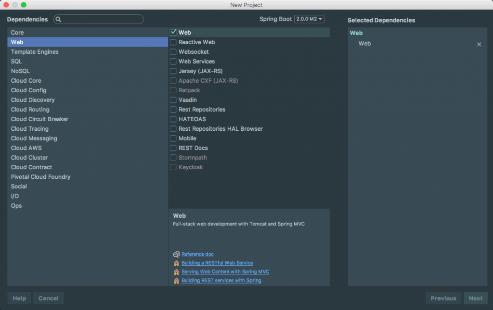

A few weeks ago we got our first look at the next major version of Spring Boot. We talked about all kinds of exciting things such as a Java 8 baseline, Spring Framework 5 support and the new Gradle plugin.  In this article, we take a quick look at the next iteration of Spring Boot 2.0, milestone 2. 

## Spring Boot 2.0 M2

If you want to read the full release notes you can do so [here](https://github.com/spring-projects/spring-boot/wiki/Spring-Boot-2.0.0-M2-Release-Notes). This release covers over [90 issues and](https://github.com/spring-projects/spring-boot/milestone/54?closed=1) pull requests. If you want to test out any of the new features you can start a new project using [http://start.spring.io](http://start.spring.io) or by firing up my favorite IDE, IntelliJ. 

We won't go through all of the features here but I will mention a few of them. 

### Quartz Scheduler

Spring Boot 2 provides support for the Quartz scheduler that can be used via the spring-boot-starter-quartz dedicated starter. Both in-memory and jdbc stores can be configured.

### Spring Data Web configuration

Spring Boot exposes a new spring.data.web configuration namespace that allows to easily configure paging and sorting.

### JSON starter

A new spring-boot-starter-json starter gathers the necessary bits to read and write json. It provides not only jackson-databind but also useful modules when working with Java8: jackson-datatype-jdk8, jackson-datatype-jsr310 and jackson-module-parameter-names. This new starter is now used where jackson-databind was previously defined.

### Thymeleaf starter

The Thymeleaf starter now includes thymeleaf-extras-java8time out of the box. 

### JdbcTemplate

The JdbcTemplate that Spring Boot auto-configures can now be customized via the spring.jdbc.template namespace. Also, the NamedParameterJdbcTemplate that is auto-configured reuses the JdbcTemplate behind the scenes.

### jOOQ

Spring Boot detects the jOOQ dialect automatically based on the DataSource (similarly to what is done for the JPA dialect). Also a @JooqTest has been introduced to ease testing where only jOOQ has to be used.  

## SPRING 2.0 COURSE

If you haven’t already had a chance to check out my [Spring Boot Introduction course](http://courses.www.danvega.dev/p/spring-boot-intro) please do. This course is based on Spring Boot 1.3 and was very much an introduction. I am already planning a curriculum for a Spring 2.0 course is coming and I will be releasing it sometime around SpringOne. 

This is not just going to be a repeat of the previous course with a few new features. First off, I am going to create 2 free courses for setting up your development environment on both Windows 10 and Mac OS. Next, I will incorporate the feedback I have received from my current students. My current course is the best selling course on one platform and I know there is tons of room for improvement.  These courses will allow me to extract that portion of the course that some find necessary and others find boring. These courses will be bundled for free into the Spring Boot 2.0 course. I am working on the curriculum now but if you would like to receive updates check out my [Spring Boot 2.0 Course Page](https://www.danvega.dev/spring-boot-2-0) and signup for updates. Anyone on this list will be the first to find out when it’s released and will receive a discount. 

## CONCLUSION

We are starting to get a real good look at the next version of Spring Boot. I don't know about you but I am looking forward to everything Spring Framework 5 has to offer. 

_**Question:** What are you most looking forward to in Spring Boot 2.0?_
