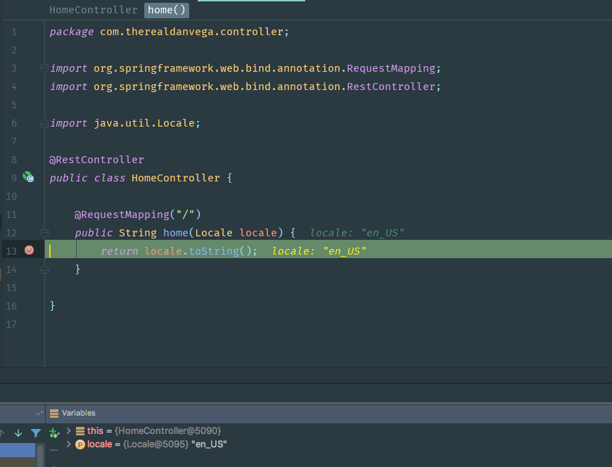
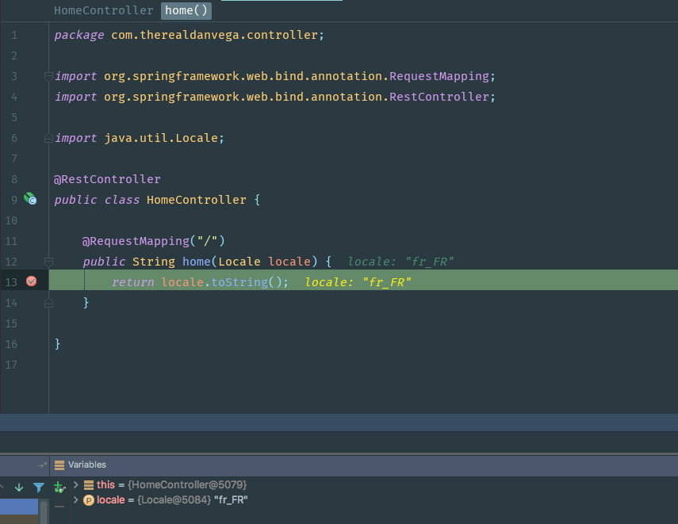

In today's article, we are going to look at a question from a student in my [Spring Boot Introduction course](https://www.danvega.dev/spring-boot). This question has to do with Internationalization and more specifically how to set the locale in the properties file of a Spring Boot application. This question comes in from Mykhaylo. 

> Hi, I've put in my property file spring.mvc.locale=fr , but it is still messages from default messages.properties file that are displayed.  If I display a value of current locale I see that this is en\_GB, and not French:  <p th:text="${#locale}">.....</p> What is the way to set up a locale in SpringBoot?

## Setting the locale

Before we dive into the solution let's take a look at what the student was doing here. If you want to override the locale and give it a fixed value you can do so by setting the following property in your application.properties. 

```bash
spring.mvc.locale=fr_FR
```

In this example, we are setting the locale to French. If you aren't sure of the different locale settings, don't worry. IntelliJ will provide intelli-sense here and give you a list of choices to choose from.


With that in place, I went ahead and created a quick example. 

```java
package com.therealdanvega.controller;

import org.springframework.web.bind.annotation.RequestMapping;
import org.springframework.web.bind.annotation.RestController;

import java.util.Locale;

@RestController
public class HomeController {

    @RequestMapping("/")
    public String home(Locale locale) {
        return locale.toString();
    }

}
```

I placed a debug marker on line 13, ran the application and visited http://localhost:8080. To my surprise, the locale was still what I would expect mine to show up as, en\_US. 



## Locale Resolver

This is actually expected behavior and it has to do with something called the [LocaleResolver](http://docs.spring.io/spring/docs/current/javadoc-api/org/springframework/web/servlet/LocaleResolver.html). This interface allows for implementations based on the request, session, cookies, etc. The default implementation is,[ `AcceptHeaderLocaleResolver` ](http://docs.spring.io/spring/docs/current/javadoc-api/org/springframework/web/servlet/i18n/AcceptHeaderLocaleResolver.html "class in org.springframework.web.servlet.i18n") simply using the request's locale provided by the respective HTTP header.  This means that no matter what you set the locale to Spring is always going to look at the HTTP request header to determine the locale. Luckily for us we can override the LocaleResolver using another property in Spring Boot. 

```java
spring.mvc.locale=fr_FR
spring.mvc.locale-resolver=fixed
```

With this setting in place, our application should now use the locale that you set in your properties file. 



_If you think you had this working at one point in your application you_ aren't_ crazy. This worked in Spring Boot 1.3.7 but then in 1.4 [there was a change](https://github.com/spring-projects/spring-boot/commit/d54474b81cd7e1ae08d1e7200da725df2fd23e13) and if you want it to work going forward you must set the locale resolver. _

## Setting the locale Screencast

I created a quick screencast to walk through setting the locale in your Spring Boot application. Please subscribe to my YouTube channel to get notifications about new screencasts. 

https://www.youtube.com/watch?v=nt27SPF10vY

## Conclusion

I want to thank Mykhaylo again for the question. This is one of those things that has probably tripped most of us at some point.
