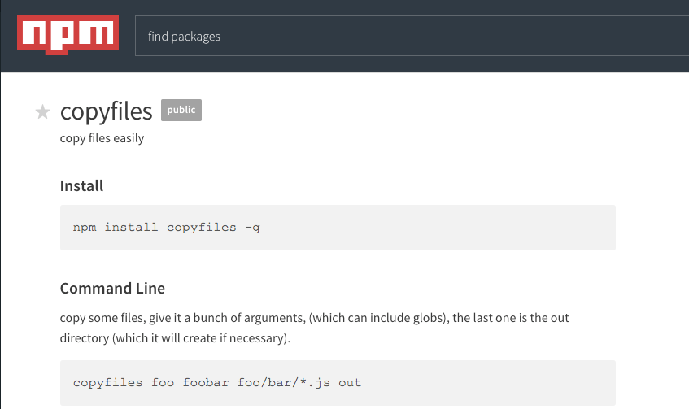
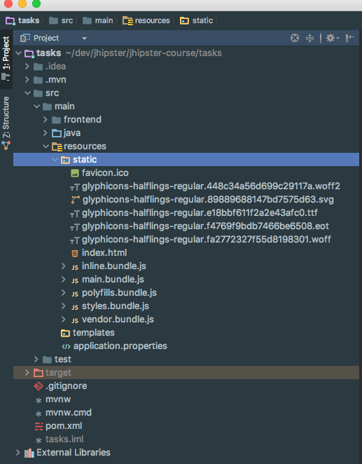

I have been working on a ton of different Angular projects lately and some of them are going to be included in my [Angular 4 Java Developers Course](https://www.danvega.dev/jhipster). There might be times when you have one team working on the front end (Angular) and another working on the back end. There are certainly times when it makes sense to separate the tasks for these applications but there are also times when you as a developer wear many hats. Today we are going talk about the scenario where you are working on both the Angular & Spring Boot application side by side. 

## Angular & Spring Boot Application

If you haven't already checked out the tutorial below please check it out. In this tutorial, I walk you through a quick application that uses Angular and Spring Boot in the same project. 

https://www.youtube.com/watch?v=v7X\_ZHdcNvc&t=5s

I had someone that watched this video and reached out to me asking how the build process works. So this is a good time to talk through how the build works if you're working on both applications at once.

### Building Angular

If you saw towards the end of the tutorial we were building the Angular application so that it would place all of the files in the /src/main/resources directory. I want to dive into that process a little further and explain how we make that happen. If you look at the package.json file inside of  your Angular application you will see a scripts block that looks something like this. 

```json
  "scripts": {
    "ng": "ng",
    "start": "ng serve --proxy-config proxy-conf.json",
    "build": "ng build",
    "test": "ng test",
    "lint": "ng lint",
    "e2e": "ng e2e"
  },
```

This is almost what your scripts section will look like and if we wanted to build the project we could run the following command. 

```bash
npm run build
```

What we want to do is build upon that (pun intended) and to do so we are going to add a couple more scripts. When a build is called a script called post build will be called automatically. In our post-build script, we are going to reference another script. 

```json
"postbuild": "npm run deploy"
```

With that in place, we need to create a deploy script and have it do something. What we want to do is copy all of the files from the result of the Angular (ng) build process to our /resources/static directory. To do so we need some functionality to copy those files. We could write that ourselves or we could use a package that already exists on npm called [copyfiles](https://www.npmjs.com/package/copyfiles). 



You can install it using the instructions above or in my case I just used "npm install copyfiles --save-dev". With that in place, we can now write our deploy script. 

```json
"deploy": "copyfiles -f dist/** ../resources/static"
```

This is great and will work the first time but what about subsequent builds? We need to make sure that the resources/static directory is clean for us to run a proper build & deploy. Just as with post build we can run a script prior to another one running. In this case, I am going to run a pre-deploy script that removes that directory and then creates it. We are going to use another two packages from npm called [rimraf](https://www.npmjs.com/package/rimraf) and [mkdirp](https://www.npmjs.com/package/mkdirp). 

```json
"predeploy": "rimraf ../resources/static/ && mkdirp ../resources/static"
```

Now your scripts should look something like this

```json
  "scripts": {
    "ng": "ng",
    "start": "ng serve --proxy-config proxy-conf.json",
    "build": "ng build",
    "postbuild": "npm run deploy",
    "predeploy": "rimraf ../resources/static/ && mkdirp ../resources/static",
    "deploy": "copyfiles -f dist/** ../resources/static",
    "test": "ng test",
    "lint": "ng lint",
    "e2e": "ng e2e"
  },
```

When you run a build simply use the following command and this will run build, postbuild, predeploy and deploy in that order. 

```bash
npm run build
```

This will perform the following steps

*   Runs _ng serve_ to build your angular app which among many things will bundle your assets. 
*   Deletes out the /src/main/resources/static directory 
*   Creates /src/main/resources/static directory 
*   Copy all the files in the dist/ folder (result of ng build) to the /src/main/resources/static directory

All the files need will now be in the /static folder allowing you to run the Spring Boot Application.



When you visit http://localhost:8080 the index.html file of the static folder is served and your Angular application should run as intended. 

## Conclusion

I just want to give a huge shoutout to [Yakov Fain, the author of Angular 2 Development with TypeScript](http://amzn.to/2tTMa5D). I picked up this little tip from him and can't recommend his book enough. I own that book and LOVE it. 

_**Question:** Are you facing any issues developing Angular & Spring Boot applications? _
