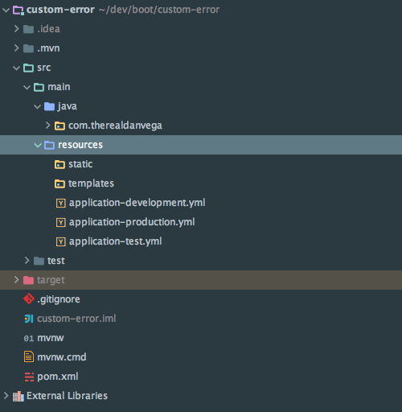

In this tutorial, we are going to look at a question from a student in my [Spring Boot Introduction](https://therealdanvega.com/spring-boot) course. This question had to do with using a YAML file for configuration and the best way about how to inject a single property for multiple environments.  \[featured-image single\_newwindow="false" alt="Spring Boot YAML Configuration"\] Let's take a look at the question and then we will talk through the solution. 

> Hi! How can I access these properties from a single yml properties file in the DataSourceConfig? Thanks.

environments:
  development:
    name: Development setup
    url: http://dev.bar.com
  production:
    name: Production setup
    url: http://prod.bar.com

@Configuration
public class DataSourceConfig
{
    String url;

    @Bean(name="datasource")
    @Profile("development")
    DataSource development()
    {
        return new DataSource(url, 9999);
    }

    @Bean(name="datasource")
    @Profile("production")
    DataSource production()
    {
        return new DataSource(url, 9999);
    }
}

## YAML Configuration

If you haven't heard of YAML before Wikipedia's definition of it is as follows

> **YAML** ([/ˈjæməl/](https://en.wikipedia.org/wiki/Help:IPA_for_English "Help:IPA for English"), rhymes with _mammal_) is a [human-readable](https://en.wikipedia.org/wiki/Human-readable "Human-readable")[data serialization language](https://en.wikipedia.org/wiki/Data_serialization_language "Data serialization language"). It is commonly used for [configuration files](https://en.wikipedia.org/wiki/Configuration_file "Configuration file"), but could be used in many applications where data is being stored (e.g. debugging output) or transmitted (e.g. document headers).

We can use it in place of or right along side of the application.properties. It really just comes down to a preference but if you have a ton of configuration it is usually easier to read YAML configuration in my opinion.  If we take a look back our student had a YAML configuration file that looked like this. 

environments:
  development:
    name: Development setup
    url: http://dev.bar.com
  production:
    name: Production setup
    url: http://prod.bar.com

### Profile Specific Configuration

The first thing I will say about this is that I usually break out different environment configurations into separate configuration files. You can do this with both .properties or .yml configuration using a -environment name on the file. If we had a development, test and production environment we would have 3 files in src/main/resources that looked like this.  

### One Config to rule them all

That is what I would do but if you want to keep them all in one file you most certainly can do so. If we had them all in a single file we can use the 3 dashes and treat them as separate configurations. In this configuration, I am setting the active profile to the development profile and set up two different profiles. 

spring:
  profiles:.active: development
---
spring:
  profiles: development
datasource:
  name: Development Setup
  url: http://dev.bar.com
---
spring:
  profiles: production
datasource:
  name: Production Setup
  url: http://prod.bar.com

Back in our DataSource Configuration class, we can make a small change. When the only thing that changes about the bean is the properties it's instantiated with like we have here there is no need to create different beans based on the environment we are in.  We can simply create one single bean and we will use the correct properties based on the active profile. To get our properties into our class we will use the [@Value annotation](https://docs.spring.io/spring/docs/current/javadoc-api/org/springframework/beans/factory/annotation/Value.html) and the correct values based on our profile will get injected. 

package com.therealdanvega.config;

import com.therealdanvega.domain.DataSource;
import org.springframework.beans.factory.annotation.Value;
import org.springframework.context.annotation.Bean;
import org.springframework.context.annotation.Configuration;

@Configuration
public class DataSourceConfig {

    @Value("${datasource.name}")
    private String name;

    @Value("${datasource.url}")
    private String url;

    @Bean
    DataSource dataSource() {
        return new DataSource(name,url);
    }

}

This is the approach I would take and it works out pretty well. 

## Spring Boot Configuration using YAML Properties Screencast

https://youtu.be/Utwu-17Ct9Y

## Conclusion

Thanks for the question and I hope this helped others clear up some questions on using YAML configuration. This can be a little confusing when you have some many ways to inject properties but after some practice it all makes sense.  _**Question:** What problems are you facing with YAML Configuration? _