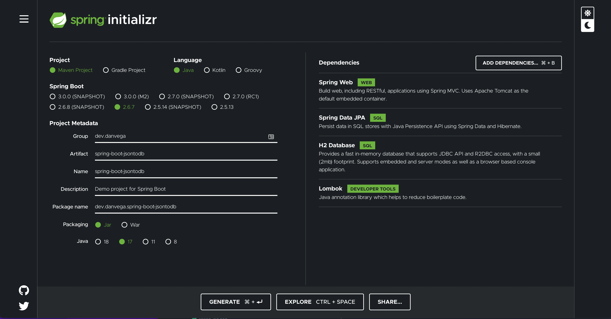
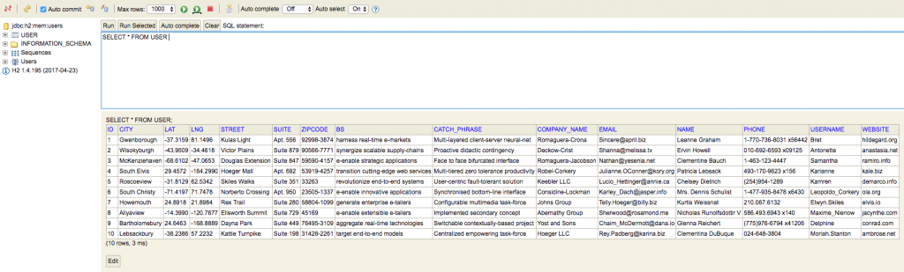

In this tutorial, we are taking a look at a student's question from my [Spring Boot Introduction Course](/courses). If you have a question you would like me to answer please feel free to reach out and ask me. The question I am answering today is:

> How can I read in a JSON file in Spring Boot and save the records to a database?

If you have ever had to read and write JSON data you know that this can be tricky. First, you have to read in the JSON data and mapping that data to your domain model isn't always easy. Once you have that in place you need to take that data and save it off to a database. In this tutorial, we will look at a quick and easy way to do this in Spring Boot.

## Spring Boot Application

The first thing you need to do is to create a new Spring Boot application using the Spring Initalizr. This will create a new Spring Boot application and you will want to select the following dependencies:



### JSON Data

Next you need some sample JSON data and one of my favorite services for doing this is [JSON Placeholder](https://jsonplaceholder.typicode.com/). We are going to grab a [list of users](https://jsonplaceholder.typicode.com/users) and save that to a file called users.json and place it inside of /src/main/resources/json/. Each JSON record for a user will look something like this.

```json
  {
    "id": 1,
    "name": "Leanne Graham",
    "username": "Bret",
    "email": "Sincere@april.biz",
    "address": {
      "street": "Kulas Light",
      "suite": "Apt. 556",
      "city": "Gwenborough",
      "zipcode": "92998-3874",
      "geo": {
        "lat": "-37.3159",
        "lng": "81.1496"
      }
    },
    "phone": "1-770-736-8031 x56442",
    "website": "hildegard.org",
    "company": {
      "name": "Romaguera-Crona",
      "catchPhrase": "Multi-layered client-server neural-net",
      "bs": "harness real-time e-markets"
    }
  },
```

Now that you have a list of users saved you need to model a domain after a user. You could create relationships between each of your domain models but to keep this simple I would just store all of this data in a single user table. To accomplish this you are going to use an embedded address and company domain.

```java
@Data
@AllArgsConstructor
@Entity
public class User {

    @Id
    @GeneratedValue( strategy = GenerationType.AUTO )
    private Long id;
    private String name;
    private String username;
    private String email;
    private String phone;
    private String website;

    @Embedded
    private Address address;
    @Embedded
    private Company company;

    public User() {}

}
```

```java
@Data
@AllArgsConstructor
@Embeddable
public class Address {

    private String street;
    private String suite;
    private String city;
    private String zipcode;

    @Embedded
    private Geo geo;

    public Address() {}
}
```

```java
@Data
@AllArgsConstructor
@Embeddable
public class Geo {

    private String lat;
    private String lng;

    public Geo() {}

}
```

```java
@Data
@AllArgsConstructor
@Embeddable
public class Company {

    @Column( name = "company_name")
    private String name;
    private String catchPhrase;
    private String bs;

    public Company() {}

}
```

### Spring Boot REST Application

Now that you have our domain model in place you are going to build out a REST controller that uses a service & Repository to list and save data.

```java
@RestController
@RequestMapping("/users")
public class UserController {

    private final UserService userService;

    public UserController(UserService userService) {
        this.userService = userService;
    }

    @GetMapping("/list")
    public Iterable<User> list() {
        return userService.list();
    }
}
```

The important thing about our service here is that it takes a list of users and calls our repository to save them all at once.

```java
@Service
public class UserService {

    private final UserRepository userRepository;

    public UserService(UserRepository userRepository) {
        this.userRepository = userRepository;
    }

    public Iterable<User> list() {
        return userRepository.findAll();
    }

    public Iterable<User> save(List<User> users) {
        return userRepository.save(users);
    }

}
```

### Read & Write JSON Data to Database

Before you can write to a database you need to make sure that you have a database configured. In this tutorial you are using an in-memory H2 database. The in-memory part just means that each time we restart the application the database will be wiped clean. If you're new H2 you can check out [this tutorial](https://youtu.be/tSJW5NKPhcM). For now you will need to open up `application.properties` and add the following lines:

```
spring.h2.console.enabled=true
spring.datasource.generate-unique-name=false
spring.datasource.name=users
```

With our application in place, there is only one step left to do. To read the JSON and write it to a database you are going to use a command-line runner. If you're not familiar with a command-line runner it is an interface that you can implement to executed some code before the application starts up. If you want to read more on this you can check out [my blog post here](/blog/2017/04/07/spring-boot-command-line-runner/).

When you bring in the Web dependency you also get the jackson-databind dependency. This contains an Object Mapper class which allows us to easily map JSON data to our domain model.

```xml
<dependency>
    <groupId>com.fasterxml.jackson.core</groupId>
    <artifactId>jackson-databind</artifactId>
</dependency>
```

Using that Object Mapper and our well-crafted domain model from above we have what we need to accomplish our goal. You can read in users.json file and then map that data to the domain model.

```java
@SpringBootApplication
public class JsondbApplication {

	public static void main(String[] args) {
		SpringApplication.run(JsondbApplication.class, args);
	}

	@Bean
	CommandLineRunner runner(UserService userService) {
		return args -> {
			// read json and write to db
			ObjectMapper mapper = new ObjectMapper();
			TypeReference<List<User>> typeReference = new TypeReference<List<User>>(){};
			InputStream inputStream = TypeReference.class.getResourceAsStream("/json/users.json");
			try {
				List<User> users = mapper.readValue(inputStream,typeReference);
				userService.save(users);
				System.out.println("Users Saved!");
			} catch (IOException e){
				System.out.println("Unable to save users: " + e.getMessage());
			}
		};
	}
}
```

If you run our application and look visit the [H2 Database console](http://localhost:8080/h2-console) you should see the 10 records have been inserted. Congratulations, you just read data from a JSON file and inserted it into a database.



## Conclusion

I often get quetions like the one we looked at today. The first thing you need to do is to break down this problem into smaller pieces. The first problem to solve for was creating some sample JSON, modeling our domain model after it and reading it in. Once you have that you can move on to persisting that data into a database.

If you want to check out the source code head over to [Github](https://github.com/cfaddict/spring-boot-jsontodb).

