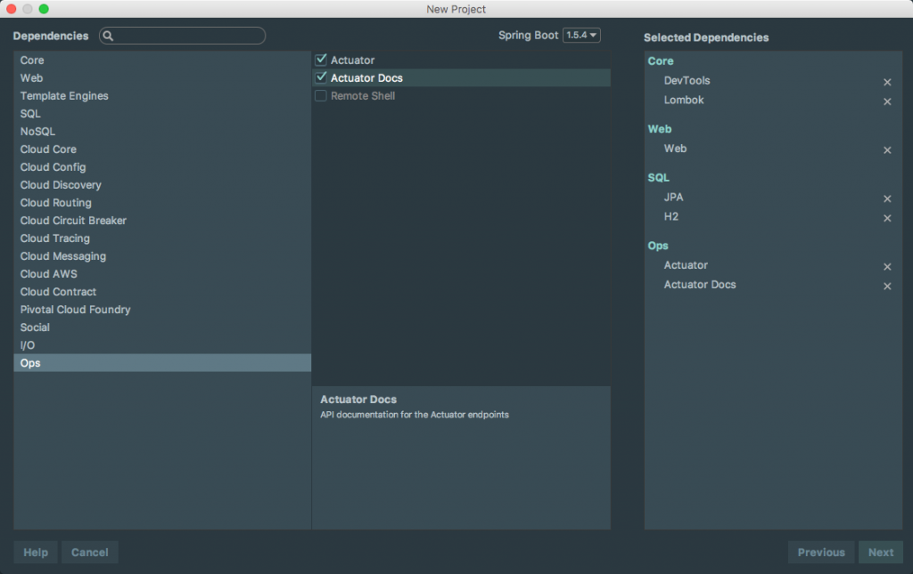

In this tutorial, we are taking a look at a student's question from my [Spring Boot Introduction Course](https://www.danvega.dev/spring-boot). 

> How can I read in a JSON file in Spring Boot and save the records to a database?

If you have ever had to read and write JSON data you know that this can be tricky. First, you have to read in the JSON data and mapping that data to your domain model isn't always easy. Once you have that in place you need to take that data and save it off to a database. In this tutorial, we will look at a quick and easy way to do this in Spring Boot.

## Spring Boot Application

The first thing we need to do is to create a new Spring Boot application using the following dependencies. 



### JSON Data

The first thing we need to do is to get some dummy JSON data and one of my favorite services for doing this is [JSON Placeholder](https://jsonplaceholder.typicode.com/). We are going to grab a [list of users](https://jsonplaceholder.typicode.com/users) and save that to a file called users.json and place it inside of /src/main/resources/json/. Each JSON record for a user will look something like this.

```json
  {
    "id": 1,
    "name": "Leanne Graham",
    "username": "Bret",
    "email": "Sincere@april.biz",
    "address": {
      "street": "Kulas Light",
      "suite": "Apt. 556",
      "city": "Gwenborough",
      "zipcode": "92998-3874",
      "geo": {
        "lat": "-37.3159",
        "lng": "81.1496"
      }
    },
    "phone": "1-770-736-8031 x56442",
    "website": "hildegard.org",
    "company": {
      "name": "Romaguera-Crona",
      "catchPhrase": "Multi-layered client-server neural-net",
      "bs": "harness real-time e-markets"
    }
  },
```

Now that we have our list of users saved we need to model a domain after our user. We could create relationships between each of our domain models but to keep this simple I am going to store all of this data in a single user table. To accomplish this I am going to have embedded and embeddable domain models. 

```java
package com.therealdanvega.domain;

import lombok.AllArgsConstructor;
import lombok.Data;

import javax.persistence.*;

@Data
@AllArgsConstructor
@Entity
public class User {

    @Id
    @GeneratedValue( strategy = GenerationType.AUTO )
    private Long id;
    private String name;
    private String username;
    private String email;
    private String phone;
    private String website;

    @Embedded
    private Address address;
    @Embedded
    private Company company;

    public User() {}
}
```

```java
package com.therealdanvega.domain;

import lombok.AllArgsConstructor;
import lombok.Data;

import javax.persistence.Embeddable;
import javax.persistence.Embedded;

@Data
@AllArgsConstructor
@Embeddable
public class Address {

    private String street;
    private String suite;
    private String city;
    private String zipcode;

    @Embedded
    private Geo geo;

    public Address() {}
}
```

```java
package com.therealdanvega.domain;

import lombok.AllArgsConstructor;
import lombok.Data;

import javax.persistence.Embeddable;

@Data
@AllArgsConstructor
@Embeddable
public class Geo {

    private String lat;
    private String lng;

    public Geo() {}
}
```

```java

package com.therealdanvega.domain;

import lombok.AllArgsConstructor;
import lombok.Data;

import javax.persistence.Column;
import javax.persistence.Embeddable;

@Data
@AllArgsConstructor
@Embeddable
public class Company {

    @Column( name = "company_name")
    private String name;
    private String catchPhrase;
    private String bs;

    public Company() {}
}
```

### Spring Boot REST Application

Now that we have our domain model in place we are going to build out a REST controller that uses a service & Repository to list and save data. 

```java
@RestController
@RequestMapping("/users")
public class UserController {

    private UserService userService;

    public UserController(UserService userService) {
        this.userService = userService;
    }

    @GetMapping("/list")
    public Iterable<User> list() {
        return userService.list();
    }
}
```

The important thing about our service here is that it takes a list of users and calls our repository to save them all at once.

```java
@Service
public class UserService {

    private UserRepository userRepository;

    public UserService(UserRepository userRepository) {
        this.userRepository = userRepository;
    }

    public Iterable<User> list() {
        return userRepository.findAll();
    }

    public Iterable<User> save(List<User> users) {
        return userRepository.save(users);
    }

}
```

### Read & Write JSON Data to Database

With our application in place, there is only one step left to do. To read the JSON and write it to a database we are going to use a command line runner. When we bring in the Web dependency we also get the jackson-databind dependency. This contains an Object Mapper class which allows us to easily map JSON data to our domain model.

```xml
<dependency>
    <groupId>com.fasterxml.jackson.core</groupId>
    <artifactId>jackson-databind</artifactId>
</dependency>
```

Using that Object Mapper and our well-crafted domain model from above we have what we need to accomplish our goal. We are going to read in our users.json file and then map that data to our domain model. 

```java
@SpringBootApplication
public class JsondbApplication {

	public static void main(String[] args) {
		SpringApplication.run(JsondbApplication.class, args);
	}

	@Bean
	CommandLineRunner runner(UserService userService) {
		return args -> {
			// read json and write to db
			ObjectMapper mapper = new ObjectMapper();
			TypeReference<List<User>> typeReference = new TypeReference<List<User>>(){};
			InputStream inputStream = TypeReference.class.getResourceAsStream("/json/users.json");
			try {
				List<User> users = mapper.readValue(inputStream,typeReference);
				userService.save(users);
				System.out.println("Users Saved!");
			} catch (IOException e){
				System.out.println("Unable to save users: " + e.getMessage());
			}
		};
	}
}
```

If we run our application and look at the H2 Database console we can see the 10 records have been inserted. 


## Screencast

https://youtu.be/rGdKmF2UzSc

## Conclusion

If you want to check out the [source code for this project you can do so here](https://github.com/cfaddict/spring-boot-jsontodb).

_**Question:** Are you facing any issues with JSON in your applications? _
