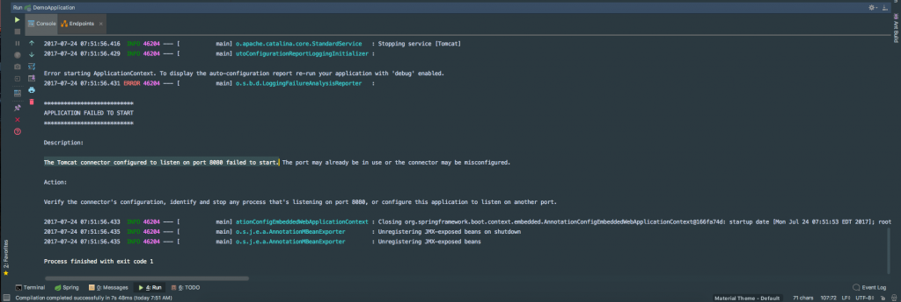

Errors are a part of the development lifecycle and there is no way getting around them. I know we all like to think we are top notch coders and that we are error prone but I can assure you that isn't the case.  \[featured-image single\_newwindow="false" alt="Application Failed To Start"\] When errors come up it is nice to have as much information at our disposal as possible. We don't have time to search the web for hours of cryptic stack messages to find our solution. In this article, I am going to show you an error you might come across and how Spring Boot 1.4 has made it a little bit easier to decipher error messages. 

## Analysis of Startup Failures

Prior to Spring Boot version 1.4, it was a little tough decrypting error messages that were causing our applications not to start. If you already have an application running on port 8080 and try to start up another one you might have seen an error that looked like this. 

2016-02-16 17:46:14.334 ERROR 24753 --- \[           main\] o.s.boot.SpringApplication               : Application startup failed

java.lang.RuntimeException: java.net.BindException: Address already in use
    at io.undertow.Undertow.start(Undertow.java:181) ~\[undertow-core-1.3.14.Final.jar:1.3.14.Final\]
    at org.springframework.boot.context.embedded.undertow.UndertowEmbeddedServletContainer.start(UndertowEmbeddedServletContainer.java:121) ~\[spring-boot-1.3.2.RELEASE.jar:1.3.2.RELEASE\]
    at org.springframework.boot.context.embedded.EmbeddedWebApplicationContext.startEmbeddedServletContainer(EmbeddedWebApplicationContext.java:293) ~\[spring-boot-1.3.2.RELEASE.jar:1.3.2.RELEASE\]
    at org.springframework.boot.context.embedded.EmbeddedWebApplicationContext.finishRefresh(EmbeddedWebApplicationContext.java:141) ~\[spring-boot-1.3.2.RELEASE.jar:1.3.2.RELEASE\]
    at org.springframework.context.support.AbstractApplicationContext.refresh(AbstractApplicationContext.java:541) ~\[spring-context-4.2.4.RELEASE.jar:4.2.4.RELEASE\]
    at org.springframework.boot.context.embedded.EmbeddedWebApplicationContext.refresh(EmbeddedWebApplicationContext.java:118) ~\[spring-boot-1.3.2.RELEASE.jar:1.3.2.RELEASE\]
    at org.springframework.boot.SpringApplication.refresh(SpringApplication.java:766) \[spring-boot-1.3.2.RELEASE.jar:1.3.2.RELEASE\]
    at org.springframework.boot.SpringApplication.createAndRefreshContext(SpringApplication.java:361) \[spring-boot-1.3.2.RELEASE.jar:1.3.2.RELEASE\]
    at org.springframework.boot.SpringApplication.run(SpringApplication.java:307) \[spring-boot-1.3.2.RELEASE.jar:1.3.2.RELEASE\]
    at org.springframework.boot.SpringApplication.run(SpringApplication.java:1191) \[spring-boot-1.3.2.RELEASE.jar:1.3.2.RELEASE\]
    at org.springframework.boot.SpringApplication.run(SpringApplication.java:1180) \[spring-boot-1.3.2.RELEASE.jar:1.3.2.RELEASE\]
    at sample.undertow.SampleUndertowApplication.main(SampleUndertowApplication.java:26) \[classes/:na\]
Caused by: java.net.BindException: Address already in use
    at sun.nio.ch.Net.bind0(Native Method) ~\[na:1.8.0\_60\]
    at sun.nio.ch.Net.bind(Net.java:433) ~\[na:1.8.0\_60\]
    at sun.nio.ch.Net.bind(Net.java:425) ~\[na:1.8.0\_60\]
    at sun.nio.ch.ServerSocketChannelImpl.bind(ServerSocketChannelImpl.java:223) ~\[na:1.8.0\_60\]
    at sun.nio.ch.ServerSocketAdaptor.bind(ServerSocketAdaptor.java:74) ~\[na:1.8.0\_60\]
    at org.xnio.nio.NioXnioWorker.createTcpConnectionServer(NioXnioWorker.java:190) ~\[xnio-nio-3.3.4.Final.jar:3.3.4.Final\]
    at org.xnio.XnioWorker.createStreamConnectionServer(XnioWorker.java:243) ~\[xnio-api-3.3.4.Final.jar:3.3.4.Final\]
    at io.undertow.Undertow.start(Undertow.java:137) ~\[undertow-core-1.3.14.Final.jar:1.3.14.Final\]
    ... 11 common frames omitted

Now if you that error message enough times you can quickly recognize it but if you're seeing it for the first time it can be a little confusing. 

## Spring Boot 1.4 Improvement

Spring Boot will now perform analysis of common start-up failures and provide useful diagnostic information rather than simply logging an exception and its stack trace. This is what the same error message looks like in 1.4+.   With this error message, you can clearly see why our application is not starting. If you still want to see the stack trace of the underlying cause, enable debug logging for  `org.springframework.boot.diagnostics.LoggingFailureAnalysisReporter` .

## Conclusion

The Spring Boot team is always listening to feedback to improve the developer experience. If you have issues like this one [please consider submitting an issue request](https://github.com/spring-projects/spring-boot).  _**Question:** What problems are you facing debugging errors in Spring Boot applications?_