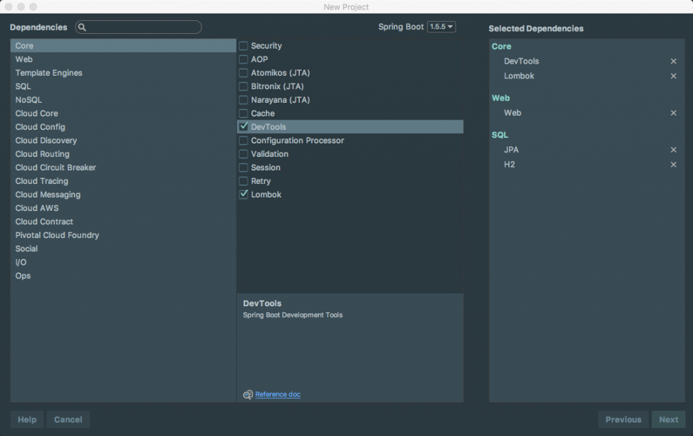
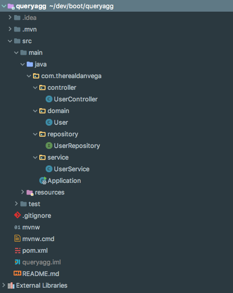

In this tutorial, we are taking a look at a student's question from my [Spring Boot Introduction Course](https://www.danvega.dev/spring-boot).

> Hi Dan, How can I use the @Query to specify an aggregation function in a select statement like... "select post\_date, sum(value) from post group by post\_date" retrieve it to a DTO and show on screen?

This is actually pretty easy to do using the @Query annotation. In this tutorial, I will show you how to do this using JQL and native SQL. 

## Creating the application

The first thing we need to do is to create a very basic Spring Boot application with the following dependencies. If you want you can grab the source code for this [demo here](https://github.com/cfaddict/queryagg). 



I won't walk you through every single step of this application because I don't want to focus on the application itself. We are building a simple application that exposes some endpoints that call a service and a repository.  



This is what our domain looks like. 

```java
@Entity
@Data
@NoArgsConstructor
public class User {

    @Id @GeneratedValue
    private long id;
    private String firstName;
    private int age;

    public User(String first, int age) {
        this.firstName = first;
        this.age = age;
    }

}
```

And we will load some initial test data using a [Command Line Runner](https://www.danvega.dev/blog/2017/04/07/spring-boot-command-line-runner). 

```java
@SpringBootApplication
public class Application {

	public static void main(String[] args) {
		SpringApplication.run(Application.class, args);
	}

	@Bean
	CommandLineRunner runner(UserRepository userRepository){
	    return args -> {
	        userRepository.save( new User("Sam", 20) );
	        userRepository.save( new User("Joe", 25) );
	        userRepository.save( new User("Mark", 48) );
	        userRepository.save( new User("Emily", 26) );
	        userRepository.save( new User("Nick", 59) );
	    };
	}

}
```

With those in place, we can now begin to add some new methods to our repositories. 

## Spring Data Repositories

In the first example, I want to find out the average age of all the users in our system. We can do so by using the Aggregate function AVG in both JPQL and SQL. We can write these queries using the [@Query annotation](https://docs.spring.io/spring-data/jpa/docs/current/reference/html/#jpa.query-methods.at-query). 

```java
public interface UserRepository extends CrudRepository<User, Long> {

    @Query("SELECT AVG(u.age) from User u")
    int getAverageAge();

}
```

In this example, we are using [JPQL](http://docs.oracle.com/html/E13946_04/ejb3_langref.html) to write the SQL that will fetch us the data we need. JPQL stands for Java Persistence Query Language and if you have ever worked with Hibernate before you have probably seen this in action. It is important to understand that this is the default and if you want to write native SQL you can, but you need to add a flag, more on that in a bit.  Now let's say that we wanted to add a new method that would give us the max age of all the users but also allow us to exclude a single user. This is strictly a demo and you probably wouldn't use this in a real application but it does show off a couple of things. First, it shows us how to include parameters in our SQL statement and it also shows us that we can write native SQL by using the native SQL flag. 

```java
package com.therealdanvega.repository;

import com.therealdanvega.domain.User;
import org.springframework.data.jpa.repository.Query;
import org.springframework.data.repository.CrudRepository;

public interface UserRepository extends CrudRepository<User, Long> {

    @Query("SELECT AVG(u.age) from User u")
    int getAverageAge();

    @Query(value = "SELECT max(age) from User where first_name <> ?1", nativeQuery = true)
    int getMaxAgeMinus(String name);

}
```

## Screencast 

https://www.youtube.com/watch?v=zLRavueFJy0

## Conclusion

I think the one that confuses people is not understanding that the default query syntax for @Query annotation is [JPQL and that it does support aggregate functions](http://docs.oracle.com/html/E13946_04/ejb3_langref.html#ejb3_langref_agg_examples). If you are interested in the full source code for this [demo you can grab it here](https://github.com/cfaddict/queryagg). 

_**Question:** Are you facing any issues with your Spring Data Repositories? _
