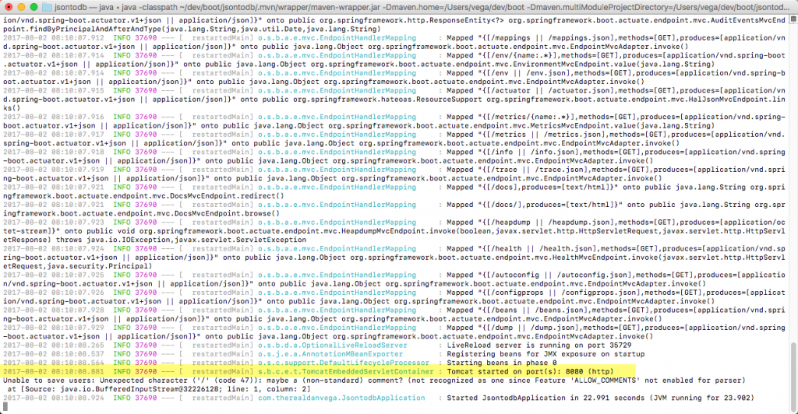
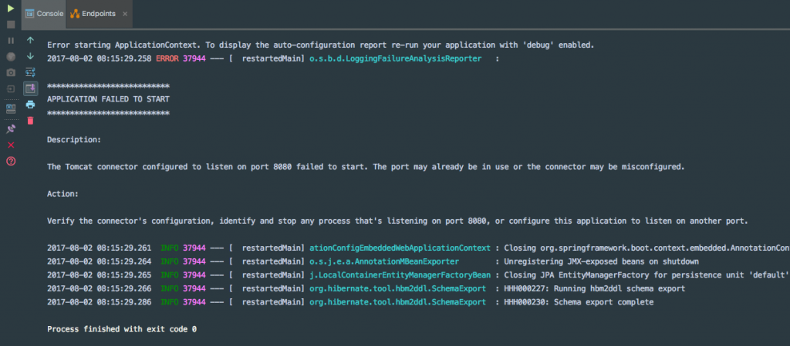
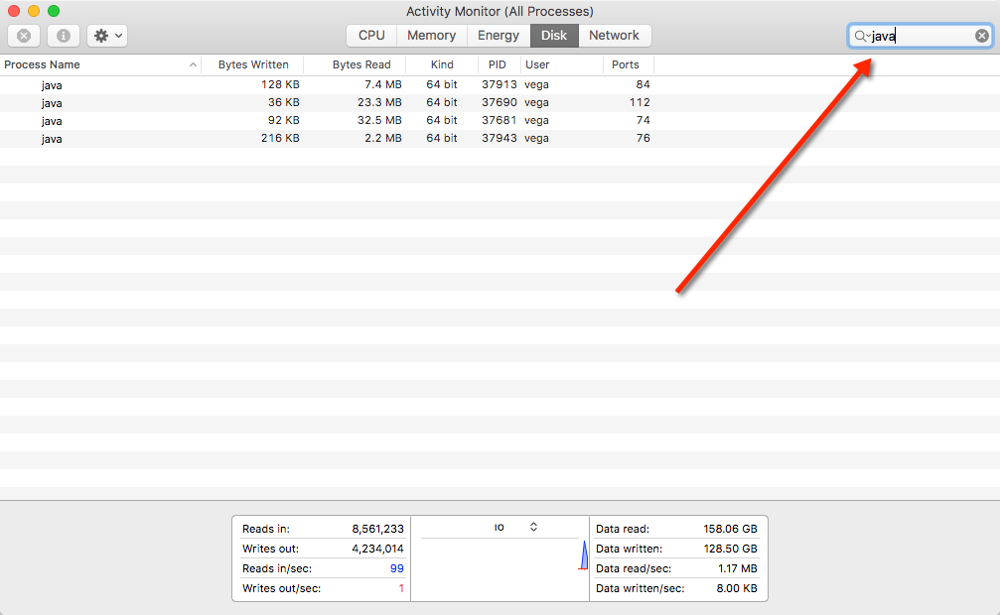

Last week I [wrote an article](https://www.danvega.dev/blog/2017/07/24/spring-boot-application-failed-start) on the improvements in Spring Boot 1.4 of startup errors. Specifically, we saw that we got a really informative error message when we try and run an application and port 8080 is already in use.  I received a question from a reader that went like this  "I get the port 8080 is already in use error from time to time and I am not sure how to fix it, what can I do?"  This is actually pretty easy to fix and happens to all of us. In this short article, I will show you how to do it on macOS and link to another article I wrote on how to do this on Windows. 

## Port 8080 is already in use

This problem usually comes up because another process wasn't properly terminated. If you want to simulate this issue you can fire up one app in a terminal and then try launching another in your favorite IDE (IntelliJ right?). I opened up a terminal and ran my other project using the Maven plugin.

```bash
./mvnw spring-boot:run
```



Now if we head into IntelliJ and try to run our application we are going to see an error that looks something like this. 



## Activity Monitor FTW

So we know that another process is running but it isn't always as simple as forgetting a terminal window is open and running another app. This can happen when an IDE is closed and the process is correctly terminated.  macOS gives us a nice tool for monitoring process by name and port called Activity Monitor. If you open up Activity Monitor (I just use Spotlight) you could manually look for the processes or use the search bar in the upper right-hand corner. Now you can kill the existing processes and your unwanted process will be gone.



### What about Windows? 

If you're a windows user I wrote an article awhile back on how to kill a process by port number. 

## Screencast

https://www.youtube.com/watch?v=Qn3vhcDQmpI
