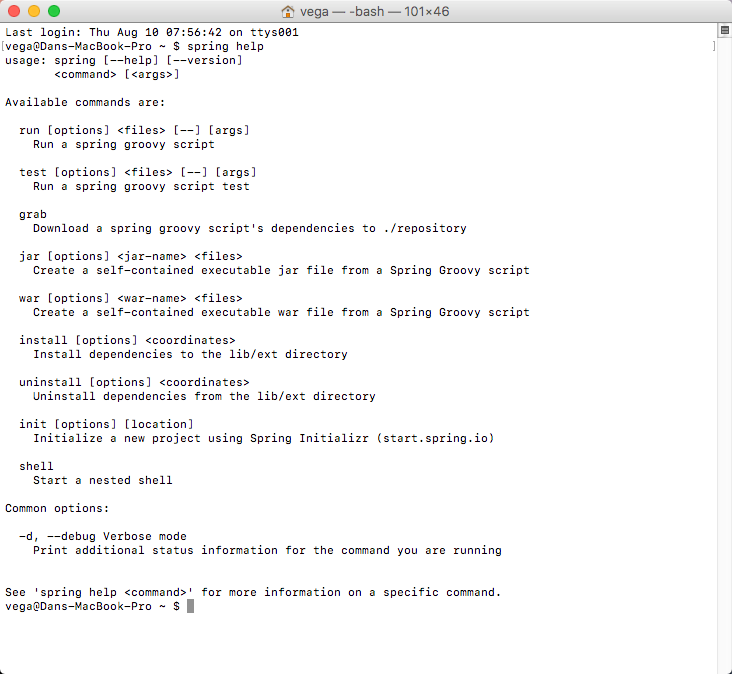

In this tutorial, we are taking a look at a student's question from my [Spring Boot Introduction Course](https://therealdanvega.com/spring-boot). This question has to do with the Spring CLI which is a great tool that allows you to quickly prototype with Spring.  \[featured-image single\_newwindow="false" alt="Spring CLI"\]

> Hi Dan,
> 
> I have created the spring boot application through spring CLI in the same way you showed in the video but my question is, How can we add multiple dependencies in our application through spring CLI? You have shown it for only one dependency i.e "web" using -d option but what if we want to add more dependencies through CLI?

In this article, I am going to talk through what the Spring CLI, how to install it and use it and of course answer the question above. 

## Spring CLI

If you weren't already aware there is a really cool tool called the Spring CLI (Command Line Interface).  The Spring Boot CLI is a command line tool that can be used if you want to quickly prototype with Spring. It allows you to run [Groovy](http://groovy.codehaus.org/) scripts, which means that you have a familiar Java-like syntax, without so much boilerplate code. Did I mention I also [teach a course on Groovy](https://therealdanvega.com/groovy) and absolutely love the language?  You don’t need to use the CLI to work with Spring Boot but it’s definitely the quickest way to get a Spring application off the ground.

## Installing the Spring CLI

There are a couple of ways to install the Spring CLI and we will go through them here. First, you can install them manually by downloading the Spring CLI distribution from the Spring software repository:

*   [spring-boot-cli-1.5.6.RELEASE-bin.zip](http://repo.spring.io/release/org/springframework/boot/spring-boot-cli/1.5.6.RELEASE/spring-boot-cli-1.5.6.RELEASE-bin.zip)
*   [spring-boot-cli-1.5.6.RELEASE-bin.tar.gz](http://repo.spring.io/release/org/springframework/boot/spring-boot-cli/1.5.6.RELEASE/spring-boot-cli-1.5.6.RELEASE-bin.tar.gz)

Another way to install the Spring CLI is by using SDKMan. If you have been following me at all you know that I am a huge fan of [SDKMan](http://sdkman.io/).     When you have SDKMan installed you can install the Spring CLI by running the following command. 

$ sdk install springboot
$ spring --version
Spring Boot v1.5.6.RELEASE

## Using the Spring CLI

Now that we have the Spring CLI installed its time to use it. If you aren't sure what options are available you can run the help command to get more information.   In this first example, we will create and run a simple example. First, create a file called _app.groovy_ that looks like this. 

@RestController
class AppController { 

    @RequestMapping("/")
    public String home() {
        return "Hello, World!";
    }

}

Now you can run this application from the command line using the following command. 

spring run app.groovy

 You can also use the Spring CLI to initialize a new project using [http://start.spring.io](http://start.spring.io/). This is similar to creating a new project in IntelliJ using the fancy wizard. So to answer our initial question which was how can we initialize a new project from the Spring CLI and add multiple dependencies: 

$ spring init --dependencies=web,data-jpa my-project
Using service at https://start.spring.io
Project extracted to '/Users/developer/example/my-project'

All you need to do is separate them using a comma and you can add as many dependencies as you like. 

## Conclusion

I think the Spring CLI is a great little tool for getting started. I hope you found this tutorial useful and I hope you check out the Spring CLI if you haven't already looked at it.  _**Question:** What other tools do you find are helpful for developers new to Spring Boot? _