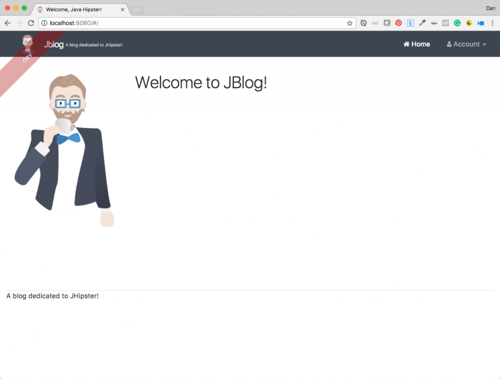
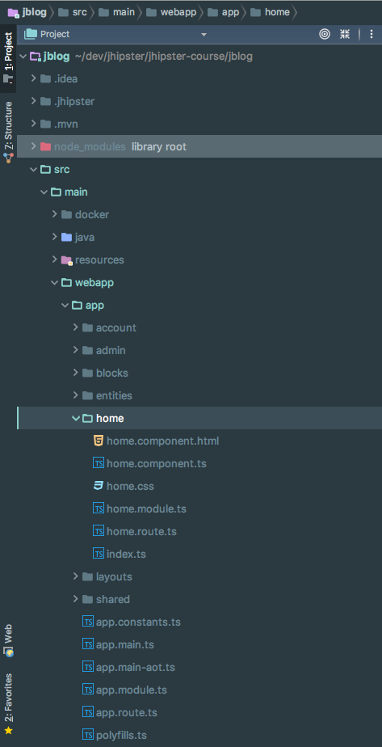
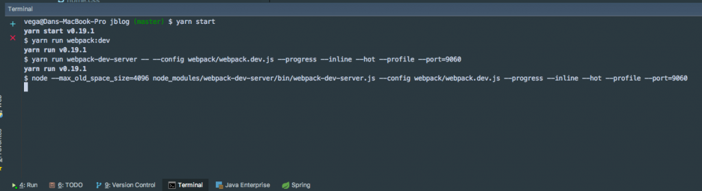

I have been working really hard lately to wrap up [my latest course on JHipster](https://therealdanvega.com/jhipster).  \[featured-image single\_newwindow="false" alt="JHipster in Development"\] In one of the exercises, I have the students create their own application. In this application, one of the requirements is to make UI changes. When working with Angular you have probably come to expect to see those changes automatically reflected in the browser. In this tutorial, we will look at how to work with JHipster in Development. 

## JHipster in Development

I was working on this course and I quickly realized that unless you were familiar with this stack it might be a little confusing to know what to do in development. It is important to remember that we are really working with 2 different applications, Angular & Spring Boot, that work together. When you first start working with JHipster your first thought is to simply run the Spring boot app. 

### Angular Development

At this point, you might try to go into your webapp (Angular) directory, locate the home component and begin making changes to the application.   The problem with this is that any changes you make won't be seen in the browser, even if you reload the page. JHipster gives us a way to work efficiently in development mode.  If you have worked on Angular applications before you might have spun up a server using "npm start" that will watch for any changes and automatically refresh the browser window. JHipster gives us something similar by running the "yarn start" command and you can run it right in your IDE.   [From the JHIpster documentation](http://www.jhipster.tech/development/#working-with-angular) running this command provides us some very impressive features. 

*   As soon as you modify one of your HTML/CSS/TypeScript files, your browser will refresh itself automatically
*   As your testing your application on several different browsers or devices, all your clicks/scrolls/inputs should be automatically synchronized on all screens

This will launch:

*   A Webpack task that will automatically compile TypeScript code into JavaScript
*   A Webpack “hot module reload” server that will run on [http://localhost:9060/](http://localhost:9060/) (and has a proxy to [http://127.0.0.1:8080/api](http://127.0.0.1:8080/api) to access the Java back-end)
*   A BrowserSync task that will run on [http://localhost:9000/](http://localhost:9000/), which has a proxy to [http://localhost:9060/](http://localhost:9060/) (the Webpack “hot module reload” server), and which will synchronize the user’s clicks/scrolls/inputs
*   The BrowserSync UI, which will be available on [http://localhost:3001/](http://localhost:3001/)

## JHipster in Development Mode Screencast 

https://www.youtube.com/watch?v=SVUB3Yhv3sQ&t=114s  

## Conclusion

I hope this short tutorial shed some light on how to work with JHipster in development.  _**Question:** What problems are you facing in your JHipster projects? _