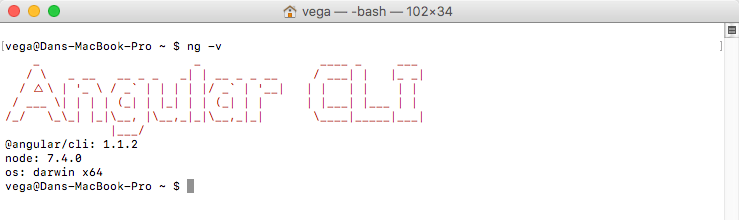
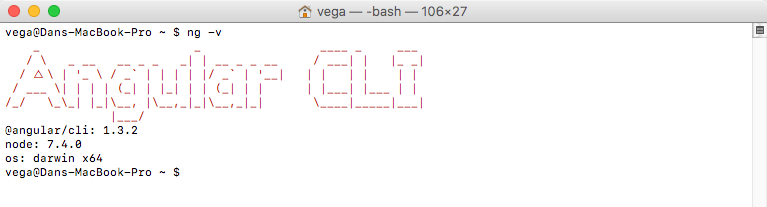

Angular CLI recently released its next major version, 1.3 (Hopper). There are some pretty great features in this release and I can't wait to talk about a few of them here.  In this article, we are going to discuss how to check what version of the CLI you are running, how to upgrade and what new features 1.3 is giving us.

## Upgrading Angular CLI

The first thing we need to talk about is installing or upgrading the Angular CLI. For those of you who have never actually installed it yet please [check out this article I wrote](https://therealdanvega.com/blog/2017/06/05/getting-started-angular-cli). If you are already running the Angular CLI you can check what version you are using by running the `ng -v` command.



As we can see it has been a minute since I ran an update so this is a perfect time to do so.

### Upgrading 1.0.0-beta.28 or earlier

If you're using Angular CLI  `1.0.0-beta.28`  or less, you need to uninstall  `angular-cli`  package. It should be done due to changing of package's name and scope from  `angular-cli`  to  `@angular/cli`

```bash
npm uninstall -g angular-cli @angular/cli
npm cache clean
npm install -g @angular/cli
```

### Update Angular CLI

In my case, I was running a newer version so we can just run a simple command to update.

```bash
npm install -g @angular/cli
```

Now if I run `ng -v` you can see that I have updated to the latest stable version which is 1.3.2



## What's New in Angular CLI 1.3

Angular CLI now officially supports ES2017 and TypeScript 2.4 paving the way for Angular 5 which should be released very soon!

### Universal Support (Server Side Rendering)

Angular Universal Support allows you to run your Angular code on the server side as opposed to in the browser. Angular CLI supports a generation of a Universal build for your application. This is a CommonJS-formatted bundle which can be `require()` into a Node application (for example, an Express server) and used with  `@angular/platform-server` 's APIs to pre-render your application.

[Follow this tutorial to check it out.](https://github.com/angular/angular-cli/wiki/stories-universal-rendering)

### Build Optimizer

Angular CLI 1.3 upgrades us to Webpack 3 which brings us some new features a bug fixes. We also get a new optimizer that is meant to slim down our applications in production.

```bash
ng build --prod --build-optimizer
```

### Named Chunks

As long as we are talking about builds we should mention a new flag --named-chunks which will generate named chunks. Prior to Angular CLI 1.3 all of the lazily loaded chunks were named:

```bash
0.js
1.js
2.js
etc...
```

This setting can be enabled disabled with the namedChunks option in angular-cli.json and defaults to true. With that option in place, we will get some nicely named chunks.

```bash
products.module.chunk.js
orders.module.chunk.js
```

### Proxy Configuration

It's been possible to define a proxy configuration for awhile now. This allows to match a pattern and forward all of those requests to our server side application. I do this a lot in my Spring Boot applications with something like this.

```javascript
{
  "/api": {
  "target": "http://localhost:8080"
  }
}
```

The problem was you had to modify the ng serve command so that it took in your proxy config

```bash
ng serve --proxy-config proxy.conf.json
```

Now we can simply configure a proxyConfig in our angular-cli.json and the serve command will pick it up automatically.

### Bug Fixes

As always a considerable amount of bug fixes!

## Angular CLI 1.3 Release Notes

This is release 1.3.0 of the Angular CLI. As a minor release, it adds a lot of new features (as well as a considerable amount of bug fixes) from the 1.2 releases. 

[Read the full release notes here](https://github.com/angular/angular-cli/releases/tag/v1.3.0).

## Conclusion

The Angular team is constantly improving the CLI and it's exciting to see some of the new features and bug fixes.
