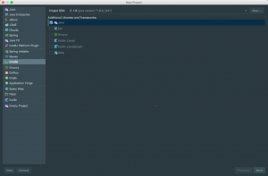
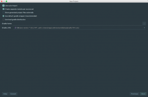
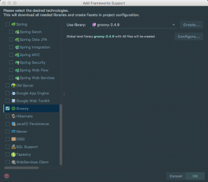
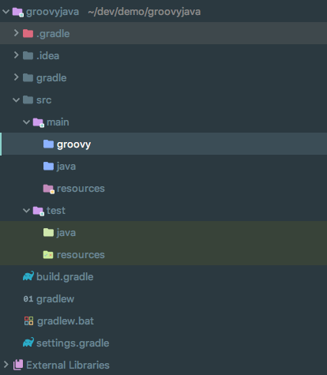
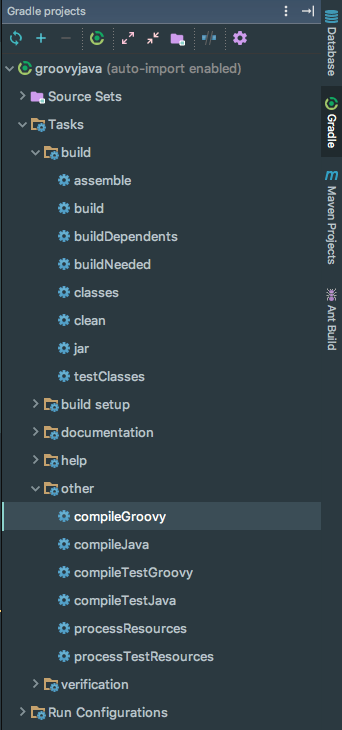

I had an interesting problem come up at work last week and I would like to share it with you today. A coworker was having an issue with a Gradle build. Whenever he tried to compile the project it threw an error saying it couldn't find the Groovy class he was trying to call from Java.

In this article, we are going to walk through setting up a project that will illustrate this problem. We will then examine what normal behavior is in a Gradle build and how we can make a change to fix this problem that we were facing. 

## Create a new Gradle Project

The first thing we are going to do is create a new project using Gradle. This is going to give us a standard Gradle & Java project layout. 





The next thing we need to do is add support to our IDE for Groovy.



With that in place, we are going to add a new groovy folder to our main directory. 



## Create a new Groovy class

Now that a lot of our setup is done we get to finally write some code. I created a new package "com.foo" under my Groovy src folder and created a simple class called Developer.

```java
package com.foo

class Developer {

    String firstName
    String lastName
    String email
    String github

    List<String> languages = \[\]

    Developer(String firstName, String lastName, String email, String github, List<String> languages) {
        this.firstName = firstName
        this.lastName = lastName
        this.email = email
        this.github = github
        this.languages = languages
    }
}
```

Next, we will modify our Gradle build. We are going to add the Groovy dependency and a couple plugins. The groovy plugin gives us the ability to compile the Groovy code. 

``` java
group 'com.therealdanvega'
version '1.0-SNAPSHOT'

apply plugin: 'java'
apply plugin: 'groovy'
apply plugin: 'idea'

sourceCompatibility = 1.8

repositories {
    mavenCentral()
}

dependencies {
    compile group: 'org.codehaus.groovy', name: 'groovy-all', version: '2.4.9'
    testCompile group: 'junit', name: 'junit', version: '4.12'
}
```

We should now be able to run the compileGroovy task from Gradle. 



## Creating the Java Application

It's time to focus on the Java side of this project and create our main application. I have created a very simple application that simply creates a new developer. 

```java
package com.therealdanvega;

import com.foo.Developer;

import java.util.Arrays;
import java.util.List;

public class Application {

    public static void main(String\[\] args) {
        List<String> languages = Arrays.asList("Java","Groovy");
        Developer developer = new Developer("Dan","Vega","danvega@gmail.com","cfaddict", languages);
    }

}
```

If we try and run a Gradle build now it will fail and this is the problem we were facing at work. 

## Compiling Groovy before Java

The reason this fails is that the default action for our Gradle build is to compile the Java class before it compiles the Groovy class. When this takes our Java class will have no idea what our Developer class is because it hasn't been compiled yet. No worries though, we can change this behavior with a little bit of code in our Gradle build.  The Groovy plugin actually extends the Java plugin so that we can compile Groovy along with Java. What we are doing here is just telling Groovy to compile everything for us. When you understand what is going on behind the scenes this makes a lot of sense. 

```java
sourceSets {
    main {
        java {
            srcDirs = \[\] // don't compile Java code twice
        }
        groovy {
            srcDirs = \[ 'src/main/groovy', 'src/main/java' \]
        }
    }
}
```

Now if you were trying to call a Java class from Groovy the normal behavior would work out just fine. 

## Conclusion

This is a pretty common mistake when you try and mix both Java and Groovy. I loving mixing Java & Groovy in projects whenever I get the chance so hopefully, this taught you something and you will do the same in the near future. _**Question:** Are you using Java & Groovy in your projects today? _
