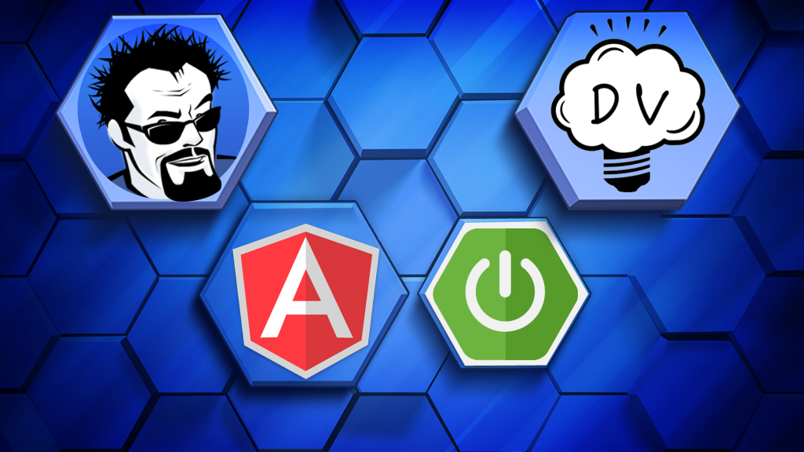
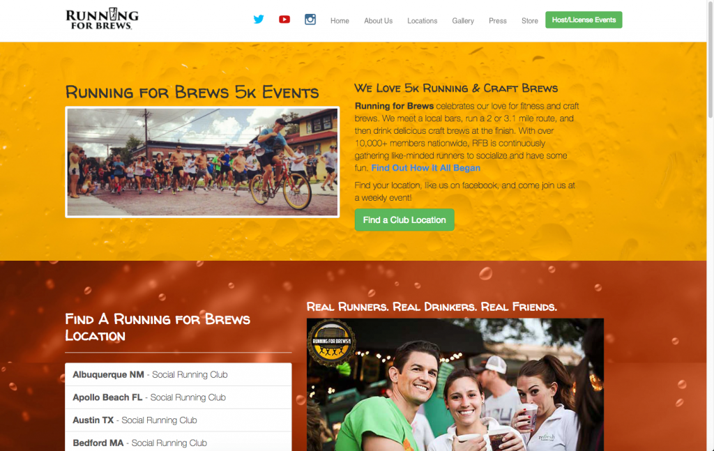

I'm so excited to finally announce the release of my new course with [John Thompson](https://springframework.guru), **Angular 4 Java Developers**! In this course, you will learn how to build applications using some of the hottest technologies in the industry today, including Spring Boot and Angular. These are two of our favorite technologies to work with right now, it really makes developing applications a breeze.

In this introduction to the course, I am going to give you all of the details, as well as a special offer so please read the entire article. 

## About Angular 4 Java Developers

First off, I just want to say congrats to my partner in crime on this course, [John Thompson](https://springframework.guru). We have put a lot of thought and hard work into this course and I think it's really going to show. We had a clear vision when we started this course and I think we ended up delivering. What we started out building is very different than what it looks like today, but you need to put yourself in your student's shoes and ask yourself "Am I getting what I need out of this course?"  

### What you will learn

*   **Building Angular & Spring Boot apps** **without JHipster -** To start this course off, we are going to build a small tasks application that demonstrates just what goes into putting all of these technologies together.
*   **What is JHipster?** Next, we are going to learn about what JHipster is and why you should never start another Angular & Spring Boot project without it again.
*   **How to setup your development environment -** Any good cook knows that if you don't have all of your ingredients and tools, it is really hard to prepare a meal. The same goes for you as a developer and your environment. We will walk you through setting up your environment and showing you the tools that you will need.
*   **Compare starting from scratch & JHipster -** We will take that same application we built from scratch and show you how we build it in JHipster.
*   **JDL Studio -**A great way to build out your domain model.
*   **MongoDB -**Learn how to use MongoDB in your applications.
*   **Microservices -** Are all the buzz these days. We are going to learn about what they are and more importantly when to use them. After that, we will learn how to build out microservices in our JHipster application.
*   **Build and deploy a real-world application -** We won't just teach you about how to build real-world applications, we will actually help you do it. In this course, you are going to build a real-world application from requirements to production.

## Running for Brews

I think the best part of this course is that we built a real-world application from conception to completion. We sat down with the [Running for Brews](http://runningforbrews.com/) organization and talked through the requirements with them. Running for Brews is a national running club that is all about bringing people together. In this course, we helped them build a loyalty program that is going to reward runners for consistently showing up. I had so much fun on this project that as soon as the weather gets warm again, I am going to organize my own RFB location!  

*   **Starting with requirements -** Before you can build an application, you need to listen to your client and get the requirements. John and I sit down in an interview with the project stakeholder to find out what he wants this application to do.
*   **Generate project from scratch -** We will create this project from scratch so that you can follow right along with us.
*   **Customize the UI -** A lot of students have questions on how to customize the default UI in JHipster. We are going to walk through a number of UI changes to give our application a custom look and feel.
*   **Helpful Exercises -**Even as we are building out this real-world application, we will stop to give you some helpful exercises to go through.
*   **Production -**Where we all want to be, right? After our application is completed, we will show you what it takes to get us into production.

## Angular 4 Java Developers Bonus Content

When you purchase this course, you will get access to exclusive bonus content!

*   **Downloadable lessons -** There are 10 modules (over 11 total hours!) that you can take with you anywhere.
*   **IntelliJ Ultimate License -** As a special bonus, you will have access to download a **90 day free trial of IntelliJ Ultimate Edition**.
*   **Bonuses to keep you on track -** Including interviews with the "Running for Brews" President on how this application is working out for them.
*   **Exclusive access to a Facebook community -** To discuss coursework and trade ideas with your fellow classmates.
*   **Live Videos** - As part of our community, you will have access to exclusive Facebook live events and recorded videos.
*   **T-Shirt giveaways -** If you liked the JHipster shirt Dan was wearing in some of the lessons, we will be giving a few of these away to members only.

## What are you waiting for?

John and I have worked really hard on creating this course and we hope that you find it helpful in your software development journey. This course will normally sell for $200 but as part of the launch, I am giving my loyal blog readers a special gift. As a valued reader, I am going to offer you the course for _**85% off regular price!**_ Yep, you can get access to over 11 hours of content for just _**$29.99!**_ This special launch pricing is available until the end of Sunday. [Click here](https://therealdanvega.teachable.com/p/jhipster/?product_id=456739&coupon_code=TRDVLAUNCH_2999) to buy the course for just $29.99!